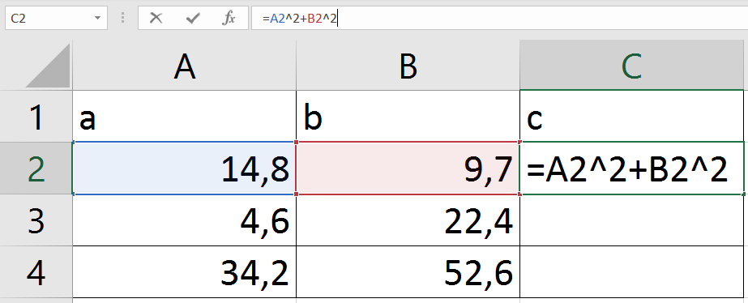
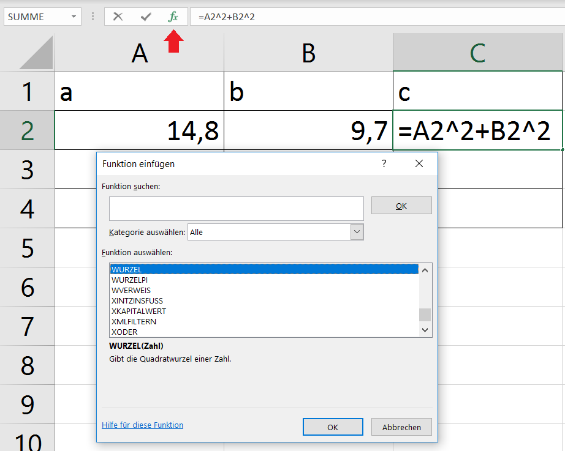
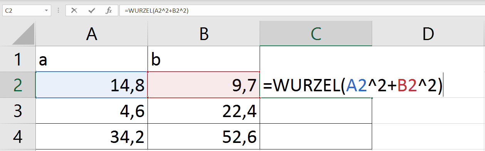
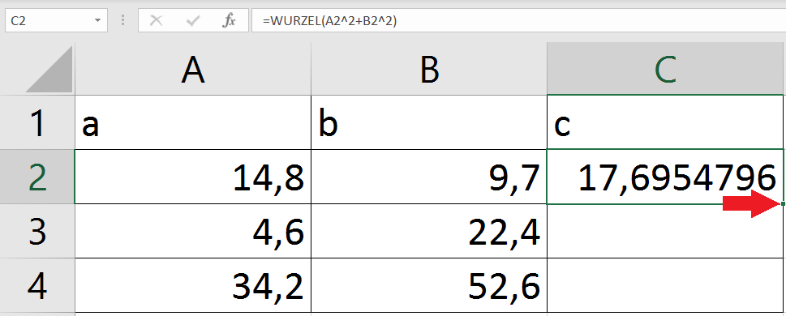
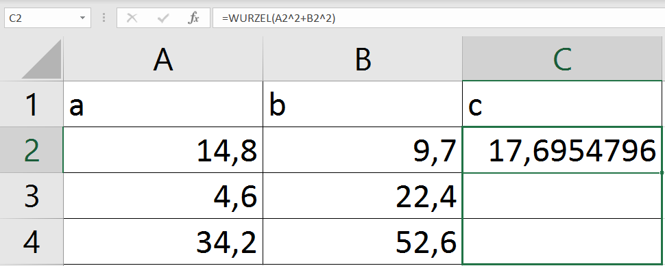

<!--
link: css/callouts.css
-->
## Excel-Formeln

<!-- class = "callout danger with-title" -->
> Mathehausaufgaben im Studium?
> 
>Für eine Hausaufgabe musst du mehrere mathematische Aufgaben lösen. Deine Dozentin gibt dir dafür eine Formel vor, welche du anwenden musst: "a²+b²=c²". So weit, so gut. Du versuchst die Aufgaben mit Stift, Papier und solarbetriebenem Taschenrechner zu lösen, doch bald verlierst du den Überblick. Schlimmer noch: die Ergebnisse deiner Rechnungen scheinen aufeinander aufzubauen und sobald sich an einer Stelle ein Fehler einschleicht musst du einen ganzen Rattenschwanz an Rechnungen noch einmal lösen! Außerdem musst du bei jeder neuen Aufgabe komplett von vorne anfangen. Na toll; jetzt geht die Sonne unter und der Taschenrechner funktioniert nicht mehr richtig. Der Stift ist auch abgebrochen. Geht das nicht mit dem Computer einfacher?

## Excel-Formeln

<!-- class = "callout tip with-title" -->
> Excel hilft bei komplizierten Formeln
> 
> Vor Mathe wirst du in den meisten Studiengängen nicht verschont bleiben. Dafür bietet dir die Fachhochschule Potsdam eine Lizenz für Microsoft 365, in welcher das Programm **Excel** enthalten ist. Sobald du den Status eines Studierenden hast, kannst du dir auf der Seite der Fachhochschule Zugang verschaffen, indem du diesem Link folgst:
https://www.fh-potsdam.de/campus-services/it-service/softwarelizenzen/microsoft-365

<!-- class = "callout Info with-title" -->
> Calc bietet eine Alternative
> 
>
Im Folgenden soll erklärt werden, wie du Formeln mit **Excel** löst, da du ohnehin als Studierender eine Lizenz bekommst. Falls du kein Fan von Windows bist kannst du alternativ auch mit dem Tabellenkalkulationsprogramm **Calc** von Libre Office arbeiten. Es funktioniert ähnlich, aber nicht exakt wie **Excel** und du kannst es unter folgenden Link herunterladen:
https://de.libreoffice.org/download/download/

## Excel-Formeln

Sobald du Excel öffnest siehst du eine große Tabelle. Die senkrecht verlaufenden Spalten sind mit Großbuchstaben gekennzeichnet. Die Zeilen werden mit Zahlen benannt. Eine einzelne Zelle ist ein Bereich, in welchem Spalte und Zeile sich schneiden. Entsprechend hat jede Zelle sozusagen eine Koordinate, welche aus dem Buchstaben der Spalte und der Zahl der Zeile besteht (nicht umgekehrt!). Diese Namen der Zellen nennt man **Bezüge**, weil man sich innerhalb von Formeln so auf Zellen beziehen kann.

Um zu prüfen, ob du diese Benennungskonvetionen verstanden hast, ergänze den folgenden Text, welcher sich auf dieses Bild bezieht!

In rot gezeigt wird die Spalte [[  A  ]]. Orange ist die Zeile [[  3  ]]. Die lilane Zelle wird mit [[  A1  ]] gekennzeichnet.

<!-- class = "callout Info with-title" -->
> Dimsensionen der Excel Tabelle
> 
>Auf einem Tabellenblatt in Excel kannst du mit 1.048.576 Zeilen und 16.384 Spalten arbeiten. Das bedeutet, die Zelle, welche am weitesten unten rechts auf dem Tabellenblatt liegen kann heißt: **"XFD1048576"**!

## Excel-Formeln

Gehen wir ans Eingemachte! In unserem Beispiel sollen wir mit dem Satz des Pythagoras arbeiten. Dieser besagt:

a²+b²=c²

Mit dieser Formel werden die Längenverhältnisse der drei Seiten eines gleichschenkligen Dreiecks beschrieben. "a" und "b" sind die Längen der Seiten, welche den rechten Winkel bilden, die sogenannten Katheten. "c" beschreibt die Länge der gegenüberliegenden dritten Seite, der Hypotenuse. Der Zauber dieser Formel liegt darin, dass sie uns ermöglicht die unbekannte Länge einer Seite eines gleichschenkligen Dreiecks zu bestimmen, vorausgesetzt, dass die Längen der beiden anderen Seiten bekannt sind.

Unsere Dozentin gibt uns verschiedene Werte für "a" und "b" vor, aus welchen wir jeweils die Länge von "c" deduzieren sollen.

| a | b | c |
| ----:| ----:| ----:|
| 14,8 | 9,7 | ? |
| 4,6 | 22,4 | ? |
| 34,2 | 52,6 | ? |

In einer zweiten Aufgabe sollen wir errechnen, welche Werte sich ergeben, wenn der Wert von "a" bleibt wie bei dem ersten Dreieck (14,8).

## Excel-Formeln

um eine Excel-Formel einzuleiten müssen wir den Eintrag einer Zelle mit dem **Gleichheitszeichen (=)** beginnen.

 wird der Beginn einer Formel in einer Zelle markiert.")

Verschiedene **Operatoren** stehen uns in einer Formel zur Verfügung. Das sind im Grunde die selben Zeichen, welche wir auch im Matheunterricht kennengelernt haben:

| Operator | Allgemeine Bezeichnung |
| ----:| ----:|
| + | Plus |
| - | Minus |
| * | Mal |
| / | Geteilt |
| < | Kleiner als |
| > | Größer als |

In unserem Fall benötigen wir noch den Operator "^", damit wir unsere Werte "hoch 2" rechnen können. Nun haben wir in Zeile C2 schon etwas, was nach dem Satz des Phytagoras aussieht. In Zelle "A2" steht unser Wert für "a", in "B2" steht unser Wert für "b". "C2" Enthält unsere Formel und das Ergebnis von "a²+b²".

## Excel-Formeln
Doch gefragt ist nicht nach "c²"! Wir müssen noch eine Wurzel ziehen! Dafür müssen wir nicht nach einem Wurzel-Zeichen auf dem Keyboard suchen. Stattdessen klicken wir auf das Formelzeichen (fx) neben der Eingabezeile. Es erscheint ein Fenster, Welches uns erlaubt aus allen Funktionen auszuwählen, welche Excel zu bieten hat.

Wir benötigen die Funktion

=WURZEL()

So haben wir endlich unsere Formel in Excel eingegeben!

## Excel-Formeln
<!-- class = "callout danger with-title" -->
> Ist es mit Excel so viel einfacher?
> 
> Nun hast du einiges über Excel gelernt. Taschenrechner, Stift und Papier hast du gegen den PC getauscht. Aber war es vorher nicht einfacher? Der Taschenrechner hatte ein eigenes Wurzelzeichen und wenn die Sonne draufschien ist er einfach angegangen. Für Stift und Papier brauchtest du keine Kabel und Schaltkreise. Mit ihnen hättest du im tiefsten Wald oder auf dem höchsten Berg deine Aufgaben lösen können, kilometerweit von der nächsten Steckdose entfernt. Die Geheimnisse der Mathematik hätten sich dir mit Stift und Papier genauso erschlossen, wie einst Phytagoras vor tausenden von Jahren. Nun bist du abhängig von Strom, welcher lange nicht nachhaltig gewonnen werden kann. Dein Anspruch auf einen Computer macht dich mitverantwortlich dafür, dass irgendwo auf der Welt Menschen in gefährlichen Minen Kupfer und andere seltene Mineralien der Erde entreißen. Und du hast dich der Omnipräsenz von Microsoft unterworfen, einem gesichtslosen, monopolistischen Riesen-Unternehmen, welches mehr Einfluss auf die globale Arbeitskultur hat, als die meisten Staaten. Zudem ist es auch gar nicht so leicht Excel zu lernen. Ist es das überhaupt wert?

## Excel-Formeln

Aber Existenzkrise beiseite. Wir haben auf "Enter" gedrückt und in Zelle "C2" wird endlich unser Ergebnis angezeigt!

Wenn wir eine Zelle angewählt haben, wird diese grün umrandet. In der unteren, rechten Ecke der Zelle befindet sich dann ein kleines dunkelgrünes Quadrat. Unsere Maus wird zu einem kleinen schwarzen Kreuz, wenn wir sie über dieses Quadrat bewegen. Nun klicken wir mit der linken Maustaste auf das grüne Quadrat, ziehen den grünen Kasten die Spalte hinunter...

... et voila! 

## Excel-Formeln
Trage die folgenden Begriffe in den Lückentext ein!

<kbd>Operatoren</kbd><kbd>Konstanten</kbd><kbd>Bezüge</kbd><kbd>Funktionen</kbd><kbd>Elementen</kbd><kbd>relative</kbd><kbd>absolute</kbd>

Excel-Formeln bestehen aus verschiedenen [[  Elementen  ]]. [[  Funktionen  ]] beginnen immer mit einem Gleichheitszeichen (=). Einträge wie Zahlen, Texte oder Daten verändern sich beim Ziehen einer Formel nicht und werden [[  Konstanten  ]] genannt. Im Gegensatz dazu verändern sich [[  relative  ]] [[  Bezüge  ]], sobald eine Funktion gezogen wird. Mit einem "$" gekennzeichnete [[  absolute  ]] [[  Bezüge  ]] widerum bleiben auch beim Ziehen einer Formel gleich. Mit [[  Operatoren  ]] können die verschiedenen Elemente einer Formel mathematisch oder logisch miteinander in Bezug gesetzt werden.

## Quellen

Download Windows 365 von der FH Potsdam:

https://www.fh-potsdam.de/campus-services/it-service/softwarelizenzen/microsoft-365  (Stand 22.12.2023; 13:40 Uhr)

Download Libre Office:

https://de.libreoffice.org/download/download/ (Stand 22.12.2023; 13:40 Uhr)

Zu den Maßen einer Excel-Tabelle:

https://support.microsoft.com/de-de/office/spezifikationen-und-beschr%C3%A4nkungen-in-excel-1672b34d-7043-467e-8e27-269d656771c3

Zu der am weitesten unten rechts liegenden Zelle in Excel:

http://www.blaschke1.at/stammtisch/?p=518

(https://support.content.office.net/de-de/media/0c0657d7-2951-431d-9e3f-d3dcc074e09b.gif (Stand 22.12.2023; 13:40 Uhr)

https://support.microsoft.com/de-de/office/%C3%BCbersicht-%C3%BCber-formeln-in-excel-ecfdc708-9162-49e8-b993-c311f47ca173 (Stand 22.12.2023; 13:40 Uhr)