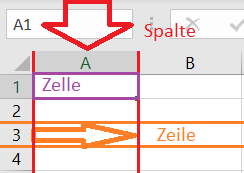

<!--
link: css/callouts.css
-->
## Excel-Formeln

<!-- class = "callout danger with-title" -->
> Mathehausaufgaben im Studium?
> 
>Für eine Hausaufgabe musst du mehrere mathematische Aufgaben lösen. Deine Dozentin gibt dir dafür eine Formel vor, welche du nicht verstehen, sondern nur anwenden musst: "a²+b²=c²". So weit, so gut. Du versuchst die Aufgaben mit Stift, Papier und solarbetriebenem Taschenrechner zu lösen, doch bald verlierst du den Überblick. Schlimmer noch: die Ergebnisse deiner Rechnungen scheinen aufeinander aufzubauen und sobald sich an einer Stelle ein Fehler einschleicht musst du einen ganzen Rattenschwanz an Rechnungen noch einmal lösen! Außerdem musst du bei jeder neuen Aufgabe komplett von vorne anfangen. Na toll; jetzt geht die Sonne unter und der Taschenrechner funktioniert nicht mehr richtig. Der Stift ist auch abgebrochen. Geht das nicht mit dem Computer einfacher?

## Excel-Formeln

<!-- class = "callout tip with-title" -->
> Excel hilft bei komplizierten Formeln
> 
> Vor Mathe wirst du in den meisten Studiengängen nicht verschont bleiben. Dafür bietet dir die Fachhochschule Potsdam eine Lizenz für Microsoft 365, in welcher das Programm **Excel** enthalten ist. Sobald du den Status eines Studierenden hast, kannst du dir auf der Seite der Fachhochschule Zugang verschaffen, indem du diesem Link folgst:
https://www.fh-potsdam.de/campus-services/it-service/softwarelizenzen/microsoft-365

<!-- class = "callout Info with-title" -->
> Calc bietet eine Alternative
> 
>
Im Folgenden soll erklärt werden, wie du Formeln mit **Excel** löst, da du ohnehin als Studierender eine Lizenz bekommst. Falls du kein Fan von Windows bist kannst du alternativ auch mit dem Tabellenkalkulationsprogramm **Calc** von Libre Office arbeiten. Es funktioniert ähnlich, aber nicht exakt wie **Excel** und du kannst es unter folgenden Link herunterladen:
https://de.libreoffice.org/download/download/

## Excel-Formeln

Sobald du Excel öffnest siehst du eine große Tabelle. Die senkrecht verlaufenden Spalten sind mit Großbuchstaben gekennzeichnet. Die Zeilen werden mit Zahlen benannt. Eine einzelne Zelle ist ein Bereich, in welchem Spalte und Zeile sich schneiden. Entsprechend hat jede Zelle sozusagen eine Koordinate, welche aus dem Buchstaben der Spalte und der Zahl der Zeile besteht (nicht umgekehrt!).

Um zu prüfen, ob du diese Benennungskonvetionen verstanden hast, ergänze den folgenden Text, welcher sich auf dieses Bild bezieht!

In rot gezeigt wird die Spalte [[  A  ]]. Orange ist die Zeile [[  3  ]]. Die lilane Zelle wird mit [[  A1  ]] gekennzeichnet.

<!-- class = "callout Info with-title" -->
> Dimsensionen der Excel Tabelle
> 
>Auf einem Tabellenblatt in Excel kannst du mit 1.048.576 Zeilen und 16.384 Spalten arbeiten. Das bedeutet, die Zelle, welche am weitesten unten rechts auf dem Tabellenblatt liegen kann heißt: **"XFD1048576"**!

## Excel-Formeln

Gehen wir ans Eingemachte! In unserem Beispiel sollen wir mit dem Satz des Pythagoras arbeiten welcher besagt:

a²+b²=c²

Mit dieser Formel werden die Längenverhältnisse der drei Seiten eines gleichschenkligen Dreiecks beschrieben. "a" und "b" sind die Längen der Seiten, welche den rechten Winkel bilden, die sogenannten Katheten. "c" beschreibt die Länge der gegenüberliegenden dritten Seite, der Hypotenuse.

## Excel-Formeln
Trage die folgenden Begriffe in den Lückentext ein!

<kbd>Operatoren</kbd><kbd>Konstanten</kbd><kbd>Bezüge</kbd><kbd>Funktionen</kbd><kbd>Elementen</kbd><kbd>relative</kbd><kbd>absolute</kbd>

Excelformeln bestehen aus verschiedenen [[  Elementen  ]]. [[  Funktionen  ]] beginnen immer mit einem Gleichheitszeichen (=). Einträge wie Zahlen, Texte oder Daten verändern sich beim Ziehen einer Formel nicht und werden [[  Konstanten  ]] genannt. Im Gegensatz dazu verändern sich [[  relative  ]] [[  Bezüge  ]], sobald eine Funktion gezogen wird. Mit einem "$" gekennzeichnete [[  absolute  ]] [[  Bezüge  ]] widerum bleiben auch beim Ziehen einer Formel gleich. Mit [[  Operatoren  ]] können die verschiedenen Elemente einer Formel mathematisch oder logisch miteinander in Bezug gesetzt werden.

## Quellen

Download Windows 365 von der FH Potsdam:

https://www.fh-potsdam.de/campus-services/it-service/softwarelizenzen/microsoft-365  (Stand 22.12.2023; 13:40 Uhr)

Download Libre Office:

https://de.libreoffice.org/download/download/ (Stand 22.12.2023; 13:40 Uhr)

Zu den Maßen einer Excel-Tabelle:

https://support.microsoft.com/de-de/office/spezifikationen-und-beschr%C3%A4nkungen-in-excel-1672b34d-7043-467e-8e27-269d656771c3

Zu der am weitesten unten rechts liegenden Zelle in Excel:

http://www.blaschke1.at/stammtisch/?p=518

(https://support.content.office.net/de-de/media/0c0657d7-2951-431d-9e3f-d3dcc074e09b.gif (Stand 22.12.2023; 13:40 Uhr)

https://support.microsoft.com/de-de/office/%C3%BCbersicht-%C3%BCber-formeln-in-excel-ecfdc708-9162-49e8-b993-c311f47ca173 (Stand 22.12.2023; 13:40 Uhr)