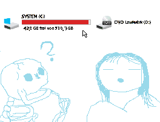

<!--
link: css/callouts.css
-->
## Die HDD-Festplatte

<!-- class = "callout danger with-title" -->
> Der alte Computer ist langsam...
> 
> Du willst auf die Fachhochschule gehen und Informationswissenschaft studieren. Dafür benötigst du natürlich einen Computer! Zum Glück hast du ja schon seit einigen Jahren einen Laptop. Dein Laptop hat viel mehr Hardware im Kasten, als für normale Büroanwendungen erforderlich wäre: Windows 10, leistungsstarke NVIDIA Grafikkarte, Intel Core i5 Prozessor, 8GB RAM und eine eingebaute 1000 GB HDD Festplatte. Eigentlich müsstest du damit sogar neuere Spiele zum laufen kriegen, wenn da nicht ein Problem wäre... Mit der Zeit wurde dein Computer immer langsamer und langsamer, sodass du mittlerweile bei den einfachsten Programmen ewig warten musst, bis sie starten. Als du das Gerät neu hattest war es in ein oder zwei Minuten hochgefahren. Mittlerweile dauert das aber zehn Minuten oder mehr! Ist das Gerät verschlißen? Musst du nun ein neues Gerät anschaffen? Du erzählst deiner besten Freundin von dem Problem, während du den Computer hochfährst, um dir mit ihr neue Modelle im Internet anzusehen. "Weißt du was?", fragt sie mit Tee in der Hand, den sie sich in der Zwischenzeit auch kochen konnte, "Ich glaube ich habe eine Idee! Lass mich bitte mal kurz etwas nachgucken, wenn der Rechner hochgefahren ist!"

## Die HDD-Festplatte

<!-- class = "callout callout with-title" -->
> "Aha!"
>
> Deine Freundin hat nicht lange gebraucht um zu finden, was sie gesucht hat. "Kein Wunder, dass dein Computer so langsam ist... Du hast gesagt, dass du hier eine **1000 GB HDD Festplatte** drin hast, richtig? Du Scherzkeks hast deine Festplatte aber nicht **partitioniert**, bevor du sie vollgestopft hast! Alle deine Daten und Programme befinden sich auf derselben **Partition** wie dein **Betriebssystem**! Das kannst du mit einer **HDD-Festplatte** nicht machen!" Mit dieser Erklärung kannst du nicht viel anfangen und deine Freundin kann es dir ansehen. "Ich sag dir was", fährt sie fort, "du musst keinen neuen Computer kaufen. Weil ich deine *beste Freundin* bin (und Mitleid mit deinem armen Laptop habe), helfe ich dir dieses Mal, deinen Rechner wieder in Ordnung zu kriegen. Du musst mir aber versprechen wenigstens zu versuchen zu verstehen was ich dir erkläre, damit du den selben Fehler nicht noch mal machst und in Zukunft pfleglicher mit deinem Rechner umgehst. Das wird auch dauern, aber warten bist du ja gewöhnt. Wir werden noch viel Tee kochen müssen die kommenden Tage..."

## Die HDD-Festplatte

Zunächst solltest du verstehen, dass es zwei handelsübliche Typen von Festplatten gibt: **HDD-Festplatten** und **SSD-Festplatten**. Für beide Typen gilt, wenn sie fest in deinem Computer verbaut ist, nennt man sie **interne Festplatte**. Manche Festplatten kannst du über deinen USB-Anschluss an den Computer anschließen und wieder rausziehen. Diese werden **externe Festplatten** genannt.

**Hard-Disk-Drives** funktionieren mechanisch. Ähnlich wie bei einem alten Schallplattenspieler, haben sie eine Scheibe, auf welcher die Daten gespeichert sind und einen Arm, welcher diese Daten abliest. Diesen Mechanismus kann man sogar im Computer arbeiten hören, wenn die Festplatte zum Einsatz kommt!

**Solid-State-Drives** haben dagegen keine beweglichen Teile und sind entsprechend robuster und leiser. Man kann sie sich wie USB-Sticks vorstellen, welche relativ viel Speicher haben.

Es gibt auch Hybride, welche **SSHD-Festplatten** genannt werden.

Obwohl die SSD-Festplatte die HDD-Festplatte langsam abzulösen scheint, gibt es immer noch Gründe die HDD vorzuziehen. Hier sind die Vorteile der Festplatten im Vergleich:

|HDD|SSD|
|:---|:---|
|+ günstiger im Preis-Leistungs-Verhältnis|+ überträgt Daten schneller|
|+ mehr Speicherplatz|+ robuster|
|+ mögliche Rettung bei Datenverlust|+ leiser|
||+ leichter|

<!-- class = "callout tip with-title" -->
> SSD partitionieren?
>
> Es ist zwar praktisch und übersichtlich eine SSD-Festplatte zu partitionieren, etwa, wenn dass Betriebssystem neu aufgesetzt werden muss, wie wir sehen werden. Partitionen sind jedoch nicht notwendig, damit die SSD schnell arbeitet.
## Die HDD-Festplatte
<!-- class = "callout callout" -->
> 
> "Also Schritt 1: Du besorgst dir eine **externe SSD-Festplatte** auf der du deine Daten sicherst! Wichtig sind Fotos, digitale Dokumente, Musik- und Videodateien und vielleicht Spielstände; sowas. Alle Programme können wir einfach neu installieren, die brauchst du also nicht auf einer Festplatte sichern.", schlägt deine Freundin vor. 

## Die HDD-Festplatte

Quellen:

Zum Unterschied von HDD und SSD:

https://praxistipps.chip.de/festplatten-hdd-und-ssd-wo-liegt-der-unterschied_43249

Zu der Frage, ob es functional notwendig ist eine SSD-Festplatte zu partitionieren:

https://www.electronicshub.org/should-i-partition-my-ssd/