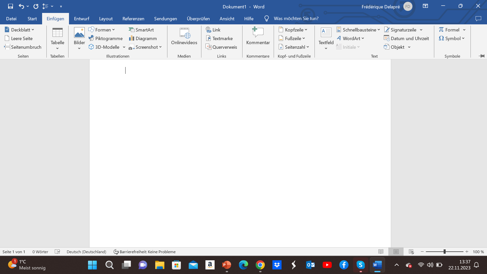

# Word

**Was wollen wir zeigen?**
<ul><u>Was für Funktionen sind vorhanden?</u></ul>
<li>Formatierung
<li>Einsetzen
Bilder

Bilder werden eingefügt indem in der oberen Leiste auf Bilder 
<li> Tabelle, Grafiken, SmartArt

<li>Inhaltsverzeichnis
<li>Zitierung
<li>Literaturverzeichnis
<li>Layout
<li>Überprüfung
<li>Ansicht

