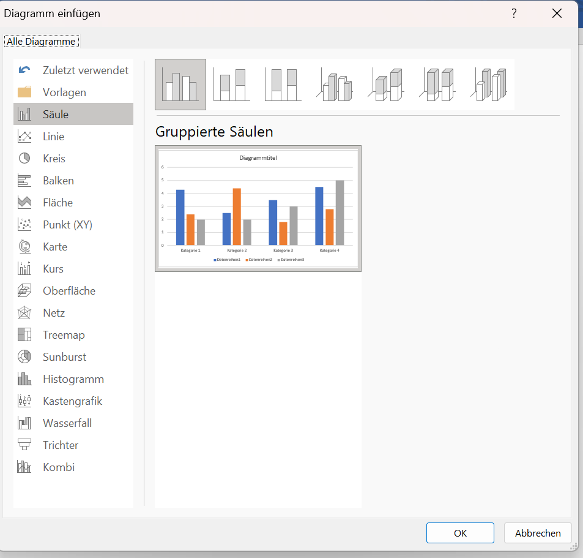
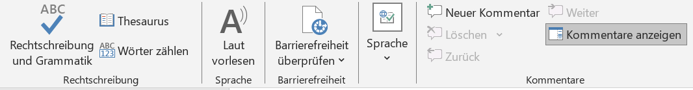

# Word

**Was musst du fürs Studium in Word können?**
<ul><u>Einleitung</u></ul>

Als Student wird das wissenschaftliche arbeiten ein großer Bestandteil deines Studiums sein. Eines der wichtigsten Programme ist hierbei Microsoft Word. Ob Texte, Inhaltsverzeichnisse oder Formatierungen, bei Word kann man so einiges professionel und individuell erstellen und bearbeiten. Um nicht alles umständlich runterzuschreiben, bietet das MS-Office Programm nützliche Funktionen für Ihre zukünftigen Arbeiten.

Auf den nächsten Seiten wollen wir dir daher einen kurzen Einblick über einige dieser Funktionen bieten, die unserer Meinung nach Eure wissenschaftliche Arbeit in Word erleichtern könnte. Vielleicht kanntest du sie noch nicht und wir können dir helfen, ein kleines Stück besser mit Word umzugehen. 

*Zu jedem unserer Themen wird nur ein Beispiel gezeigt. Es gibt auch andere Möglichkeiten, die verschiedenen Funktionen zu benutzen. Werde kreativ und probieren sie alles mal aus.*

## Gliederung

- **Formatierung**
- **Einsetzen**
    -   *Bilder*
    -   *Tabelle*
    -   *Diagramme*
    -   *SmartArt*
- **Inhaltsverzeichnis**
- **Zitierung**
- **Literaturverzeichnis**
- **Layout**
- **Überprüfung**
- **Ansicht**

## Formatierung

Einer der ersten Schritte zum erstellen deines Dokuments, wird die Formatierung sein. Bei **Start** findest du alle nötigen Funktionen um die Grundlagen für ihre Arbeit festzulegen. Dazu gehören unteranderem Absätze, Formatvorlagen und die Schrift selbst.

## Einsetzen
**Bilder**

Bilder werden eingefügt, indem in der oberen Leiste auf Bilder klickst. Daraufhin öffnet sich ein Tab bei dem du auswählst: Dieses Gerät oder Onlinebilder. 

'Dieses Gerät'

Zuerst öffnet sich der Dateiordner. Dort wird die Datei mit dem gewünschten Bild ausgewählt und geöffnet. 

**Tabelle**

Tabellen werden eingefügt, indem auf die oberen Leiste bei **Einfügen** auf die **Tabellen** geklickt wid. Dauraufhin öffnet sich ein Tab, bei welchem du die Anzahl deiner Spalten und Zeilen auswählen musst.
Danach besteht die Möglichkeit durch Klick auf die Tabelle weitere Spalten und Zeilen hinzuzufügen. Zudem öffnet eine neue Option in der Leiste *Format*, dort können Farbe der Tabelle angepasst werden.

**Diagramme**

Die grafische Darstellung von Daten oder Informationen, kann unter Umständen in deiner wissenschaftlichen Arbeit den Sachverhalt besser veranschaulichen. 
**Achte jedoch auf eine simple Gestaltung**
Den dazugehörigen Punkt findest Du in der oberen Leiste bei **Einfügen** > **Diagramme**. Damit sollte sich ein neues Fenster mit den unterchiedlichsten Diagrammen öffen. 

Hat man sich für ein Diagramm entschieden, öffnet sich eine zusätzliche Excel Tabelle. In der du deine Forschungsdaten eintragen kannst. Diese werden dann im Diagramm veranschaulicht.

**SmartArt**

SmartArt ermöglicht eine visuelle Darstellung von Informationen und Bildern. Um sich eine SmartArt-Grafik zu erstellen und anschließend zu verwenden, muss man in der oberen Leiste bei **Einfügen** > **SmartArt** klicken. Tut man dies, so öffnet sich ein Fenster mit vielen verschiedenen Auswahlmöglichkeiten, um seine Informationen perfekt für sich darstellen zu lassen.

Als weiteren Schritt, kann man gegebenfalls seine Grafik nach seinen Vorstellungen anpassen. 
Sei es durch Farbe, eine andere Formatvorlage oder zusätzliche Formen. 

## Inhaltsverzeichnis

Um sich das erstellen oder anpassen eines Inhaltsverzeichnis zu erleichtern, hat Word eine nützliche Funktion für dich.
Wechselt in der oberen Leiste zu **Referenzen** dort findest du ganz links die Funktion ein Inhaltsverzeichnis zu erstellen oder bei Bedarf zu aktualisieren. Damit spart man sich Zeit und vermeidet eventuelle Fehlern beim Schreiben eines Inhaltsverzeichnis. Um seinen Text dem Inhalstverzeichnis hinzuzufügen, muss man auf *Text einfügen* klicken. 

## Zitierung

Das zitieren von Zitaten oder Textabschnitten ist für viele Studenten eine der Königsdisziplinen beim erstellen ihrer wissenschaftlichen Arbeiten. Wenn man bei Word jedoch in der oberen Zeile auf **Referenzen** geht, findet man die Funktion *Zitat einfügen*. Mit den zusätzlichen Funktion *Formatvorlage*, kann man sich einfach und übersichtlich ein Zitat mit einer direkten Verlinkung zum Inhaltsverzeichnis erstellen.

> [!TIP]
> Eine Empfehlung für eine Formatvorlage beim zitieren, wäre Chicago.

## Literaturverzeichnis

## Layout

## Überprüfung

## Ansicht

