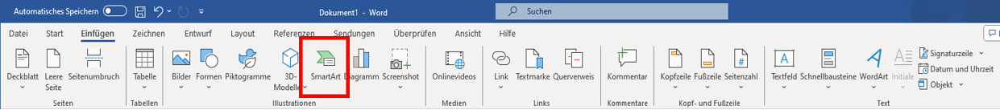

# Word

**Was musst du fürs Studium in Word können?**
<ul><u>Einleitung</u></ul>

Ob ein Inhaltsverzeichnis erstellen oder die Formatierung ändern. Bei Word werden Texte nicht nur runtergeschrieben, sondern ...

Auf den nächsten Seiten findet ihr einen kurzen Einblick wie ihr mit Word umgehen könnt. 

*Zu jedem Thema wird nur ein Beispiel gezeigt. Es gibt auch andere Möglichkeiten, die verschiedenen ... zu erstellen*

## Gliederung

- **Formatierung**
- **Einsetzen**
    -   *Bilder*
    -   *Tabelle*
    -   *Grafiken*
    -   *SmartArt*
- **Inhaltsverzeichnis**
- **Zitierung**
- **Literaturverzeichnis**
- **Layout**
- **Überprüfung**
- **Ansicht**

## Einsetzen
**Bilder**

Bilder werden eingefügt, indem in der oberen Leiste auf Bilder klickst. Daraufhin öffnet sich ein Tab bei dem du auswählst: Dieses Gerät oder Onlinebilder. 

'Dieses Gerät'

Zuerst öffnet sich der Dateiordner. Dort wird die Datei mit dem gewünschten Bild ausgewählt und geöffnet. 

**Tabelle**

Tabellen werden eingefügt, indem auf die oberen Leiste bei **Einfügen** auf die **Tabellen** geklickt wid. Dauraufhin öffnet sich ein Tab, bei welchem du die Anzahl deiner Spalten und Zeilen auswählen musst.
Danach besteht die Möglichkeit durch Klick auf die Tabelle weitere Spalten und Zeilen hinzuzufügen. Zudem öffnet eine neue Option in der Leiste *Format*, dort können Farbe der Tabelle angepasst werden.

**Grafiken**

...

**SmartArt**

SmartArt ermöglicht eine visuelle Darstellung von Informationen und Bildern. Um sich eine SmartArt-Grafik zu erstellen und anschließend zu verwenden, muss man in der oberen Leiste bei **Einfügen** > **SmartArt** klicken. Tut man dies, so öffnet sich ein Fenster mit vielen verschiedenen Auswahlmöglichkeiten, um seine Informationen perfekt für sich darstellen zu lassen.

Als weiteren Schritt, kann man gegebenfalls seine Grafik nach seinen Vorstellungen anpassen. 
Sei es durch Farbe, eine andere Formatvorlage oder zusätzliche Formen. 

## Inhaltsverzeichnis

Um sich das erstellen oder anpassen eines Inhaltsverzeichnis zu erleichtern, hat Word eine nützliche Funktion für Euch.
Wechselt in der oberen Leiste zu **Referenzen** dort habt Ihr ganz links die Funktion ein Inhaltsverzeichnis zu erstellen oder bei Bedarf zu aktualisieren. Damit spart man sich Zeit und vermeidet eventuelle Fehlern beim Schreiben eines Inhaltsverzeichnis. Um seinen Text dem Inhalstverzeichnis hinzuzufügen, muss man auf *Text einfügen* klicken. 

## Zitierung

Das zitieren von Zitaten oder Textabschnitten ist für viele Studenten eine der Königsdisziplin beim erstellen ihrer wissenschaftlichen Texte. Wenn man bei Word jedoch in der oberen Zeile auf **Referenzen** geht, findet man die Funktion *Zitat einfügen*. Mit den zusätzlichen Funktion *Formatvorlage*, kann man sich einfach und übersichtlich ein Zitat mit einer direkten Verlinkung zum Inhaltsverzeichnis erstellen.

> [!TIP]
> Eine Empfelung für eine Formatvorage beim zitieren, wäre Chicago.

## Literaturverzeichnis

## Layout

## Überprüfung

## Ansicht
