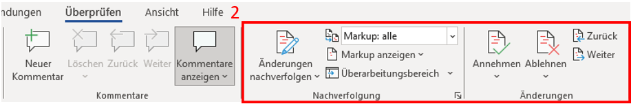
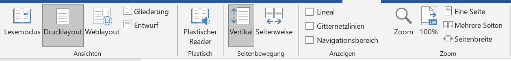

<!--

link: css/callouts.css

-->

## 
Word

**Was musst Du fürs Studium in Word können?**

Ein großer Bestandteil wird das Arbeiten mit diversen Programmen sein. Eines der Wichtigsten ist hierbei Microsoft Word. Ob Texte, Inhaltsverzeichnisse oder Formatierungen, bei Word kann man so einiges professionell und individuell erstellen und bearbeiten. Um nicht alles umständlich herunterzuschreiben, bietet das MS-Office-Programm nützliche Funktionen für Deine zukünftigen Arbeiten.

Auf den nächsten Seiten wollen wir Dir daher einen kurzen Einblick über einige Funktionen bieten, die unserer Meinung nach Dir vieles erleichtern. Vielleicht kanntest Du sie noch nicht und wir können Dir helfen, ein kleines Stück besser mit Word umzugehen. 

*Zu jedem unserer Themen wird nur ein Beispiel gezeigt. Es gibt auch andere Möglichkeiten, die verschiedenen Funktionen zu benutzen. Werde kreativ und probiere sie einfach alle einmal aus.*

### 
Gliederung

{{1}}[**Formatierung**](#formatierung)

{{2}}[**Einfügen**](#einfügen)

- **Bilder**
- **Tabelle**
- **Diagramme**
- **SmartArt**

{{3}}[**Inhaltsverzeichnis**](#inhaltsverzeichnis)

{{4}}[**Zitierung**](#zitierung)

{{5}}[**Literaturverzeichnis & Abbildungsverzeichnis**](#literaturverzeichnis)

{{6}}[**Layout**](#layout)

{{7}}[**Überprüfung**](#überprüfung)

{{8}}[**Ansicht**](#ansicht)

#### 
Formatierung

Einer der ersten Schritte zum Erstellen Deines Dokumentes wird die Formatierung sein. Beim Reiter **Start** findest Du alle nötigen Funktionen, um die Grundlagen für Deine Arbeit festlegen zu können. Dazu gehören unter anderem Absätze, Formatvorlagen und die Schrift selbst.

#### 
Einfügen

Auf den nachfolgenden Seiten findest Du Informationen, wie man einzelne Elemente in Dein Word-Dokument einfügen kann. 

### Bilder

Bilder werden eingefügt, indem Du im Reiter auf **Bilder** klickst. Daraufhin öffnet sich ein Tab, bei dem Du auswählst: **dieses Gerät** oder **Onlinebilder**. 

**Dieses Gerät**

Zuerst öffnet sich der Dateiordner. Dort wird die Datei mit dem gewünschten Bild ausgewählt und geöffnet. 

**Online Bilder**

Hierbei öffnet sich ein weiteres Fenster. In welchem Du entweder über die Suchleiste oder aus vorgefertigten Suchbegriffen ein passendes Bild für Dein Dokument heraussuchst. Du kannst bei der Suche angeben, ob das Bild **Creative Common** sein soll oder nicht.

### 
Tabelle

Tabellen werden eingefügt, indem im Reiter bei **Einfügen** auf die **Tabelle** geklickt wird. Daraufhin öffnet sich ein Tab, bei welchem Du die Anzahl Deiner Spalten und Zeilen auswählen musst.

Danach besteht die Möglichkeit, durch Rechtsklick auf die Tabelle weitere Spalten und Zeilen unter **Einfügen** hinzuzufügen. Außerdem öffnet sich ein neuer Reiter **Tabellenentwurf**, dort können Farbe, Rahmen oder Schattierung einer oder aller Spalten der Tabelle angepasst werden.

### 
Diagramme

Die grafische Darstellung von Daten oder Informationen kann unter Umständen in Deiner Arbeit den Sachverhalt besser veranschaulichen. 
Den dazugehörigen Punkt findest Du im Reiter bei **Einfügen** > **Diagramme**. Damit sollte sich ein neues Fenster mit den unterschiedlichsten Diagrammen öffnen. 

<!-- class = "callout warning" -->
> Achte jedoch auf eine simple Gestaltung.

Hat man sich für ein Diagramm entschieden, öffnet sich eine zusätzliche Excel-Tabelle, in der Du Deine Forschungsdaten eintragen kannst. Diese werden dann im Diagramm veranschaulicht.

### 
SmartArt

SmartArt ermöglicht eine visuelle Darstellung von Informationen und Bildern. Um sich eine SmartArt-Grafik zu erstellen und anschließend zu verwenden, muss man im Reiter auf **Einfügen** > **SmartArt** klicken. Danach öffnet sich ein Fenster mit vielen verschiedenen Auswahlmöglichkeiten, um seine Informationen perfekt für sich darstellen zu lassen.

Als weiteren Schritt kann man gegebenenfalls seine Grafik nach seinen Vorstellungen anpassen, sei es durch Farbe, eine andere Formatvorlage oder zusätzlichen Formen. 

#### 
Inhaltsverzeichnis

Um sich das Erstellen oder das Anpassen eines Inhaltsverzeichnisses zu erleichtern, hat Word eine nützliche Funktion für Dich.
Wechsel im Reiter zu **Referenzen**, dort findest Du ganz links die Funktion ein Inhaltsverzeichnis zu erstellen. Bei Bedarf kann dieses auch aktualisiert werden. Man spart sich somit Zeit und vermeidet eventuelle Fehler. Um seinen Text dem Inhaltsverzeichnis hinzuzufügen, muss man auf **Text einfügen** klicken. 

#### 
Zitierung

Das Zitieren von Zitaten oder Textabschnitten ist für viele eine Königsdisziplin beim Erstellen der Arbeiten. Wenn man bei Word jedoch im Reiter auf **Referenzen** geht, findet man die Funktion **Zitat einfügen**. Unter **neue Quelle** kannst Du alle wichtigen Informationen bezüglich Deines Zitates hinzufügen. 
Mit der zusätzlichen Funktion **Formatvorlage** kann man sich einfach und übersichtlich ein Zitat mit einer direkten Verlinkung zum Inhaltsverzeichnis erstellen.

<!-- class = "callout tip" -->
> Unsere Format Empfehlung beim zitieren, wäre Chicago.

#### 
Literaturverzeichnis & Abbildungsverzeichnis

Im Literaturverzeichnis kann man natürlich nicht nur seine Zitate hinterlegen, sondern auch alle Literaturquellen, die man verwendet. Dafür erstellst Du Dir erst einmal ein leeres Literaturverzeichnis. Klicke im Reiter auf **Literaturverzeichnis** und sucht Dir erst einmal eine Vorlage aus.
Deine Quellen kannst Du bei Bedarf jederzeit aktualisieren. Um eine neue Quelle hinzuzufügen oder eine bereits vorhandene zu bearbeiten, klickt man auf **Zitate und Literaturverzeichnis** > **Quellen verwalten**. Im neuen Tab kannst Du dann beliebig Deine Quellen verwalten.

Auch das Erstellen eines Abbildungsverzeichnisses wird über den Reiter **Referenzen** > **Beschriftung** durchgeführt. Dabei kann man entscheiden, wie das Abbildungsverzeichnis aussehen und ob es gegebenenfalls Verlinkungen zum jeweiligen Bild geben soll.

#### 
Layout

Solltest Du mal für eine Deiner Arbeiten einen benutzerdefinierten Seitenrand, ein horizontales Blatt oder vielleicht eine zwei Spaltenansicht benötigen, bist Du hier beim Layout genau richtig. 
Ganz links findest Du alles, was mit Seitenrändern oder Absätzen zu tun hat. Dir wird eine vielfältige Auswahl an vorgefertigten Einstellungen geboten. Solltest Du aber andere Vorstellungen oder Angaben haben, dann kann man sie ganz einfach unter **Weitere** oder **Mehr** selbst konfigurieren. 
Gleich daneben findest Du den Absatzblock. Dabei kannst Du bestimmen, wie weit Dein Absatz nach links, rechts, oben oder unten rücken soll. 

#### 
Überprüfung

Unter dem Reiter **Überprüfen** befinden sich eine Vielzahl von Funktionen, die Dir eine optimale Unterstützung beim Schreiben Deines Dokumentes bieten können.
Neben den Standardfunktionen wie Rechtschreibung und Grammatik oder dem Wörterzählen kann Word Dir Deine geschriebenen Sätze laut vorlesen. Es hilft ungemein, diese laut zu hören. Dir können so Fehler leichter auffallen, die Du vielleicht noch nicht entdeckt hast. Diese Funktion findest Du im Reiter bei **Überprüfen** > **Sprache** > **laut vorlesen**.

Des Weiteren wollen wir Dir die mögliche Angst vor Fremdsprachen nehmen. Im Reiter unter **Sprache** hast Du die Funktionen **Übersetzen** und **Sprache** zur Verfügung. Gerade der zweite Punkt **Sprache** ist interessant, denn mit dieser Funktion kannst Du ganz einfach Deine Rechtschreib- und Grammatikprüfung in eine andere Sprache umstellen.

Anschließend gibt es noch die Kommentar- und Änderungssektion. Unter diesen kannst Du allein oder mit anderen Personen an einem Dokument arbeiten, ohne Euch gegenseitig im Weg zu stehen. 

1. Die Kommentare bieten sich besonders dann an, wenn man sich kleine Anmerkungen für später oder Notizen für andere Personen hinterlegen möchte. Zum Hinzufügen gehe im Reiter zum Punkt **Kommentare** und füge einen Kommentar am Zeilenrand hinzu. Achte darauf, mit der Maus in der richtigen Zeile zu sein. Anschließend wird der von Dir markierte Teil eingefärbt. So verliert niemand den Überblick. Natürlich kannst Du Deine Anmerkungen verändern, löschen oder bei Bedarf auf andere Kommentare reagieren.

  

2. Die Änderungssektion ist vor allem dann interessant, wenn Du Veränderungen nicht sofort im Text umsetzen willst. Sei es in Einzel- oder Gruppenarbeiten. Die vorläufigen Änderungen können alle auf einmal angenommen oder abgelehnt werden.
   

<!-- class = "callout tip" -->
> Um ein Dokument einer anderen Person freizugeben, klicke hierbei über dem Reiter auf **Freigeben** > **Freigabe**. Stelle dabei sicher, dass Dein Dokument auf OneDrive gespeichert ist. Die betreffende Person, der Du Dein Dokument freigibst, sollte nachdem Teilen eine E-mail erhalten.

#### 
Ansicht

Unter Ansicht kannst Du das Dokument Dir so anzeigen lassen, wie Deine Präferenzen sind. Im Reiter **Seitenbewegung** kannst Du festlegen, ob Deine Seiten im Dokument vertikal oder horizontal wie bei einem Buch angezeigt werden soll. 
Im **Lesemodus** kannst Du Dich, wie es der Name schon verrät, ganz aufs Lesen Deiner Arbeit konzentrieren. 

Der **Plastische Reader** bietet Dir neben der internen Veränderung der Seitenfarbe, dem Text- oder Spaltenabstand ebenso auch eine Silbentrennung an. Auch kannst Du den **Zeilenfokus** aktivieren. Dieser erlaubt Dir, Dich Zeile für Zeile in Deiner Arbeit vorzuarbeiten.

