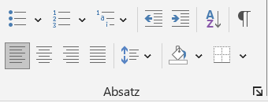
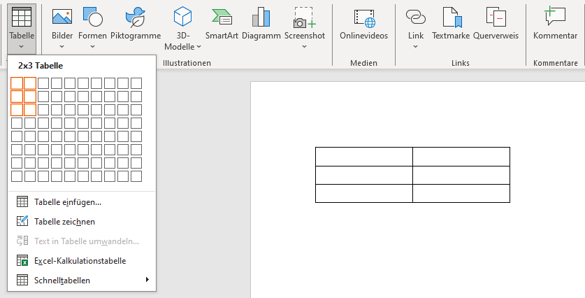
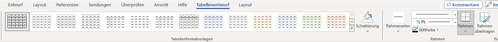
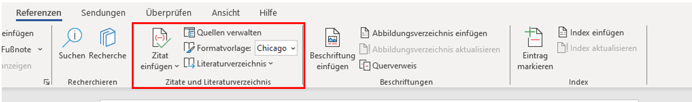
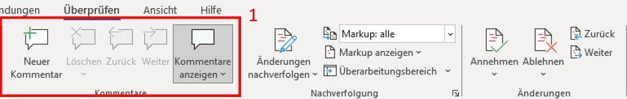

# Word

**Was musst du fürs Studium in Word können?**
<ul><u>Einleitung</u></ul>

Als Student wird das wissenschaftliche arbeiten ein großer Bestandteil deines Studiums sein. Eines der wichtigsten Programme ist hierbei Microsoft Word. Ob Texte, Inhaltsverzeichnisse oder Formatierungen, bei Word kann man so einiges professionell und individuell erstellen und bearbeiten. Um nicht alles umständlich herunterzuschreiben, bietet das MS-Office Programm nützliche Funktionen für Ihre zukünftigen Arbeiten.

Auf den nächsten Seiten wollen wir Dir daher einen kurzen Einblick über einige dieser Funktionen bieten, die unserer Meinung nach Eure wissenschaftliche Arbeit in Word erleichtern könnte. Vielleicht kanntest Du sie noch nicht und wir können Dir helfen, ein kleines Stück besser mit Word umzugehen. 

*Zu jedem unserer Themen wird nur ein Beispiel gezeigt. Es gibt auch andere Möglichkeiten, die verschiedenen Funktionen zu benutzen. Werde kreativ und probieren sie alles mal aus.*

## Gliederung

- [**Formatierung**](#formatierung)
- [**Einfügen**](#einfügen)
    -   *Bilder*
    -   *Tabelle*
    -   *Diagramme*
    -   *SmartArt*
- [**Inhaltsverzeichnis**](#inhaltsverzeichnis)
- [**Zitierung**](#zitierung)
- [**Literaturverzeichnis & Abbildungsverzeichnis**](#literaturverzeichnis)
- [**Layout**](#layout)
- [**Überprüfung**](#überprüfung)
- [**Ansicht**](#ansicht)

### Formatierung

Einer der ersten Schritte zum Erstellen Deines Dokuments, wird die Formatierung sein. Bei **Start** findest DU alle nötigen Funktionen, um die Grundlagen für ihre Arbeit festzulegen. Dazu gehören unter anderem Absätze, Formatvorlagen und die Schrift selbst.

### Einfügen

Auf den nachfolgenden Seiten findest Du Informationen wie man einzelne Elemente in Dein Word-Dokument einfügen kann. 

## Bilder

Bilder werden eingefügt, indem in der oberen Leiste auf Bilder klickst. Daraufhin öffnet sich ein Tab, bei dem du auswählst: *dieses Gerät* oder *Onlinebilder*. 

**Dieses Gerät**

Zuerst öffnet sich der Dateiordner. Dort wird die Datei mit dem gewünschten Bild ausgewählt und geöffnet. 

**Online Bilder**

Hierbei öffnet sich ein weiteres Fenster. In diesem kannst Du in der Suchleiste oder aus vorgefertigten Suchbegriffen ein passendes Bild für Dein Dokument raussuchen. Dabei kannst Du bei der Suche angeben, ob das Bild *Creative Common* sein soll oder nicht.

## Tabelle

Tabellen werden eingefügt, indem auf die obere Leiste bei **Einfügen** auf die **Tabelle** geklickt wird. Daraufhin öffnet sich ein Tab, bei welchem Du die Anzahl Deiner Spalten und Zeilen auswählen musst.

Danach besteht die Möglichkeit durch Rechts-Klick auf die Tabelle weitere Spalten und Zeilen unter *Einfügen* hinzuzufügen. Zudem öffnet eine neue Option in der Leiste *Format*, dort können Farbe, Rahmen oder Schattierung eines oder aller Spalten der Tabelle angepasst werden.

## Diagramme

Die grafische Darstellung von Daten oder Informationen kann unter Umständen in Deiner wissenschaftlichen Arbeit den Sachverhalt besser veranschaulichen. 
**Achte jedoch auf eine simple Gestaltung**
Den dazugehörigen Punkt findest Du in der oberen Leiste bei **Einfügen** > **Diagramme**. Damit sollte sich ein neues Fenster mit den unterschiedlichsten Diagrammen öffnen. 

Hat man sich für ein Diagramm entschieden, öffnet sich eine zusätzliche Excel Tabelle. In der Du deine Forschungsdaten eintragen kannst. Diese werden dann im Diagramm veranschaulicht.

## SmartArt

SmartArt ermöglicht eine visuelle Darstellung von Informationen und Bildern. Um sich eine SmartArt-Grafik zu erstellen und anschließend zu verwenden, muss man in der oberen Leiste bei **Einfügen** > **SmartArt** klicken. Tut man dies, so öffnet sich ein Fenster mit vielen verschiedenen Auswahlmöglichkeiten, um seine Informationen perfekt für sich darstellen zu lassen.

Als weiteren Schritt kann man gegebenenfalls seine Grafik nach seinen Vorstellungen anpassen. 
Sei es durch Farbe, eine andere Formatvorlage oder zusätzliche Formen. 

### Inhaltsverzeichnis

Um sich das erstellen oder das anpassen eines Inhaltsverzeichnis zu erleichtern, hat Word eine nützliche Funktion für Dich.
Wechselt in der oberen Leiste zu **Referenzen** dort findest Du ganz links die Funktion ein Inhaltsverzeichnis zu erstellen oder bei Bedarf zu aktualisieren. Damit spart man sich Zeit und vermeidet eventuelle Fehlern beim Schreiben eines Inhaltsverzeichnisses. Um seinen Text dem Inhaltssverzeichnis hinzuzufügen, muss man auf *Text einfügen* klicken. 

### Zitierung

Das Zitieren von Zitaten oder Textabschnitten ist für viele Studenten eine der Königsdisziplinen beim Erstellen ihrer wissenschaftlichen Arbeiten. Wenn man bei Word jedoch in der oberen Zeile auf **Referenzen** geht, findet man die Funktion *Zitat einfügen*. Unter *neue Quelle* hinzufügen, kannst Du alle wichtigen Informationen bezüglich Deines Zitates hinzufügen. 
Mit der zusätzlichen Funktion *Formatvorlage*, kann man sich einfach und übersichtlich ein Zitat mit einer direkten Verlinkung zum Inhaltsverzeichnis erstellen.

> [!TIP]
> Eine Empfehlung für eine Formatvorlage beim zitieren, wäre Chicago.

### Literaturverzeichnis & Abbildungsverzeichnis

Im Literaturverzeichnis kannst Du natürlich nicht nur Deine Zitate hinterlegen, sondern alle Literaturquellen die Du verwendest. Dafür kannst Du Dir auch erstmal ein leeres Literaturverzeichnis erstellen. Dafür klickt man auf den Punkt **Literaturverzeichnis** und such erstmal eine Vorlage aus.
Deine Quellen kannst Du nämlich bei Bedarf jederzeit aktualisieren. Um eine neue Quelle hinzuzufügen oder eine bereits vorhandene Quelle zu bearbeiten, klickt man auf **Zitate und Literaturverzeichnis** > **Quellen verwalten**. Im neuen Tab kannst Du dann beliebig Deine Quellen verwalten.

Auch das erstellen eines Abbildungsverzeichnis wird über die obere Zeile **Referenzen** > **Beschriftung** gemacht. Dabei kann man entscheiden, wie das Abbildungverzeichnis aussehen soll und ob es Verlinkungen zum jeweiligen Bild geben soll.

### Layout

Solltest Du mal für eine Deiner wissenschaftlichen Arbeiten einen benutzerdefinierten Seitenrand, ein horizontales Blatt oder vielleicht eine zwei Spaltenansicht brauchen, dann bist Du hier beim Layout genau richtig. 
Ganz links findest Du alles was mit Seitenrändern oder Absätzen zu tun hat. Dir wird eine vielfältige Auswahl an vorgefertigten Einstellungen geboten. Solltest Du aber andere Vorstellungen oder Angaben haben, dann kannst sie ganz einfach unter *Weitere* oder *Mehr* selbst konfigurieren. 
Eins rechts weitere findest Du den Absatzblock. Dabei kannst Du bestimmen, wie weit Dein Absatz nach links, rechts, oben oder unten rücken soll. 

### Überprüfung

Unter dem Punkt *Überprüfungen* befinden sich eine Vielzahl von Funktionen, die Dir eine optimale Unterstützung beim Schreiben Deines Dokuments zu bieten.
Neben den Standardfunktionen zur Überprüfung von Rechtschreibung und Grammatik oder dem Wörterzählen kann Word Dir Deine geschriebenen Sätze laut vorlesen. Es hilft ungemein dies laut zu hören. So können Dir Fehler auffallen, die Du vielleicht noch nicht entdeckt hast. Diese Funktion findest Du, wenn man bei **Überprüfungen** > **Sprache** > **laut vorlesen** anklickt.

Des Weiteren wollen wir Dir die mögliche Angst vor Fremdsprachen nehmen. In der Leiste unter dem Punkt **Sprache** hast Du die Funktionen **Übersetzen** und **Sprache** zur Verfügung. Gerade der zweite Punkt **Sprache** ist interessant. Denn mit diesem kannst DU ganz einfach Deine Rechtschreib- und Grammatikprüfung in eine andere Sprache umstellen.

Anschließend gibt es noch die Kommentar- und Änderungssektion die wir Dir zeigen wollen. Unter diesen kannst Du allein oder mit anderen an einem Dokument arbeiten, ohne Euch gegenseitig beim Arbeiten im Weg zu stehen. 

1. Die Kommentare bieten sich besonders dann an, wenn man sich kleine Anmerkungen für später oder Notizen für andere hinterlegen möchte. Zum Hinzufügen, gehe in der Leiste zum Punkt *Kommentare* und füge eins am Zeilenrand hinzu. Achte darauf mit der Maus in der richtigen Zeile zu sein. Anschließend wird der von Dir markierte Teil eingefärbt. So verliert niemand den Überblick.   Natürlich kannst Du Deine Anmerkungen verändern, löschen oder bei Bedarf auf andere Kommentare reagieren.

  

2. Die Änderungssektion ist vor allem dann wichtig, wenn Du Veränderungen nicht sofort im Text umgesetzt haben willst. Sei es in Einzel oder Gruppenarbeit. Die vorläufigen Änderungen können alle auf einmal angenommen oder abgelehnt werden.
   

> [!TIP]
> Um ein Dokument einer anderen Person freizugeben, klicke hierbei über dem Menüband auf **Freigeben** > **Freigabe**. Stelle dabei sicher, das Dein Dokument auf OneDrive gespeichert ist. Die betreffende Person, der Du Dein Dokument freigibst, sollte, nachdem teilen, eine Email erhalten.

### Ansicht

Unter Ansicht kannst Du das Dokument Dir so anzeigen lassen, wie Deine Präferenzen sind. Unter dem Punkt **Seitenbewegung** kannst Du festlegen, ob Deine Seiten im Dokument Vertikal oder Horizontal, wie bei einem Buch angezeigt werden soll. 
Im **Lesemodus** kannst Du dich wie es der Name schon verrät, ganz aufs lesen Deiner Arbeit konzentrieren. 

Der **Plastische Reader** bietet Dir neben der internen Veränderung der Seitenfarbe, dem Text- oder Spaltenabstand oder der Silbentrennung. Kannst Du auch den *Zeilenfokus* aktivieren. Dieser erlaubt Dir, Dich Zeile für Zeile in Deiner Arbeit vorzuarbeiten.

