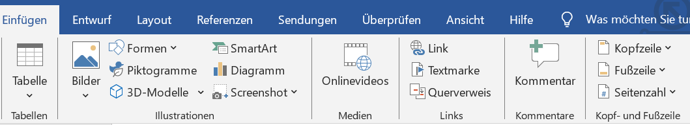

# Word

**Was wollen wir zeigen?**
<ul><u>Was für Funktionen sind vorhanden?</u></ul>

## Gliederung

- Formatierung
- Einsetzen
-   Bilder
-   Tabelle
-   Grafiken
-   SmartArt
- Inhaltsverzeichnis
- Zitierung
- Literaturverzeichnis
- Layout
- Überprüfung
- Ansicht

## Einsetzen
Bilder

Bilder werden eingefügt indem in der oberen Leiste auf Bilder 
