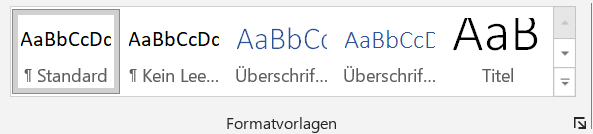
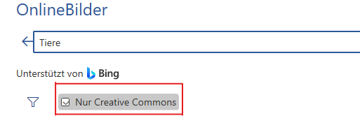

<!--
author: Von: Maria Schendel, Paula ...
Zweites Lernelement
link: css/callouts.css
-->

## 
Word

[Von: quinn.anya, Lizenz: CC BY-SA 2.0](https://live.staticflickr.com/5044/5251378117_d57920fe6e_b.jpg)

## 
Gliederung

{{1}}[**Einleitung**](#3 "Einleitung")

{{2}}[**Formatierung**](#4 "Formatierung")

{{3}}[**Einfügen von einzelnen Elementen**](#5 "Einfügen von einzelnen Elementen")

- **3.1 Bilder**
- **3.2 Tabelle**
- **3.3 Diagramme**
- **3.4 SmartArt**

{{4}}[**Inhaltsverzeichnis**](#10 "Inhaltsverzeichnis")

{{5}}[**Zitierung**](#11 "Zitierung")

- **5.1 Literatur- und Abbildungsverzeichnis**

{{7}}[**Layout**](#13 "Layout")

{{8}}[**Überprüfung**](#14 "Überprüfung")

{{9}}[**Ansicht**](#15 "Ansicht")

## 
1. Einleitung

**Welche Kompetenzen sind notwendig für das Studium in Word?**

Microsoft Word ist eines der wichtigstens Programme für das Arbeiten im schulischen oder studentischen Alltag, sowie im Berufsleben.

Grundlegend dient das Programm zur Verfassung von unterschiedlichen Textformen.

Wie z.B. das Erstellen von ...

- Dokumentationen

- Sachtexten 

- Listen 
etc.     

Nützliche Funktionen finden in Word Verwendung:

- Das Verfassen und Formatieren von Texten

- Erstellen eines Inhaltsverzeichnisses

- Individuelles erstellen und bearbeiten des Inhaltes 

> In den folgenden Seiten, werden wir Dir einen Einblick über bestimmte Funktionen in Word vorstellen.
> Bestenfalls können wir Dir damit eine Hilfestellung für zukünftige Arbeiten bieten. :-D

## 
2. Formatierung

Die Formatierung bildet die Grundlage für das Festlegen deiner Arbeit

Mögliche Funktionen, unter Reiter **Start**:

**1.** Individuelles gestalten der Typografie

**2.** Absatzmöglichkeiten

**3.** Formatvorlagen

---

**1.** 

**2.** 

**3.** 

## 
3. Einfügen von einzelnen Elementen

<!-- class = "callout info" -->
> Auf den nachfolgenden Seiten findest Du Informationen, wie Du einzelne Elemente in Dein Word-Dokument einfügen kannst. 

## 3.1 Bilder

1. In der oberen Leiste; Unter **Einfügen**

2. **Bilder**

3. **Zwei Auswahlmöglichkeiten**

- **Dieses Gerät** 

- **Online Bilder**

--- 

**Dieses Gerät**

**1.** Öffnung des Dateiordners 

**2.** Gewünschtes Bild auswählen und hochladen 

**Online Bilder**

**1.** Weiteres Fenster öffnet sich

**2.** Suchleiste oder vorgefertigte Bild-/Suchbegriffe

- Auswählen eines Bildes, inklusive mit Aktivierung der **Creative Common Lizenz**

## 3.2 Tabellen

Unter:

**1.** **Einfügen**

**2.** **Tabelle**

**2.1** Festlegen oder Auswählen der Anzahl von Spalten und Zeilen

**Bearbeiten der Tabelle**

**1.** Rechtsklick auf die Tabelle

- Einstellen von Farben, Rahmen oder Schattierung einer oder aller Spalten der Tabelle

**2.** **Tabellenentwurf**: Tabelle markieren oder anklicken

- Auswahl von Tabellenformatvorlagen

## 3.3 Diagramme

Diagramme verhelfen Daten oder Informationen eines Sachverhalts besser visualisiert darzustellen

**Einfügen** > **Diagramme**

- Neues Fenster öffnet sich, mit den unterschiedlichsten Diagrammen 

<!-- class = "callout warning" -->
> Beachte:
> 
Die Visualisierung sollte möglichst simple gestaltet sein!

Nach Einfügen eines Diagrammes:

- Zusätzliche Excel-Tabelle, für das Einfügen der Forschungsdaten

## 3.4 SmartArt

SmartArt bedient bereits generierte Grafiken in unterschiedlichen Gestaltungsformen

**Einfügen** > **SmartArt**

- Fenster öffnet sich mit vielen verschiedenen Auswahlmöglichkeiten

Weiterer Schritt:

- Anpassen der Farbe, Formatvorlage oder zusätzlichen Formen

## 
 4. Inhaltsverzeichnis

Automatisches Erstellen eines Inhaltsverzeichnis

Wechsel zum Reiter **Referenzen**

- Auf der linken Seite **Inhaltsverzeichnis** anklicken

Fehler oder Neuerungen im Inhaltsverzeichnis können durch die Funktion "Inhaltsverzeichnis aktualisieren" angepasst und verbessert werden 

<!-- class = "callout warning" -->
> Inhaltsverzeichnisse in Word basieren auf die Überschriften in einem Dokument

---

**Als Videoansicht vorgezeigt**
!?[alt](https://wus-streaming-video-rt-microsoft-com.akamaized.net/512b7857-1303-4e1b-9118-701e4f3edc8c/b430d3ad-e3ff-481f-a25d-ce002e51_6750.mp4)

[Link zum Video](https://support.microsoft.com/de-de/office/einfügen-eines-inhaltsverzeichnisses-882e8564-0edb-435e-84b5-1d8552ccf0c0#PickTab=Windows)

## 
5. Zitierung

Automatisches Erstellen von Zitaten oder Textabschnitten

Reiter:

1. **Referenzen**

2. **Zitat einfügen**

3. **Neue Quelle**

- Einfügen von wichtigen Informationen eines Zitates

4. **Formatvorlage**
-  Kann man sich einfach und übersichtlich ein Zitat mit einer direkten Verlinkung zum Inhaltsverzeichnis erstellen.

-> Verstehe ich nicht so ganz; Inhaltsverzeichnis??

<!-- class = "callout tip" -->
> Chicago dient als perfektes Format für das Zitieren

## 5.1 Literatur- und Abbildungsverzeichnis

- Für das Hinterlegen aller verwendeten Literaturquellen im Literaturverzeichnis

Reiter:

1. **Literaturverzeichnis**

- Auswählen einer Vorlage

2. **Zitate und Literaturverzeichnis** > **Quellen verwalten**

- Um neue Quellen hinzuzufügen oder eine bereits vorhandene zu bearbeiten
- Verwaltung der Quellen im neuen Tab

 Erstellen eines Abbildungsverzeichnisses

- **Referenzen** > **Beschriftung** 

- Gestalterische Bearbeitung des Abbildungsverzeichnisses, sowie Einfügen von Verlinkungen zum jeweiligen Bild

## 
6. Layout

Dient der Layouteinrichtung einer Seite

Mögliche Einstellungen

- Benutzerdefinierter Seitenrand, horizontales Blatt oder Bearbeiten der Spaltenansicht
 

Auf der linken Seite

1. Seitenränder oder Ausrichtungen

- Vorgefertigte Einstellungen werden angeboten

- Unter **Seitenränder** > **benutzerdefinierte Seitenränder** können eigene Werte eingetragen werden

Auf der rechten Seite

1. Absatz- und Einzugsblock

- Bearbeitung des Absatzes nach links, rechts oder nach oben und unten

## 
7. Überprüfung

Reiter **Überprüfen**:

- Unterstützung für das Schreiben eines Dokumentes

- Standardfunktionen:
Überprüfung der Rechtschreibung und Grammatik, oder Wörterzählen

<!-- class = "callout tip" -->
> Funktion;
>
> **Überprüfen** > **Sprache** > **laut vorlesen**
>
> verhilft durch das laute Aufsagen der Wörter oder Zeilen, Fehler aufzudecken 

Hilfestellung für Fremdsprachen

1. Unter **Sprache** 

- Zur Verfügung: **Übersetzen** und **Sprache**

**Sprache**: 

- Rechtschreib- und Grammatikprüfung kann in eine andere Sprache umgestellt werden

**Kommentar- und Änderungssektion**

- Dient als Hilfestellung für selbstständige Arbeiten, oder zur Kommunikation mit weiteren Personen

1. Kommentare bieten sich an für kleine Anmerkungen oder Notizen

- Falls im Dokument weitere Personen Änderungen vornehmen müssen

Einfügen der Kommentare:

**Überprüfung** > **Kommentare**

  

- Am Zeilenrand wird ein Kommentar angezeigt und kann bearbeitet oder gelöscht werden

- Jeder Kommentar wird je nach Person automatisch farblich markiert, für einen einheitlichen Überblick

2. Änderungssektion

-  ist vor allem dann interessant, wenn Du Veränderungen nicht sofort im Text umsetzen willst. Sei es in Einzel- oder Gruppenarbeiten. Die vorläufigen Änderungen können alle auf einmal angenommen oder abgelehnt werden.

-> Verstehe ich nicht so ganz
   

<!-- class = "callout info" -->
> Für das Freigeben des Dokumentes an anderen Personen
>
> **Freigeben** > **Freigabe** 
>
>**Beachte:**
>
> Das Dokument muss auf OneDrive gespeichert sein
>
> Die betreffende Person, der Du Dein Dokument freigibst, sollte nachdem Teilen eine E-mail erhalten
