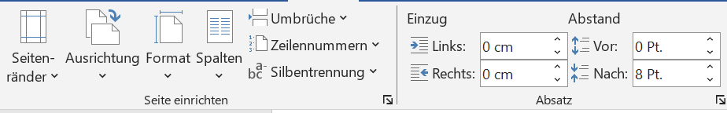
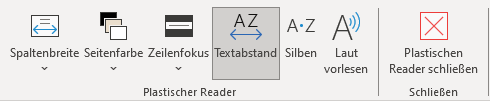

<!--
author: Von: Maria Schendel, Paula ...
Zweites Lernelement

link: css/callouts.css
-->

## 
Word

[Von: quinn.anya, Lizenz: CC BY-SA 2.0](https://live.staticflickr.com/5044/5251378117_d57920fe6e_b.jpg)

## 
Gliederung

{{1}}[**Einleitung**](#3 "Einleitung")

{{2}}[**Formatierung**](#4 "Formatierung")

{{3}}[**Einfügen von einzelnen Elementen**](#5 "Einfügen von einzelnen Elementen")

- **3.1 Bilder**
- **3.2 Tabelle**
- **3.3 Diagramme**
- **3.4 SmartArt**

{{4}}[**Inhaltsverzeichnis**](#10 "Inhaltsverzeichnis")

{{5}}[**Zitierung**](#11 "Zitierung")

- **5.1 Literatur- und Abbildungsverzeichnis**

{{7}}[**Layout**](#13 "Layout")

{{8}}[**Überprüfung**](#14 "Überprüfung")

{{9}}[**Ansicht**](#15 "Ansicht")

## 
1. Einleitung

**Welche Kompetenzen sind notwendig für das Studium in Word?**

Microsoft Word ist eines der wichtigstens Programme für das Arbeiten im schulischen oder studentischen Alltag, sowie im Berufsleben.

Grundlegend dient das Programm zur Verfassung von unterschiedlichen Textformen.

Wie z.B. das Erstellen von ...

- Dokumentationen

- Sachtexten 

- Listen 
etc.     

Nützliche Funktionen finden in Word Verwendung:

- Das Verfassen und Formatieren von Texten

- Erstellen eines Inhaltsverzeichnisses

- Individuelles erstellen und bearbeiten des Inhaltes 

> In den folgenden Seiten, werden wir Dir einen Einblick über bestimmte Funktionen in Word vorstellen.
> Bestenfalls können wir Dir damit eine Hilfestellung für zukünftige Arbeiten bieten. :-D

## 
2. Formatierung

Die Formatierung bildet die Grundlage für das Festlegen deiner Arbeit

Mögliche Funktionen, unter Reiter **Start**:

**1.** Individuelles gestalten der Typografie

**2.** Absatzmöglichkeiten

**3.** Formatvorlagen

---

**1.** 

**2.** 

**3.** 

## 
3. Einfügen von einzelnen Elementen

<!-- class = "callout info" -->
> Auf den nachfolgenden Seiten findest Du Informationen, wie Du einzelne Elemente in Dein Word-Dokument einfügen kannst. 

## 3.1 Bilder

1. In der oberen Leiste; Unter **Einfügen**

2. **Bilder**

3. **Zwei Auswahlmöglichkeiten**

- **Dieses Gerät** 

- **Im Web suchen**

--- 

**Dieses Gerät**

<Vielleicht dazu ein Screenshot einfügen>

**1.** Öffnung des Dateiordners 

**2.** Gewünschtes Bild auswählen und hochladen 

**Online Bilder**

**1.** Weiteres Fenster öffnet sich

**2.** Suchleister oder vorgefertigte Suchbegriffe

- Auswählen eines Bildes, inklusive mit Aktivierung der **Creative Common Lizenz**

## 3.2 Tabellen

Unter Reiter:

**1.** **Einfügen**

**2.** **Tabelle**

**2.1** Festlegen oder Auswählen der Anzahl von Spalten und Zeilen

**Bearbeiten der Tabelle**

**1.** Rechtsklick auf die Tabelle

<Screenshot einfügen>

**2.** Öffnung eines neuen Reiters:
**Tabellenentwurf**

- Einstellen von Farben, Rahmen oder Schattierung einer oder aller Spalten der Tabelle

## 3.3 Diagramme

Diagramme verhelfen Daten oder Informationen Deines Sachverhalts besser visualisiert darzustellen

Reiter
**Einfügen** > **Diagramme**

- Neues Fenster öffnet sich, mit den unterschiedlichsten Diagrammen 

<!-- class = "callout warning" -->
> Beachte: Die Visualisierung sollte möglichst simple gestaltet sein!

Nach Einfügen eines Diagrammes:

- Zusätzliche Excel-Tabelle, für das Einfügen der Forschungsdaten

## 3.4 SmartArt

SmartArt bedient bereits generierte Grafiken in unterschiedlichen Gestaltungsformen

Reiter:
**Einfügen** > **SmartArt**

- Fenster öffnet sich mit vielen verschiedenen Auswahlmöglichkeiten

<Screenshot dazu vielleicht?>

Weiterer Schritt:

- Anpassen der Farbe, Formatvorlage oder zusätzlichen Formen

## 
 4. Inhaltsverzeichnis

Automatisches Erstellen eines Inhaltsverzeichnis

Wechsel zum Reiter **Referenzen**

- Auf der linken Seite **Inhaltsverzeichnis** anklicken

 Bei Bedarf kann dieses auch aktualisiert werden. Man spart sich somit Zeit und vermeidet eventuelle Fehler. 

-> Was ist damit gemeint???

Einfügen des Textes im Inhaltsverzeichnis

- **Text einfügen**

<Eventuell ein Screenshot einfügen>

## 
5. Zitierung

Automatisches Erstellen von Zitaten oder Textabschnitten

Reiter:

1. **Referenzen**

2. **Zitat einfügen**

3. **Neue Quelle**

- Einfügen von wichtigen Informationen eines Zitates

<Zwischen den Punkten vll ein Screenshot einfügen>

4. **Formatvorlage**
-  kann man sich einfach und übersichtlich ein Zitat mit einer direkten Verlinkung zum Inhaltsverzeichnis erstellen.

-> Verstehe ich nicht so ganz; Inhaltsverzeichnis??

<!-- class = "callout tip" -->
> Chicago dient als perfektes Format für das Zitieren

## 5.1 Literatur- und Abbildungsverzeichnis

- Für das Hinterlegen aller verwendeten Literaturquellen im Literaturverzeichnis

Reiter:

1. **Literaturverzeichnis**

- Auswählen einer Vorlage

2. **Zitate und Literaturverzeichnis** > **Quellen verwalten**

- Um neue Quellen hinzuzufügen oder eine bereits vorhandene zu bearbeiten
- Verwaltung der Quellen im neuen Tab

<Vll ein Video einfügen>

 Erstellen eines Abbildungsverzeichnisses 
 
 - **Referenzen** > **Beschriftung** 
 - Gestalterische Bearbeitung des Abbildungsverzeichnisses, sowie Einfügen von Verlinkungen zum jeweiligen Bild

<Screenshot>

## 
6. Layout

Dient der Layouteinrichtung einer Seite

Mögliche Einstellungen

- Benutzerdefinierter Seitenrand, horizontales Blatt oder Bearbeiten der Spaltenansicht
 

Auf der linken Seite

1. Seitenränder oder Ausrichtungen

- Vorgefertigte Einstellungen werden angeboten

- Unter **Weitere** oder **Mehr** können eigene Einstellungen konfiguriert werden

<Eventuell Screenshot einfügen>

Auf der rechten Seite

1. Absatz- und Einzugsblock

- Bearbeitung des Absatzes nach links, rechts oder nach oben und unten

## 
7. Überprüfung

Reiter **Überprüfen**:

- Unterstützung für das Schreiben eines Dokumentes

- Standardfunktionen:
Überprüfung der Rechtschreibung und Grammatik, oder Wörterzählen

Tipp:
Es hilft ungemein, diese laut zu hören. Dir können so Fehler leichter auffallen, die Du vielleicht noch nicht entdeckt hast. Diese Funktion findest Du im Reiter bei **Überprüfen** > **Sprache** > **laut vorlesen**.

Hilfestellung für Fremdsprachen
1. Unter **Sprache** 

- Zur Verfügung: **Übersetzen** und **Sprache**

1.1 **Sprache**: Rechtschreib- und Grammatikprüfung kann in eine andere Sprache umgestellt werden

Anschließend gibt es noch die Kommentar- und Änderungssektion. Unter diesen kannst Du allein oder mit anderen Personen an einem Dokument arbeiten, ohne Euch gegenseitig im Weg zu stehen. 

1. Die Kommentare bieten sich besonders dann an, wenn man sich kleine Anmerkungen für später oder Notizen für andere Personen hinterlegen möchte. Zum Hinzufügen gehe im Reiter zum Punkt **Kommentare** und füge einen Kommentar am Zeilenrand hinzu. Achte darauf, mit der Maus in der richtigen Zeile zu sein. Anschließend wird der von Dir markierte Teil eingefärbt. So verliert niemand den Überblick. Natürlich kannst Du Deine Anmerkungen verändern, löschen oder bei Bedarf auf andere Kommentare reagieren.

  

2. Die Änderungssektion ist vor allem dann interessant, wenn Du Veränderungen nicht sofort im Text umsetzen willst. Sei es in Einzel- oder Gruppenarbeiten. Die vorläufigen Änderungen können alle auf einmal angenommen oder abgelehnt werden.
   

<!-- class = "callout tip" -->
> Um ein Dokument einer anderen Person freizugeben, klicke hierbei über dem Reiter auf **Freigeben** > **Freigabe**. Stelle dabei sicher, dass Dein Dokument auf OneDrive gespeichert ist. Die betreffende Person, der Du Dein Dokument freigibst, sollte nachdem Teilen eine E-mail erhalten.

<Das letzte Thema finde ich nicht besonders wichtig, vielleicht komplett entfernen?>
## 
8. Ansicht

Unter Ansicht kannst Du das Dokument Dir so anzeigen lassen, wie Deine Präferenzen sind. Im Reiter **Seitenbewegung** kannst Du festlegen, ob Deine Seiten im Dokument vertikal oder horizontal wie bei einem Buch angezeigt werden soll. 
Im **Lesemodus** kannst Du Dich, wie es der Name schon verrät, ganz aufs Lesen Deiner Arbeit konzentrieren. 

Der **Plastische Reader** bietet Dir neben der internen Veränderung der Seitenfarbe, dem Text- oder Spaltenabstand ebenso auch eine Silbentrennung an. Auch kannst Du den **Zeilenfokus** aktivieren. Dieser erlaubt Dir, Dich Zeile für Zeile in Deiner Arbeit vorzuarbeiten.

