<!--

author:   
email:
language: de
narrator: Deutsch Female

import:   https://github.com/liascript/CodeRunner

link: css/callouts.css
-->

# Lernwerkstatt IT-Kompetenzen<br><small>Ein Selbstlernkurs von Studierenden für Studierende der Informationswissenschaften</small>

## Gliederung

1. Word
2. Powerpoint
3. Excel
4. Rechtliches
5. Medienbearbeitung
6. Software
7. Hardware
8. Recherche
9. Soziale Kommunikative Kompetenzen
10. Problemlösung

<!---
Unter diesem Kommentar bitte Word einfuegen
-->

## Word

**Was musst Du fürs Studium in Word können?**

Ein großer Bestandteil wird das Arbeiten mit diversen Programmen sein. Eines der Wichtigsten ist hierbei Microsoft Word. Ob Texte, Inhaltsverzeichnisse oder Formatierungen, bei Word kann man so einiges professionell und individuell erstellen und bearbeiten. Um nicht alles umständlich herunterzuschreiben, bietet das MS-Office-Programm nützliche Funktionen für Deine zukünftigen Arbeiten.

Auf den nächsten Seiten wollen wir Dir daher einen kurzen Einblick über einige Funktionen bieten, die unserer Meinung nach Dir vieles erleichtern. Vielleicht kanntest Du sie noch nicht und wir können Dir helfen, ein kleines Stück besser mit Word umzugehen. 

*Zu jedem unserer Themen wird nur ein Beispiel gezeigt. Es gibt auch andere Möglichkeiten, die verschiedenen Funktionen zu benutzen. Werde kreativ und probiere sie einfach alle einmal aus.*

### Gliederung

{{1}}[**Formatierung**](#formatierung)

{{2}}[**Einfügen**](#einfügen)

- **Bilder**
- **Tabelle**
- **Diagramme**
- **SmartArt**

{{3}}[**Inhaltsverzeichnis**](#inhaltsverzeichnis)

{{4}}[**Zitierung**](#zitierung)

{{5}}[**Literaturverzeichnis & Abbildungsverzeichnis**](#literaturverzeichnis)

{{6}}[**Layout**](#layout)

{{7}}[**Überprüfung**](#überprüfung)

{{8}}[**Ansicht**](#ansicht)

### Formatierung

Einer der ersten Schritte zum Erstellen Deines Dokumentes, wird die Formatierung sein. Beim Reiter **Start** findest Du alle nötigen Funktionen, um die Grundlagen für Deine Arbeit festlegen zu können. Dazu gehören unter anderem Absätze, Formatvorlagen und die Schrift selbst.

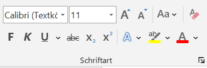

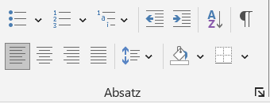

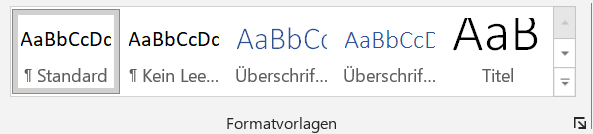

### Einfügen

Auf den nachfolgenden Seiten findest Du Informationen, wie Du einzelne Elemente in Dein Word-Dokument einfügen kannst. 

#### Bilder

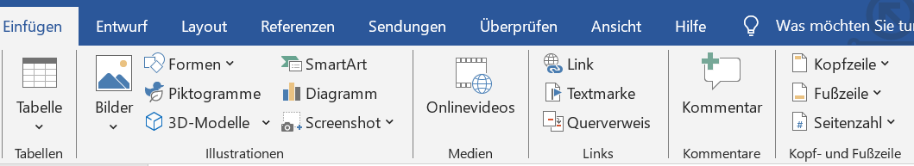

Bilder werden eingefügt, indem Du im Reiter auf **Bilder** klickst. Daraufhin öffnet sich ein Tab, bei dem Du auswählst: **dieses Gerät** oder **Onlinebilder**. 

**Dieses Gerät**

Zuerst öffnet sich der Dateiordner. Dort wird die Datei mit dem gewünschten Bild ausgewählt und geöffnet. 

**Online Bilder**

Hierbei öffnet sich ein weiteres Fenster. In welchem Du entweder über die Suchleiste oder aus vorgefertigten Suchbegriffen ein passendes Bild für Dein Dokument heraussuchst. Du kannst bei der Suche angeben, ob das Bild **Creative Common** sein soll oder nicht.

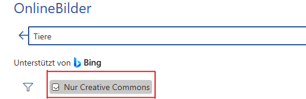

#### Tabelle

Tabellen werden eingefügt, indem im Reiter bei **Einfügen** auf die **Tabelle** geklickt wird. Daraufhin öffnet sich ein Tab, bei welchem Du die Anzahl Deiner Spalten und Zeilen auswählen musst.

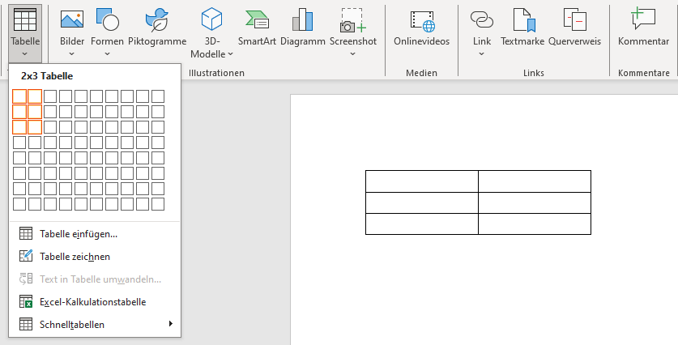

Danach besteht die Möglichkeit, durch Rechtsklick auf die Tabelle weitere Spalten und Zeilen unter **Einfügen** hinzuzufügen. Außerdem öffnet sich ein neuer Reiter **Tabellenentwurf**, dort können Farbe, Rahmen oder Schattierung einer oder aller Spalten der Tabelle angepasst werden.

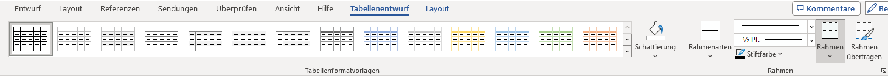

#### Diagramme

Die grafische Darstellung von Daten oder Informationen kann unter Umständen in Deiner Arbeit den Sachverhalt besser veranschaulichen. 
Den dazugehörigen Punkt findest Du im Reiter bei **Einfügen** > **Diagramme**. Damit sollte sich ein neues Fenster mit den unterschiedlichsten Diagrammen öffnen. 

<!-- class = "callout warning" -->
> Achte jedoch auf eine simple Gestaltung.

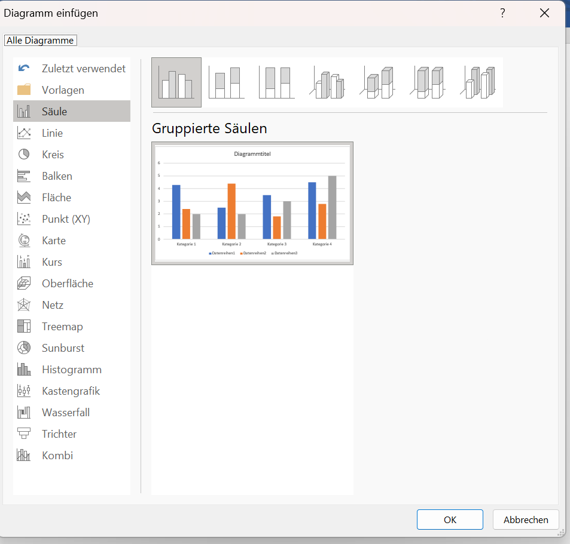

Hat man sich für ein Diagramm entschieden, öffnet sich eine zusätzliche Excel-Tabelle, in der Du Deine Forschungsdaten eintragen kannst. Diese werden dann im Diagramm veranschaulicht.

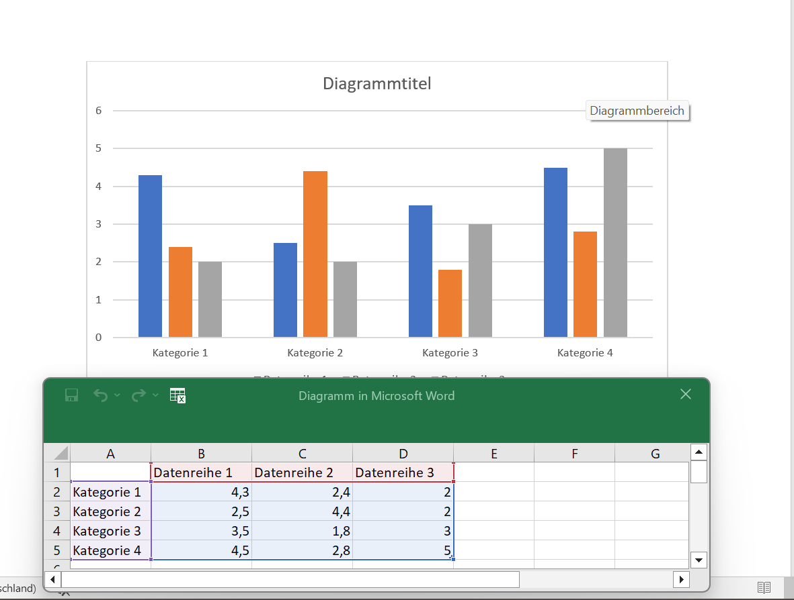

#### SmartArt

SmartArt ermöglicht eine visuelle Darstellung von Informationen und Bildern. Um sich eine SmartArt-Grafik zu erstellen und anschließend zu verwenden, muss man im Reiter auf **Einfügen** > **SmartArt** klicken. Danach öffnet sich ein Fenster mit vielen verschiedenen Auswahlmöglichkeiten, um seine Informationen perfekt für sich darstellen zu lassen.

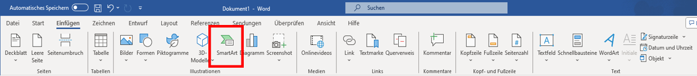

Als weiteren Schritt kann man gegebenenfalls seine Grafik nach seinen Vorstellungen anpassen, sei es durch Farbe, eine andere Formatvorlage oder zusätzlichen Formen. 

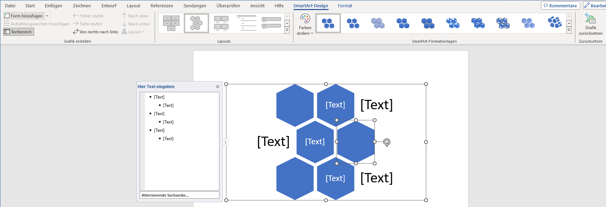

### Inhaltsverzeichnis

Um sich das Erstellen oder das Anpassen eines Inhaltsverzeichnisses zu erleichtern, hat Word eine nützliche Funktion für Dich.
Wechsel im Reiter zu **Referenzen**, dort findest Du ganz links die Funktion ein Inhaltsverzeichnis zu erstellen. Bei Bedarf kann dieses auch aktualisiert werden. Man spart sich somit Zeit und vermeidet eventuelle Fehler. Um seinen Text dem Inhaltsverzeichnis hinzuzufügen, muss man auf **Text einfügen** klicken. 

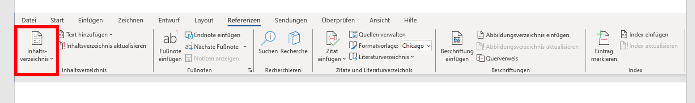

### Zitierung

Das Zitieren von Zitaten oder Textabschnitten ist für viele eine Königsdisziplin beim Erstellen der Arbeiten. Wenn man bei Word jedoch im Reiter auf **Referenzen** geht, findet man die Funktion **Zitat einfügen**. Unter **neue Quelle** kannst Du alle wichtigen Informationen bezüglich Deines Zitates hinzufügen. 
Mit der zusätzlichen Funktion **Formatvorlage** kann man sich einfach und übersichtlich ein Zitat mit einer direkten Verlinkung zum Inhaltsverzeichnis erstellen.

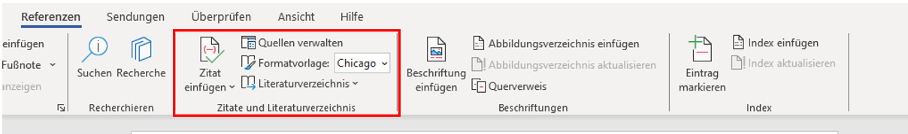

<!-- class = "callout tip" -->
> Unsere Format Empfehlung beim zitieren, wäre Chicago.

### Literaturverzeichnis & Abbildungsverzeichnis

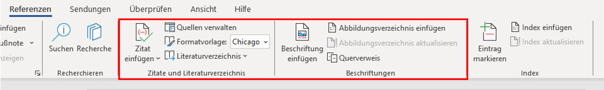

Im Literaturverzeichnis kann man natürlich nicht nur seine Zitate hinterlegen, sondern auch alle Literaturquellen, die man verwendet. Dafür erstellst Du Dir erst einmal ein leeres Literaturverzeichnis. Klicke im Reiter auf **Literaturverzeichnis** und sucht Dir erst einmal eine Vorlage aus.
Deine Quellen kannst Du bei Bedarf jederzeit aktualisieren. Um eine neue Quelle hinzuzufügen oder eine bereits vorhandene zu bearbeiten, klickt man auf **Zitate und Literaturverzeichnis** > **Quellen verwalten**. Im neuen Tab kannst Du dann beliebig Deine Quellen verwalten.

Auch das Erstellen eines Abbildungsverzeichnisses wird über den Reiter **Referenzen** > **Beschriftung** durchgeführt. Dabei kann man entscheiden, wie das Abbildungsverzeichnis aussehen und ob es gegebenenfalls Verlinkungen zum jeweiligen Bild geben soll.

### Layout

Solltest Du mal für eine Deiner Arbeiten einen benutzerdefinierten Seitenrand, ein horizontales Blatt oder vielleicht eine zwei Spaltenansicht benötigen, bist Du hier beim Layout genau richtig. 
Ganz links findest Du alles, was mit Seitenrändern oder Absätzen zu tun hat. Dir wird eine vielfältige Auswahl an vorgefertigten Einstellungen geboten. Solltest Du aber andere Vorstellungen oder Angaben haben, dann kann man sie ganz einfach unter **Weitere** oder **Mehr** selbst konfigurieren. 
Gleich daneben findest Du den Absatzblock. Dabei kannst Du bestimmen, wie weit Dein Absatz nach links, rechts, oben oder unten rücken soll. 

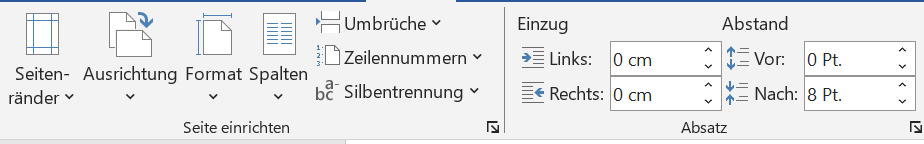

### Überprüfung

Unter dem Reiter **Überprüfen** befinden sich eine Vielzahl von Funktionen, die Dir eine optimale Unterstützung beim Schreiben Deines Dokumentes bieten können.
Neben den Standardfunktionen wie Rechtschreibung und Grammatik oder dem Wörterzählen kann Word Dir Deine geschriebenen Sätze laut vorlesen. Es hilft ungemein, diese laut zu hören. Dir können so Fehler leichter auffallen, die Du vielleicht noch nicht entdeckt hast. Diese Funktion findest Du im Reiter bei **Überprüfen** > **Sprache** > **laut vorlesen**.

Des Weiteren wollen wir Dir die mögliche Angst vor Fremdsprachen nehmen. Im Reiter unter **Sprache** hast Du die Funktionen **Übersetzen** und **Sprache** zur Verfügung. Gerade der zweite Punkt **Sprache** ist interessant, denn mit dieser Funktion kannst Du ganz einfach Deine Rechtschreib- und Grammatikprüfung in eine andere Sprache umstellen.

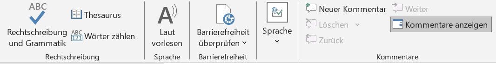

Anschließend gibt es noch die Kommentar- und Änderungssektion. Unter diesen kannst Du allein oder mit anderen Personen an einem Dokument arbeiten, ohne Euch gegenseitig im Weg zu stehen. 

1. Die Kommentare bieten sich besonders dann an, wenn man sich kleine Anmerkungen für später oder Notizen für andere Personen hinterlegen möchte. Zum Hinzufügen gehe im Reiter zum Punkt **Kommentare** und füge einen Kommentar am Zeilenrand hinzu. Achte darauf, mit der Maus in der richtigen Zeile zu sein. Anschließend wird der von Dir markierte Teil eingefärbt. So verliert niemand den Überblick. Natürlich kannst Du Deine Anmerkungen verändern, löschen oder bei Bedarf auf andere Kommentare reagieren.

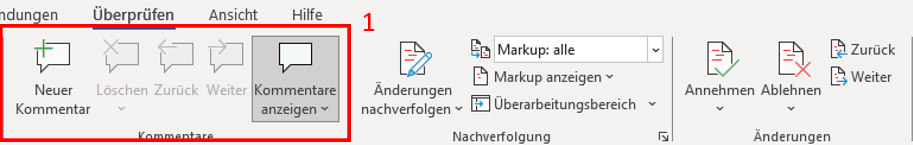  

2. Die Änderungssektion ist vor allem dann interessant, wenn Du Veränderungen nicht sofort im Text umsetzen willst. Sei es in Einzel- oder Gruppenarbeiten. Die vorläufigen Änderungen können alle auf einmal angenommen oder abgelehnt werden.
   
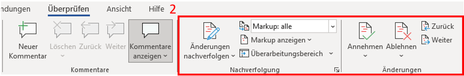

<!-- class = "callout tip" -->
> Um ein Dokument einer anderen Person freizugeben, klicke hierbei über dem Reiter auf **Freigeben** > **Freigabe**. Stelle dabei sicher, dass Dein Dokument auf OneDrive gespeichert ist. Die betreffende Person, der Du Dein Dokument freigibst, sollte nachdem Teilen eine E-mail erhalten.

### Ansicht

Unter Ansicht kannst Du das Dokument Dir so anzeigen lassen, wie Deine Präferenzen sind. Im Reiter **Seitenbewegung** kannst Du festlegen, ob Deine Seiten im Dokument vertikal oder horizontal wie bei einem Buch angezeigt werden soll. 
Im **Lesemodus** kannst Du Dich, wie es der Name schon verrät, ganz aufs Lesen Deiner Arbeit konzentrieren. 

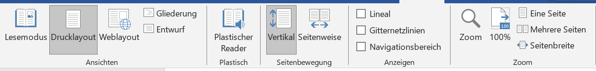

Der **Plastische Reader** bietet Dir neben der internen Veränderung der Seitenfarbe, dem Text- oder Spaltenabstand ebenso auch eine Silbentrennung an. Auch kannst Du den **Zeilenfokus** aktivieren. Dieser erlaubt Dir, Dich Zeile für Zeile in Deiner Arbeit vorzuarbeiten.

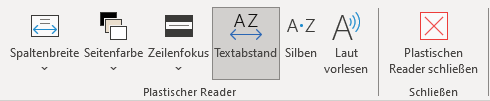

<!---
Unter diesem Kommentar bitte Powerpoint einfuegen
-->

## Powerpoint

---


[1. Abbildung](https://play.google.com/store/apps/details?id=com.microsoft.office.powerpoint&hl=de)

### Inhaltsverzeichnis

{{1}} **Einstieg**

- **1.1Festlegung der Kompetenz**

- **1.2 Fragestellung**

- **1.3 Allgemeines**

- **1.4 Ziel des Themas**


{{2}} **Einfügen von Sprechernotizen**

- **2.1 Referenzansicht**

- **2.2 Aktivierung der Referenzansicht**

- **2.3 Lösung als Videoansicht**

{{3}} **Erstellen von Animationen**

- **3.1 Animation von Bildern und Textfeldern**
   
- **3.2 Animation von Übergängen zwischen Folien**

{{4}} **Quellen**

### 1. Einstieg

**1.1 Festlegung der Kompetenz**

Für viele Studiumsbereiche sind gängige Programme, wie Microsoft-Programme notwendig, insbesondere um die Ergebnisse einer Arbeitsprobe zu erstellen und zu präsentieren. 

Die Festlegung der Kompetenzen im Bereich Softwareanwendungen, die im Kurs; _"Welche IT-Kompetenzen sind vorhanden oder müssen geschult werden"_, sind unter anderem; **Word**, **Excel** und **Powerpoint**.  

Im folgendem Beitrag haben wir uns mit der Kompetenz **"Powerpoint"** auseinander- gesetzt und uns jeweils auf ein bestimmtes Thema reduziert.  

---

**1.2 Fragestellung**

Wie sehr beschäftigst Du dich in Deinem Berufs- oder Alltagsleben mit dem Programm Powerpoint?


[(genügend)(ausreichend)(gar nicht)]
[                                  ] 


**Begründung**

[[______   ___   ___   ______]]

---

**1.3 Allgemeines**

Das Präsentationsprogramm von Microsoft:

- Gehört zum Microsofot-365-Abonnement
- Desktop-Version: Windows und macOS
- Mobile-Version: App für Android und iOS 
**Aktuellste Version**: PowerPoint 2019

---

**1.4 Ziel des Themas**

- Durch die Anwendung der Sprechernotizen in einer Powerpoint;

  - Karteikarten können vermieden werden

<!-- class = "callout info with-title" -->
> Zu beachten;
>
> Stichpunkte müssen lesbar, prägnant und kurz den Inhalt wiedergeben 

### 2. Einfügen von Sprechernotizen

---


[2. Abbildung](https://support.microsoft.com/de-de/office/hinzuf%C3%BCgen-von-sprechernotizen-zu-folien-26985155-35f5-45ba-812b-e1bd3c48928e#:~:text=Klicken%20Sie%20im%20Men%C3%BC%20Ansicht,Sie%20den%20gew%C3%BCnschten%20Notizentext%20ein)

- Notiz-Symbol neben **Kommentare** oder je nach Version neben **Anzeigeeinstellungen**


#### 2.1 Referenzansicht

**Während der Bildschirmpräsentation Notizen einsehbar**

---

**Unter:**
<lia-keep>
<!DOCTYPE html>
<html>
<body>
<center><table border></center>
<colgroup>
<col width=300>
<col width=300 align=char char=",">
</colgroup>
<tr>
<style type="text/css">
	th{ background-color:darkorange; }
</style>

	<th><center>Arbeitsschritte</center></th>
    <style type="text/css">
	th{ color:white; } 
    </style> 
	<th><center></center></th>
</tr>
<tr>
	<td><center><b>1.</b></center></td>
	<td><center>Von Beginn an</center></td>
</tr>

</tr>
<tr>
	<td><center><b>2.</b></center></td>
	<td><center>Drei-Punkte-Symbol</center></td>
</tr>

</tr>
<tr>
	<td><center><b>3.</b></center></td>
	<td><center>Referenzansicht zeigen</center></td>
</tr>
</table>
</body>
</html>
</lia-keep> 

---

**Beispiel:**


[3. Abbildung](https://support.microsoft.com/de-de/office/hinzuf%C3%BCgen-von-sprechernotizen-zu-folien-26985155-35f5-45ba-812b-e1bd3c48928e#:~:text=Klicken%20Sie%20im%20Men%C3%BC%20Ansicht,Sie%20den%20gew%C3%BCnschten%20Notizentext%20ein)

#### 2.2 Aktivierung der Referenzansicht

Unter Bildschirmpräsentation kann die **Referenzansicht aktiviert** werden


[4. Abbildung](https://support.microsoft.com/de-de/office/hinzuf%C3%BCgen-von-sprechernotizen-zu-folien-26985155-35f5-45ba-812b-e1bd3c48928e#:~:text=Klicken%20Sie%20im%20Men%C3%BC%20Ansicht,Sie%20den%20gew%C3%BCnschten%20Notizentext%20ein)

---

**2.3 Lösung als Videoansicht**

??[Tutorial](https://www.microsoft.com/de-de/videoplayer/embed/RWfkz0?pid=ocpVideo1-innerdiv-oneplayer&postJsllMsg=true&maskLevel=20&reporting=true&market=de-de " ")

1.Video: [Link zum Tutorial](https://www.microsoft.com/de-de/videoplayer/embed/RWfkz0?pid=ocpVideo1-innerdiv-oneplayer&postJsllMsg=true&maskLevel=20&reporting=true&market=de-de)


### 3. Erstellen von Animationen

---


[5. Abbildung](https://embed-ssl.wistia.com/deliveries/495e6ff8a0d973e9c08066e811bbeb25.jpg)

#### 3.1 Animation von Bildern und Textfeldern

- Headline Punkt "Animationen" anklicken
   
- Zu animierendes Objekt auswählen
  
  - Unter "Animation hinzufügen" gewünschte Animation auswählen
  
  - Optional; Reihenfolge der Animation hinzufügen

<!-- class = "callout tip" -->
> Benutzt die Reihenfolge von Animationen, um bestimmte Texte oder Bilder beim Präsentieren Stück für Stück einfliegen zu lassen


[6. Abbildung](https://cdn1.participoll.com/wp-content/uploads/2021/01/03123303/Leanne-screenshot-5.jpg)

#### 3.2 Animation/Übergänge zwischen Folien

   - Headline Punkt; Übergänge auswählen

   - Empfohlene/beliebte Übergänge werden oben vorgeschlagen

   - Übergang auswählen

   - Übergang wird im Präsentationsmodus beim Start der Folie benutzt

<!-- class = "callout tip" -->
> Versuche nicht zu viele verschiedene Übergänge zu benutzen sondern sich auf 2/3 festzulegen.

 

 [7. Abbildung](https://www.wirliebenoffice.de/images/content/tutorials/powerpoint/008-folienubergang-einfugen.png)

### 4. Quellen
---
**1.Quelle** 

- https://support.microsoft.com/de-de/office/hinzufügen-von-sprechernotizen-zu-folien-26985155-35f5-45ba-812b-e1bd3c48928e#:~:text=Klicken%20Sie%20im%20Menü%20Ansicht,Sie%20den%20gewünschten%20Notizentext%20ein

**2. Quelle**

- https://de.wikipedia.org/wiki/Microsoft_PowerPoint

<!---
Unter diesem Kommentar bitte Excel einfuegen
-->

## Excel-Formeln

<!-- class = "callout danger with-title" -->
> Mathehausaufgaben im Studium?
> 
>Für eine Hausaufgabe musst du mehrere mathematische Aufgaben lösen. Deine Dozentin gibt dir dafür eine Formel vor, welche du anwenden musst: "a²+b²=c²". So weit, so gut. Du versuchst die Aufgaben mit Stift, Papier und solarbetriebenem Taschenrechner zu lösen, doch bald verlierst du den Überblick. Schlimmer noch: die Ergebnisse deiner Rechnungen scheinen aufeinander aufzubauen und sobald sich an einer Stelle ein Fehler einschleicht musst du einen ganzen Rattenschwanz an Rechnungen noch einmal lösen! Außerdem musst du bei jeder neuen Aufgabe komplett von vorne anfangen zu rechnen. Na toll; jetzt geht die Sonne unter und der Taschenrechner funktioniert nicht mehr richtig. Der Stift ist auch abgebrochen. Geht das nicht mit dem Computer einfacher?


### Excel-Formeln

<!-- class = "callout tip with-title" -->
> Excel hilft bei komplizierten Formeln
> 
> Vor Mathe wirst du in den meisten Studiengängen nicht verschont bleiben. Dafür bietet dir die Fachhochschule Potsdam eine Lizenz für Microsoft 365, in welcher das Programm **Excel** enthalten ist. Sobald du den Status eines Studierenden hast, kannst du dir auf der Seite der Fachhochschule Zugang verschaffen, indem du diesem Link folgst:
https://www.fh-potsdam.de/campus-services/it-service/softwarelizenzen/microsoft-365

<!-- class = "callout Info with-title" -->
> Calc bietet eine Alternative
> 
>
Im Folgenden soll erklärt werden, wie du Formeln mit **Excel** löst, da du ohnehin als Studierender eine Lizenz bekommst. Falls du kein Fan von Windows bist kannst du alternativ auch mit dem Tabellenkalkulationsprogramm **Calc** von Libre Office arbeiten. Es funktioniert ähnlich, aber nicht exakt wie **Excel** und du kannst es unter folgenden Link herunterladen:
https://de.libreoffice.org/download/download/

### Excel-Formeln

Sobald du Excel öffnest siehst du eine große Tabelle. Die senkrecht verlaufenden **Spalten** sind mit Großbuchstaben gekennzeichnet. Die **Zeilen** werden mit Zahlen benannt. Eine einzelne **Zelle** ist ein Bereich, in welchem Spalte und Zeile sich schneiden. Entsprechend hat jede Zelle sozusagen eine Koordinate, welche aus dem Buchstaben der Spalte gefolgt von der Zahl der Zeile besteht (nicht umgekehrt!). Diese Namen der Zellen nennt man **Bezüge**, weil man sich innerhalb von Formeln so auf Zellen beziehen kann.

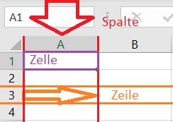

Um zu prüfen, ob du diese Benennungskonvetionen verstanden hast, ergänze den folgenden Text, welcher sich auf dieses Bild bezieht!

In rot gezeigt wird die Spalte [[  A  ]]. Orange ist die Zeile [[  3  ]]. Die lilane Zelle wird mit [[  A1  ]] gekennzeichnet.

<!-- class = "callout Info with-title" -->
> Dimsensionen der Excel Tabelle
> 
>Auf einem Tabellenblatt in Excel kannst du mit **1.048.576 Zeilen** und **16.384 Spalten** arbeiten. Das bedeutet, die Zelle, welche am weitesten unten rechts auf dem Tabellenblatt liegt heißt: **"XFD1048576"**!

### Excel-Formeln

Gehen wir ans Eingemachte! In unserem Beispiel sollen wir mit dem Satz des Pythagoras arbeiten. Dieser besagt:

`a²+b²=c²`

Mit dieser Formel werden die Längenverhältnisse der drei Seiten eines gleichschenkligen Dreiecks beschrieben. "a" und "b" sind die Längen der Seiten, welche den rechten Winkel bilden, die sogenannten Katheten. "c" beschreibt die Länge der gegenüberliegenden dritten Seite, der Hypotenuse. Der Zauber dieser Formel liegt darin, dass sie uns ermöglicht die unbekannte Länge einer Seite eines gleichschenkligen Dreiecks zu bestimmen, vorausgesetzt, dass die Längen der beiden anderen Seiten bekannt sind.


Deine Dozentin gibt dir verschiedene Werte für "a" und "b" vor, aus welchen du jeweils die Länge von "c" deduzieren sollen.

|    a |    b |    c |
| ---: | ---: | ---: |
| 14,8 |  9,7 |    ? |
|  4,6 | 22,4 |    ? |
| 34,2 | 52,6 |    ? |

In einer zweiten Aufgabe sollst du errechnen, welche Werte sich ergeben, wenn der Wert von "a" bleibt wie bei dem ersten Dreieck.

### Excel-Formeln

Um eine Excel-Formel einzuleiten müssen wir den Eintrag einer Zelle mit dem **Gleichheitszeichen (=)** beginnen.

 wird der Beginn einer Formel in einer Zelle markiert.")

Verschiedene **Operatoren** stehen uns in einer Formel zur Verfügung. Das sind im Grunde die selben Zeichen, welche wir auch im Matheunterricht kennengelernt haben:

| Operator | Allgemeine Bezeichnung |
| -------: | ---------------------: |
|      `+` |                 `Plus` |
|      `-` |                `Minus` |
|      `*` |                  `Mal` |
|      `/` |              `Geteilt` |
|      `<` |          `Kleiner als` |
|      `>` |           `Größer als` |
|      `^` |                 `Hoch` |

Nun haben wir in Zeile C2 schon etwas, was nach dem Satz des Phytagoras aussieht. In Zelle "A2" steht unser Wert für "a", in "B2" steht unser Wert für "b". "C2" Enthält unsere Formel und das Ergebnis von "a²+b²".

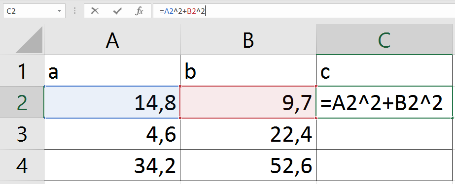

### Excel-Formeln

Doch gefragt ist nicht nach "c²"! Wir müssen noch eine Wurzel ziehen! Dafür müssen wir nicht nach einem Wurzel-Zeichen auf dem Keyboard suchen. Stattdessen klicken wir auf das **Formelzeichen (fx)** neben der Eingabezeile. Es erscheint ein Fenster, welches uns erlaubt aus allen **Funktionen** auszuwählen, welche Excel zu bieten hat.

Wir benötigen die **Funktion**

`=WURZEL()`

**Funktionen** beginnen immer mit einem Gleichheitszeichen und werden oft von Klammern gefolgt. 

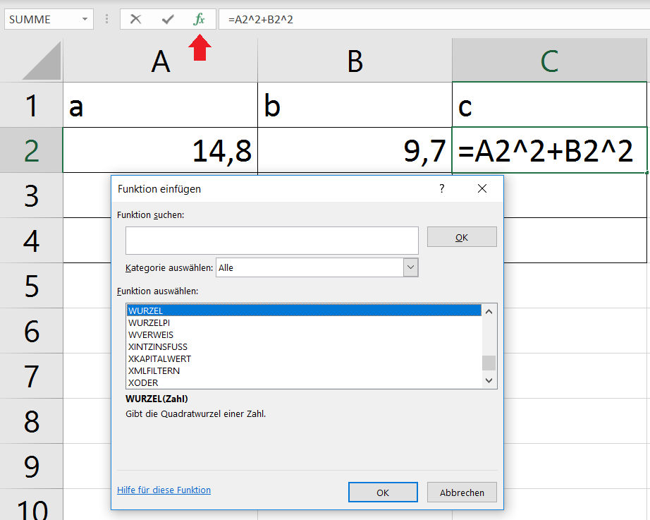

So haben wir endlich unsere Formel in Excel eingegeben!

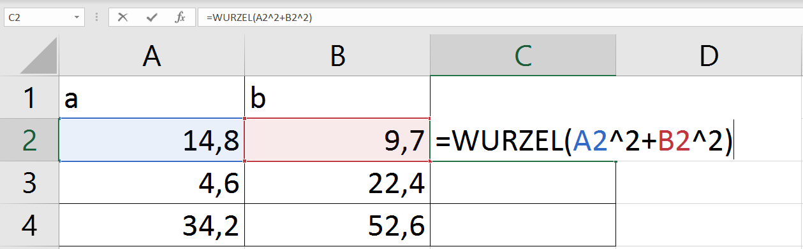

### Excel-Formeln

<!-- class = "callout danger with-title" -->
> Ist es mit Excel so viel einfacher?
> 
> Nun hast du einiges über Excel gelernt. Taschenrechner, Stift und Papier hast du gegen den PC getauscht. Aber war es vorher nicht einfacher? Der Taschenrechner hatte ein eigenes Wurzelzeichen und wenn die Sonne draufschien ist er einfach angegangen. Für Stift und Papier brauchtest du keine Kabel und Schaltkreise. Mit ihnen hättest du im tiefsten Wald oder auf dem höchsten Berg deine Aufgaben lösen können, kilometerweit von der nächsten Steckdose entfernt. Die Geheimnisse der Mathematik hätten sich dir mit Stift und Papier genauso erschlossen, wie einst Phytagoras vor tausenden von Jahren. Nun bist du abhängig von Strom, welcher lange nicht nachhaltig gewonnen werden kann. Dein Anspruch auf einen Computer macht dich mitverantwortlich dafür, dass irgendwo auf der Welt Menschen in gefährlichen Minen Kupfer und andere seltene Mineralien der Erde entreißen. Und du hast dich der Omnipräsenz von Microsoft unterworfen. Einem monopolistischen Riesen-Unternehmen, welches mehr Einfluss auf die globale Arbeitskultur hat, als die meisten Staaten. Zudem ist es auch gar nicht so leicht Excel zu lernen. Ist es das überhaupt wert?


### Excel-Formeln

Existenzkrise beiseite. Im nächsten Schritt sollte klar werden, warum du beim Rechnen mit Excel so viel Zeit sparen kannst! Wir haben auf "Enter" gedrückt und in Zelle "C2" wird endlich unser Ergebnis angezeigt!

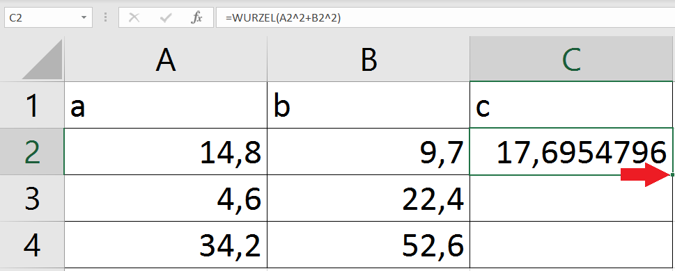

Wenn wir eine Zelle angewählt haben, erscheint diese grün umrandet. In der unteren, rechten Ecke der Zelle befindet sich dann ein kleines dunkelgrünes Quadrat. Unser Maus-Cursor wird zu einem kleinen schwarzen Kreuz, wenn wir sie über dieses Quadrat bewegen.


 Nun klicken wir mit der linken Maustaste auf das grüne Quadrat, ziehen den grünen Kasten die Spalte hinunter...

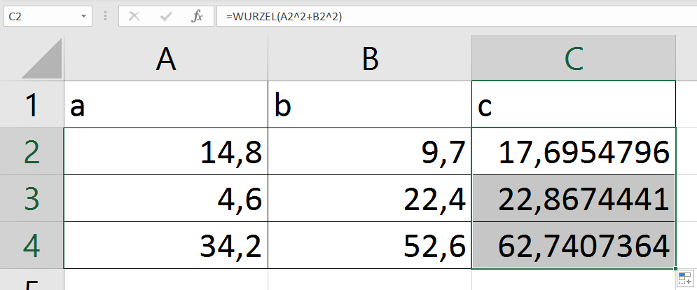

... et voila! Ohne viel Aufwand haben wir die Ergebnisse für die anderen Dreiecke ausgerechnet.

Nun steht in "C3"

`=WURZEL(A3^2+B3^2)`

und entsprechend in "C4"

`=WURZEL(A4^2+B4^2)`

Die Formel hat beim Ziehen ihre **Bezüge** geändert. Die anderen **Elemente** der Formel sind gleich geblieben: Die **Funktion "=Wurzel()"** ist geblieben, genauso wie die Operatoren **"+"** und **"^"**. Die **"2"** wird, wie alle anderen **Zahlen**, **Daten** und **Schriftzeichen** in einer Formel, **Konstante** genannt und verändert sich ebenfalls nicht beim Ziehen der Funktion. Nur die **Bezüge** auf andere Zellen. Dies ist einer der Gründe, warum es so praktisch ist, Excel zu lernen. Deine Dozentin kann dir hunderte Aufgaben mit der selben Formel stellen. Solange es nicht mehr als 1.048.576 sind, bedeutet das für dich mit Excel-Formeln kaum mehr Aufwand als eine einzige Aufgabe zu rechnen!

### Excel-Formeln

Ganz fertig sind wir allerdings noch nicht. Deine Dozentin will, dass du ausrechnest, welche Werte herauskämen, wenn der Wert "a" bliebe wie beim ersten Dreieck. Wir könnten alles noch einmal machen wie gehabt, nur dass wir statt "A2^2" in die Formel einen konstanten Wert schreiben, wie "14,8". Aber was, wenn in einem weiteren Schritt dieser Wert verändert werden soll und es eben auf den Bezug auf die Seite "a" des ersten Dreiecks ankommt?

Um die **Elemente** der Excel-Formeln abschließend zu meistern, müssen wir deshalb noch den Unterschied zwischen **absoluten Bezügen** und **relativen Bezügen** verstehen.

|                    | **relative Spalte** | **absolute Spalte** |
| -----------------: | ------------------: | ------------------: |
| **relative Zeile** |                `A1` |               `$A1` |
| **absolute Zeile** |               `A$1` |              `$A$1` |

Wie gehabt ergibt sich der Bezug auf eine Zelle aus einem (oder mehren) Großbuchstaben, welcher die Spalte kennzeichnet, gefolgt von einer Zahl für die Zeile. Bisher haben wir ausschließlich **relative Bezüge** verwendet. Schreiben wir jedoch ein **Dollarzeichen ($)** vor den Bezug zu der Spalte oder der Zeile, dann funktionieren diese Bezüge beim Ziehen einer Formel im Grunde wie Konstanten und bleiben gleich. Deswegen werden sie **absolute Bezüge** genannt. Ein Bezug kann beispielsweise einen relativen Spaltenbezug und eine absoluten Zeilenbezug aufweisen. Vier verschiedene Konfigurationen sind möglich wie in der Tabelle oben gezeigt wird.

Für unsere Aufgabe brauchen wir einen absoluten Bezug in der Spalte und der Zeile. Dafür tragen wir in die Formel jeweils ein Dollarzeichen ($) vor den Spaltenbezug und vor den Bezug zur Zelle "A2":

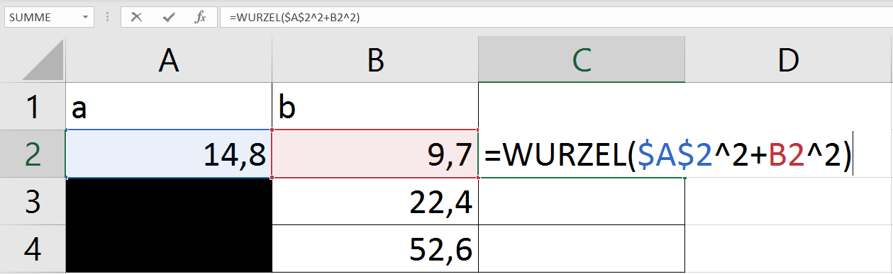

Wie gehabt ziehen wir die Formel, doch dieses Mal wird etwas anders sein. 

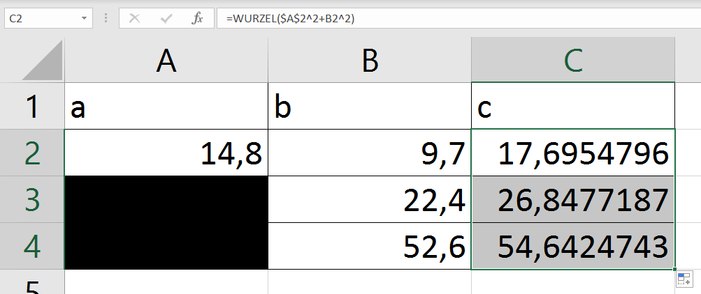

In "C3" steht nun:

`=WURZEL($A$2^2+B3^2)`

und in "C4" steht:

`=WURZEL($A$2^2+B4^2)`

Die **relativen Bezüge** auf die Werte in der Spalte "B" haben sich verändert, doch die **absoluten Bezüge** auf die Werte in Zelle "A2" sind gleich geblieben.

### Excel-Formeln

<!-- class = "callout danger with-title" -->
> Fast geschafft!
> 
> Du hast die Hausaufgaben deiner Dozentin erledigt. Doch um zu sehen, ob du die **Elemente der Excel-Formeln** erfolgreich gemeistert hast, trage die folgenden Begriffe fehlerfrei in den Lückentext ein! (Mit "Copy and Paste" geht es einfacher!)

<kbd>Operatoren</kbd><kbd>Konstanten</kbd><kbd>Bezüge</kbd><kbd>Funktionen</kbd><kbd>Elementen</kbd><kbd>relative</kbd><kbd>absolute</kbd>

Excel-Formeln bestehen aus verschiedenen [[  Elementen  ]]. [[  Funktionen  ]] beginnen immer mit einem Gleichheitszeichen (=). Einträge wie Zahlen, Texte oder Schriftzeichen verändern sich beim Ziehen einer Formel nicht und werden deshalb [[  Konstanten  ]] genannt. Im Gegensatz dazu verändern sich [[  relative  ]] [[  Bezüge  ]], sobald eine Funktion gezogen wird. Mit einem "$" gekennzeichnete [[  absolute  ]] [[  Bezüge  ]] widerum bleiben auch beim Ziehen einer Formel gleich. Mit [[  Operatoren  ]] können die verschiedenen Elemente einer Formel mathematisch oder logisch miteinander in Bezug gesetzt werden.

### Excel-Formeln

<!-- class = "callout Info with-title" -->
> Glückwunsch!
> 
> Du hast die **Elemente der Excel-Formeln** gemeistert!


### Quellen

Download-Link für Windows 365 von der FH Potsdam:

https://www.fh-potsdam.de/campus-services/it-service/softwarelizenzen/microsoft-365  (Stand 22.12.2023; 13:40 Uhr)

Download-Link für Libre Office:

https://de.libreoffice.org/download/download/ (Stand 22.12.2023; 13:40 Uhr)

Zu den Maßen einer Excel-Tabelle:

https://support.microsoft.com/de-de/office/spezifikationen-und-beschr%C3%A4nkungen-in-excel-1672b34d-7043-467e-8e27-269d656771c3

Zu der am weitesten unten rechts liegenden Zelle in Excel:

http://www.blaschke1.at/stammtisch/?p=518 (Stand 22.12.2023; 13:40 Uhr)

Die Microsoft-Support-Seite zum Thema "Excel-Formeln":

https://support.microsoft.com/de-de/office/%C3%BCbersicht-%C3%BCber-formeln-in-excel-ecfdc708-9162-49e8-b993-c311f47ca173 (Stand 22.12.2023; 13:40 Uhr)

<!---
Unter diesem Kommentar bitte Rechtliches einfuegen
-->

## Rechtliches

### Creative Commons

 {{|>}}
Creative Commons besteht aus sechs __Lizenzmodellen__, die Lizenzverträge darstellen, aus denen der Urheber eines Werks wählen kann. Der Unterschied zwischen diesen Lizenzmodellen besteht in der __Art und Anzahl der Rechte__, die eine Lizenz einem Nutzer einräumt.

{{|>}}
So unterscheidet sich beispielsweise die _Bedingungslose Lizenz_ von der _Attribution NonCommercial ShareAlike_, insofern, dass sie einem Nutzer mehr Rechte einräumt.

__Die Fragen, die eine Lizenz einem Nutzer beantwortet, sind also folgende:__

1. Was darf mit dem Werk passieren?
2. Was darf nicht mit dem Werk passieren?
3. Was muss angegeben werden, wenn das veränderte Werk veröffentlicht wird?

### Bedingungslose Lizenz


 {{|>}}
Mit der CC0 oder "Bedingungslose Lizenz" verzichtet ein Urherber weltweit auf alle möglichen Schutzrechte. 

Das Werk darf:

- kopiert
- verändert
- verbreitet
- aufgeführt
- für kommerzielle Zwecke verwendet werden,
ohne dass der Nutzer nach Erlaubnis fragen muss.

### Atribution


 {{|>}}
Die Lizenz "Attribution" (Namensnennung) ähnelt der "Bedingungslosen Lizenz", mit einigen Zusätzen.

Das Werk darf:

- kopiert
- verändert
- verbreitet
- aufgeführt
- für kommerzielle Zwecke verwendet werden,
ohne dass der Nutzer nach Erlaubnis fragen muss.

Zusätzlich müssen jedoch der __Urheber des ursprünglichen Werks__, sowie die __Anmerkungen von Veränderungen__ an dem Werk hinzugefügt werden.

### Attribution ShareAlike


 {{|>}}
Die Lizenz "Attribution ShareAlike" (Namensnennung und Weitergabe unter gleichen Bedigungen) ähnelt der "Attribution". Jedoch muss das Werk, welches durch Veränderung des Ursprungswerks entstanden ist, unter __derselben Lizenz__ weitergeführt werden, wie das Ursprungswerk.

Das Werk darf:

- kopiert
- verändert
- verbreitet
- aufgeführt
- für kommerzielle Zwecke verwendet werden,
ohne dass der Nutzer nach Erlaubnis fragen muss.

Zusätzlich müssen jedoch der __Urheber des ursprünglichen Werks__, sowie die __Anmerkungen von Veränderungen__ an dem Werk angegeben werden. Zudem muss das neu entstandene Werk unter derselben Lizenz wie das urpsprüngliche Werk veröffentlicht werden.

### Atribution NoDerivatives


 {{|>}}
Die Lizenz "Atrribution NoDerivatives" (Namensnennung, keine Bearbeitung) gibt Zugang zu vielen Rechten, schließt jedoch das Recht auf Veränderung aus.

Das Werk darf:

- kopiert
- verbreitet
- aufgeführt
- für kommerzielle Zwecke verwendet werden,
ohne dass der Nutzer nach Erlaubnis fragen muss.

Das Werk darf __nicht__:

- verändert werden

Zusätzlich muss jedoch der __Urheber des ursprünglichen Werks__ angeben werden.

### Attribution NonCommercial


 {{|>}}
Die Lizenz "Attribution NonCommercial" (Namensnennung, nicht kommerziell) gibt Zugang zu den meisten Rechten, schließt jedoch das Recht, das Werk für kommerzielle Zwecke zu verwenden, aus.

 Das Werk darf:

- kopiert
- verändert
- verbreitet
- aufgeführt werden

Das Werk darf __nicht__:

- für kommerzielle Zwecke verwendet werden

Zusätzlich müssen jedoch der __Urheber des ursprünglichen Werks__, sowie die __Anmerkungen von Veränderungen__ an dem Werk angegeben werden.

### Attribution NonCommercial ShareAlike


 {{|>}}
Die Lizenz "Attribution NonCommercial ShareAlike" (Namensnennung, nicht kommerziell, Weitergabe unter gleichen Bedingungen) ähnelt der Lizenz "Attribution NonCommercial". Jedoch muss das Werk, welches durch Veränderung des Ursprungswerks entstanden ist, unter __derselben Lizenz__ weitergeführt werden, wie das Ursprungswerk.

Das Werk darf:

- kopiert
- verändert
- verbreitet
- aufgeführt werden

Werk darf __nicht__:

- für kommerzielle Zwecke verwendet werden

Zusätzlich müssen jedoch der __Urheber des ursprünglichen Werks__, sowie die __Anmerkungen von Veränderungen__ an dem Werk angegeben werden. Zudem muss das neu entstandene Werk unter derselben Lizenz wie das urpsprüngliche Werk veröffentlicht werden.

### Attribution NonCommercial NoDerivatives


 {{|>}}
Die Lizenz "Attribution NonCommercial NoDerivatives" (Namensnennung, nicht kommerziell, keine Bearbeitung) gibt Zugang zu einigen Rechten, schließt jedoch das Recht, das Werk zu verändern, sowie es für kommerzielle Zwecke zu verwenden, aus.

Das Werk darf:

- kopiert
- verbreitet
- aufgeführt werden

Das Werk darf __nicht__:

- für kommerzielle Zwecke verwendet
- verändert werden

Zusätzlich muss jedoch der __Urheber des ursprünglichen Werks__ angeben werden.

### Übung

Welche Rechte ermöglicht die CC0 Lizenz?

> **Mehrere Optionen möglich!**

[[X]] Vervielfältigung
[[X]] Verbreitung
[[X]] Vorführung
[[X]] Verarbeitung
[[X]] Kommerzielle Nutzung

### Übung 2

Was unterscheidet die Attribution-Lizenz von der Bedingungslosen Lizenz?

[( )] Dass das Werk nicht für kommerzielle Zwecke verwenden darf.
[(X)] Dass man den Urheber des ursprünglichen Werks angeben muss.
[( )] Dass man das Werk nicht verändern darf.

### Übung 3

Was bedeutet der Ausdruck "ShareAlike" in einer Lizenz?

[( )] Dass man das ursprüngliche Werk unverändert teilen darf.
[(X)] Dass man das erstellte Werk unter derselben Lizenz weitergeben muss, wie das Werk, welches man verwendet hat.
[( )] Dass das erstellte Werk dem ursprünglichen Werk sehr ähnlich sein muss.
[( )] Dass das erstellte Werk dem ursprünglichen Werk nicht sehr ähnlich sein muss.

### Übung 4

Eine Studentin würde gerne ein Bild verwenden, indem sie es verändert und in eine Powerpoint-Präsentation einfügt und vor einigen Zuschauern zeigt. Welche Lizenz müssten für das Bild gelten, damit sie es verwenden könnte?

> **Mehrere Optionen möglich!**

[[X]] CC0 Bedingungslose Lizenz
[[X]] Atrribution
[[X]] Attribution ShareAlike
[[ ]] Atrribution NoDerivatives
[[X]] Attribution NonCommercial
[[X]] Attribution NonCommercial ShareAlike
[[ ]] Attribution NonCommercial NoDerivatives

<!---
Unter diesem Kommentar bitte Medienbearbeitung einfuegen
-->

## Medienbearbeitung

### Erstellung einer komprimierten ZIP-Datei

{{|>}}

_Warum sind kompromierte Dateien sinnvoll?_

Im Studium begegnet einem immer wieder die Herausforderung, Dateien mit dem Lehrpersonal oder anderen Studierenden zu teilen. Um die Weiterleitung von mehreren Dateien zu erleichtern, besteht die Möglichkeit, ein kompromiertes Archiv zu erstellen. Dieses Archiv dient als eine Art Container und kann mehrere Dateien komprimiert und ohne Qualitätsverlust in einem Ordner zusammenfassen, der ressourcensparend mit anderen geteilt werden kann.

{{|>}}

_Dateiformate_

Dateien können in verschiedenen Formaten komprimiert werden. Ein gängiges Format ist ZIP (aus dem Englischen "zipper" für Reißverschluss), dessen Handhabung wir uns im Folgenden genauer anschauen werden. Weitere gängige Formate sind RAR oder TAR.

{{|>}}

_Programme_

Die Funktion, ein Archiv zu erstellen, ist durch jedes Betriebsystems gewährleistet. Weitere Funktionen, wie z.B. die Verschlüsselung von Archiven mit Passwörtern, werden durch herunterladbare Programme unterstützt. Freie Programme sind z.B. Info-ZIP, PeaZip, Xarchiver und 7-Zip, kommerzielle Programme z.B. WinRAR und WinZIP.

#### Windows

{{|>}}

_Anleitung_

1. Markiere mindestens zwei Dateien, die Du zippen möchtest.
2. Drücke Rechtsklick und wähle die Option "Senden als" aus.
3. Unter den Sendeoptionen wählst Du "ZIP-komprimierter Ordner" aus.
4. Bennene Deine ZIP-Datei. Danach ist sie bereit zum Teilen.

{{|>}}

_Hinweis_

Solltest Du eine Datei vergessen haben, kannst Du sie ganz einfach über Drag & Drop in den komprimierten Ordner ziehen und so nachträglich zum Archiv hinzufügen. Um einen ZIP-Ordner wieder zu entpacken, rufe mit Rechtsklick das Kontextmenü auf und wähle die Aktion "Alle extrahieren...", um einen Zielpfad anzugeben.

#### Mac OS

{{|>}}

_Anleitung_

1. Markiere mindestens zwei Dateien, die Du zippen möchtest.
2. Drücke Rechtsklick und wähle die Option "X Objekte komprimieren" aus.
3. Im selben Ordnen befindet sich jetzt ein Ordner namens "Archiv.zip", der Deine kompromierten Dateien enthält. Du kannst dieses ZIP-Archiv beliebig umbenennen.
4. Um ein ZIP-Archiv zu entpacken, ist lediglich ein Doppelklick auf den Ordner nötig.

{{|>}}

_Hinweis_

1. Um ein ZIP-Archiv wieder zu entpacken, drücke mit der rechten Maustaste auf den betreffenden Ordner.
2. Wähle im Kontextmenü "Öffnen mit" und schließlich die Option "Archivierungsprogramm (Standard)" aus.
3. Die Dateien aus dem ZIP-Archiv werden im selben Pfad entpackt.

#### Linux

{{|>}}

_Anleitung_

1. Rufe die gewünschten Dateien im Dateiexplorer auf und markiere sie.
2. Drücke Rechtsklick und wähle die Aktion "Komprimieren" im Kontextmenü auf.
3. Als Letztes kannst Du einen Dateinamen und den Zielort auswählen.

_Hinweis_

Um eine Archivdatei wieder zu entpacken, wähle mit Rechtsklick die Aktion "Hier entpacken" im Kontextmenü aus.

#### Quellen
1. https://www.giga.de/extra/linux/tipps/linux-archive-zip-tar-gz-erstellen-oeffnen-und-entpacken-so-gehts/
2. https://support.apple.com/de-de/guide/mac-help/mchlp2528/mac
3. https://support.microsoft.com/de-de/windows/zippen-und-entzippen-von-dateien-8d28fa72-f2f9-712f-67df-f80cf89fd4e5

#### Übung

{{|>}}

Um das Zippen und Entzippen einer Containerdatei zu üben, wähle zwei oder mehrere beliebige Testdateien aus und führe sie nach den obigen Anleitungen zusammen. Vergleiche die Dateigrößen mit der letztendlichen Größe des ZIP-Archivs.

<!---
Unter diesem Kommentar bitte Software einfuegen
-->

## Software

 von [jepoirrier](https://www.flickr.com/photos/jepoirrier/), lizensiert unter [CC BY-SA 2.0](https://creativecommons.org/licenses/by-sa/2.0/).")

In disem Kapitel geht es ganz allgemein um verscheiden Aspekte von Software, die nicht unmittelbar einen konkreten Anwendunsgfall betreffen, aber troztdem bei der Auswahl und Anwendung Software berücksichtigt werden sollten.

### Hallo Welt

 von [dagadele](https://www.deviantart.com/dagadele/gallery)")

Software ist eine Ansammlung von Anweisungen, die in einer **Programmiersprachen** geschrieben werden.  Diese Anweisungen bilden Programme, die Computer ausführen, um bestimmte Aufgaben zu erledigen. Software reicht von Betriebssystemen bis zu Anwendungsprogrammen und ermöglicht die **Interaktion von Benutzern mit Computern**. Oftmals erfolgt die Interaktion über eine Grafische Benutzeroberfläche (GUI).

> The first program to write is the same for all languages:<br>
> *Print the words*<br>
> `hello, world`
>
> -- Brian Kernighan, Dennis Ritchie; The C Programming Language, 1st Edition (1978); Prentice Hall

Nahezu jedes Lehrbuch zu einer beliebigen Programmierspache und jedes Tutorial da draußen fängt mit einem ”hello, world“ Beispiel an. (Eine Ausnahme Bilden JavaScript Frameworks, dort sind es [“ToDo” Apps](https://todomvc.com). 😅) Das war schon in den 70ern so und hat sich bis heute nicht geändert. In der [Hello World Collection](http://helloworldcollection.de) sind 603 Beispiele gesammelt, in [diesem GitHub repository](https://github.com/leachim6/hello-world) sind es sogar 1000.

### I/O Beispiel

In diesem Beispiel wird ein Text ausgegeben, der eine Variable enthält. Dieser Variable wird von dir (dem Benuzter) ein Wert zugewiesen. Das nennt man eine **Benutzereingabe**. Eingaben (Input) werden verarbeitet um eine **Ausgabe** (Output) zu erzeugen. Dieser Prozess ist als **I/O** bekannt und ist fundamental für Software Anwendungen. In unserem Beispiel erfolgt die Eingabe direkt im Code, sie könnte aber genauso gut durch das Ausfüllen eines Textfeldes oder das Auslesen einer Datei erfolgen.

``` javascript
const myName = '<NAME>';

const greeting = `Hello, world!\nMy name is ${myName}.`;
const promptForName = 'Bitte gib deinen Namen in dem Script ein.';
const message = myName === '<NAME>' ? promptForName : greeting;

message;
```
<script>@input</script>

{{1}} Führe das Script aus, indem du auf den runden Button links unter dem Code klickst.

{{2}} Ersetze in der 1. Code-Zeile den Wert `<NAME>` mit deinem Namen.

{{3}} Führe das Script erneut aus vergleiche die Ausgabe.

{{4}} Versuche den Code so zu verändern, dass du eine Fehlermeldung als Ausgabe erhältst.

<!-- class = "callout info with-title" -->
> Des Pudels Kern
> 
> Eingaben beeinflussen das Verhalten von Software und können u.U. auch zu Fehlern führen.

### Bugs

 von [keith](https://www.techtravels.org/author/keith/)")

Ein **Bug** (Englisch für Käfer) in der Software ist ein **Fehler oder eine unerwünschte Fehlfunktion**, die dazu führt, dass das Programm nicht wie beabsichtigt arbeitet. Bugs können verschiedene Ursachen haben, darunter Programmierfehler, unerwartete Eingaben (wie in userem I/O Beispiel) oder Inkompatibilitäten zwischen verschiedenen Softwarekomponenten.

<!-- class = "callout info with-title" -->
> Fun Fact
>
> 1947 wurde [der erste *echte* Bug in einem Computer](https://education.nationalgeographic.org/resource/worlds-first-computer-bug/) identifizert. Eine Motte verursachte Fehler in einem Computer and der Harvard Universiät.

Früher oder später wird dir bei der Verwednung von Software eine Fehlermeldung begegnen oder irgendetwas funktioniert einfach nicht. Wenn du Glück hast waren die Programmierer so nett in der Meldung zu beschreiben was du tun kannst um den Fehler zu beheben. Wenn du Pech hast bekommst du einfach nur kryptischen Informationsmüll und ggf. eine Nummer.

Welche der folgenden Maßnahmen erscheinen dir sinnvoll wenn dir ein Fehler in einer Software begegnet?

- [[x]] Den Fehler an die Entwickler melden
- [[ ]] Mich im Netzwerk meiner Wahl laut beschweren
- [[ ]] An etwas anderem arbeiten und hoffen, dass der Fehler nächste Woche vershwunden ist
- [[x]] In der Hilfe oder Dokumentation der Software nach einer Lösung suchen
- [[x]] Die Version der Software überprüfen und ggf. eine aktuelle installieren

### Datenschutz & Datensicherheit

In einer Welt, die von digitaler Vernetzung geprägt ist, und in der Software allgegenwärtig ist, wird der Schutz von Daten und Systemen zunehmend zu einer Priorität. Je komplexer ein System ist, umso mehr Angriffsvektoren ergeben sich. Gleichfalls steigt die Wahrscheinlichkeit, dass Fehler ([siehe Bugs](#bugs)) bei der Programmierung von Software und der Wartung von Systemen gemacht werden.

Neben technischen Aspekten spielt Vertrauen eine entscheidende Rolle im Bezug auf Sicherheit im digitalen Raum. Wir teilen alle möglichen Arten von Infomationen miteinander aus, aber auch mit Systemen wie z.B. Online-Platformen. Unternehmen und Organisationen müssen Vertrauen durch transparente Datenschutzrichtlinien ([Datenschutz-Grundverordnung (DS-GVO)](https://www.bmj.de/DE/themen/digitales/DSGVO/DSGVO_node.html)), sichere Übertragungen ([Ende-zu-Ende-Verschlüsselung](https://de.wikipedia.org/wiki/Ende-zu-Ende-Verschlüsselung)) und robuste Sicherheitsmaßnahmen aufbauen.

<!-- class = "callout danger" -->
> Vertauen ist gut, Misstrauen ist besser.

Es ist wichtig, dass Nutzer eine gesunde Skepsis und kritische Haltung bewahren. Blindes Vertrauen in Online-Dienste oder  Software kann zu Sicherheitsrisiken oder Datenverlust führen. Es ist ratsam, sich über die Sicherheitspraktiken der genutzten Plattformen zu informieren, regelmäßig Passwörter zu aktualisieren, Backups anzulegen und auch mal zu überprüfen, ob eigene Daten in einem der zahlreichen Datenlecks enthalten sind.

<!-- class = "callout tip" -->
> Auf der Seite [';--have i been pwned?](https://haveibeenpwned.com) kannst du überprüfen, ob deine E-Mail-Adresse in einem Datenleck enthalten war.

### Software für offene Beziehung gesucht

 von [Gulia](https://www.flickr.com/photos/rocksrain/) lizensiert unter [CC BY 2.0](https://creativecommons.org/licenses/by/2.0/)")

Der Begriff **"offen"** im Kontext von Software kann verschiedene Bedeutungen haben. Einerseits bezieht es sich auf **Open Source-Software**, bei der der Quellcode für die Öffentlichkeit zugänglich ist, was es interessierten ermöglicht, sie zu überprüfen, zu modifizieren und zu teilen. Andererseits kann "offen" bedeuten, dass eine Software **interoperabel** und mit anderen Systemen **kompatibel** ist. "Offen" kan auch bedeuten, dass eine Software **erweiterbar** ist oder schlicht und einfach, dass deine Daten jederzeit für dich **zugänglich** sind.

#### Walled Gardens

Der Begriff "Walled Garden" bezieht sich auf eine geschlossene und kontrollierte Umgebung, insbesondere im Bereich der Software oder Online-Dienste. In einem "Walled Garden" kontrolliert ein Unternehmen oder eine Plattform den Zugang zu Inhalten, Anwendungen oder Diensten, indem es restriktive Maßnahmen implementiert. Dies kann dazu führen, dass Benutzer innerhalb der Plattform eingeschränkt sind und nur auf vordefinierte Inhalte oder Anwendungen zugreifen können. Typische Beispiele für "Walled Gardens" sind **geschlossene App Stores** oder Plattformen, die ihre eigenen Inhalte und Anwendungen bevorzugen und den **Zugang zu externen Quellen beschränken**.

Eine solche Umgebung hat Vorteile genauso wie Nachteile. Wie schätzt du die Apsekte in der folgenden Tabelle ein? 

- [[Vorteil] [Nachteil] [Beides]]
- [    [x]           [ ]             [ ]     ]  Sicherheit und Zuverlässigkeit
- [    [ ]           [x]             [ ]     ]  Zensurpotential
- [    [x]           [ ]             [ ]     ]  Konsistenz und Kompatibilität
- [    [ ]           [ ]             [x]     ]  Strenge Richtilinen und Kontrolle

#### Vendor lock-in

 von [Rob Pongsajapan](https://www.flickr.com/photos/pong/) lizensiert unter [CC BY 2.0](https://creativecommons.org/licenses/by/2.0/)")

"Vendor lock-in" bezieht sich auf die Situation, in der ein Anwender so stark von einem bestimmten Anbieter (Vendor) abhängig ist, dass es schwierig oder kostspielig wird, zu einem anderen Anbieter zu wechseln.

Die Abhängigkeit kann verschiedene Formen annehmen, einschließlich

- proprietäre Datenformate
- spezifischer Schnittstellen
- individueller Softwarelösungen

Es macht also Sinn, sich ein wenig mit der Software auseinander zu setzten, bevor du sie intensiv nutzt. 

<!-- class = "callout tip" -->
> Wenn eine Software den Import und Export von Daten zulässt ist das schon mal ein gutes Zeichen.

#### Open-Source Software

 von [opensourceway](https://www.flickr.com/photos/opensourceway/) lizensiert unter [CC BY-SA 2.0](https://creativecommons.org/licenses/by-sa/2.0/)")

Es muss nicht immer die vorinstallierte App von Microsoft oder Apple sein. Open-Source Software (OSS) bietet eine Reihe von Vorteilen:

1. **Kosten:**
   - Die Nutzung von Open-Source Software ist oft kostenfrei.

2. **Anpassbarkeit und Flexibilität:**
   - Der Quellcode von Open-Source Software ist offen und kann von Entwicklern angepasst werden. Dies ermöglicht eine hohe Flexibilität und die Anpassung an individuelle Anforderungen.

3. **Transparenz:**
   - Die Offenlegung des Quellcodes fördert Transparenz und ermöglicht eine Überprüfung auf Sicherheitslücken oder unerwünschte Funktionen durch die Gemeinschaft.

4. **Gemeinschaftsgetriebene Entwicklung:**
   - Open-Source-Projekte werden oft von einer breiten Gemeinschaft von Entwicklern unterstützt. Dies fördert eine kollaborative Entwicklungsumgebung und den Austausch von Wissen.

5. **Sicherheit:**
   - Durch die Beteiligung der Gemeinschaft an der Überprüfung und Verbesserung des Codes kann die Sicherheit von Open-Source Software oft schneller und effektiver gewährleistet werden.

6. **Unabhängigkeit von einem Anbieter (Vendor):**
   - Open-Source Software reduziert das Risiko von "Vendor lock-in", da Nutzer nicht an einen bestimmten Anbieter gebunden sind und den Quellcode selbst kontrollieren können.

7. **Langfristige Verfügbarkeit:**
   - Die Offenheit des Quellcodes trägt dazu bei, dass Softwareprojekte auch dann fortgesetzt werden können, wenn der ursprüngliche Entwickler oder Anbieter das Projekt nicht mehr unterstützt.

8. **Globale Zusammenarbeit:**
   - Open-Source-Projekte ermöglichen es Entwicklern weltweit, zusammenzuarbeiten und innovative Lösungen zu schaffen, was zu einer breiten Vielfalt von Ideen und Perspektiven führt.

<!-- class = "callout success" -->
> Open-Source Software ist toll!

**ABER**

<!-- class = "callout warning" -->
> Achte darauf, aus welcher Quelle du Software installierst.

<!---
Unter diesem Kommentar bitte Hardware einfuegen
-->

## Hardware

Hardware beschreibt die physischen Komponenten von datenverarbeitenden Systemen z.B.: Computern oder Smartphones.


### 1. USB-Sticks

Es gibt viele verschiedene Arten von USB-Sticks die sehr unterschiedliche Verwendungszwecke haben. Zum Beispiel sind USB-Sticks in der Lage eine Bluetooth-Maus mit dem Computer zu verbinden oder
dem Computer Zugang zum Internet zu gewähren. Doch der wohl am häufigsten verwendete USB-Stick ist der USB-Speicherstick. Dieser fungiert als eine kleine externe Festplatte, die dazu in der Lage ist mehrere
GB Daten zu speichern. USB-Speichersticks sind dazu in der Lage große Mengen an Daten zwischen zwei Geräten zu tauschen. Allerdings kann es zu Problemen führen, wenn der USB-Speicherstick nur von einem der beiden Geräte gelesen werden kann.

#### USB-Sticks Formatieren

Einen USB-Stick zu formatieren ist keine schwere Aufgabe. Vorher sollte sichergestellt werden, dass keine wichtigen Daten auf dem Stick vorhanden sind, da beim Formatieren alle Daten verloren gehen.

1. Gehe im Datei-Explorer mit Rechtsklick auf den USB-Stick
2. Wähle *Formatieren* aus
3. im letzten Schritt muss ein Dateisystem ausgewählt werden. Hierbei empfiehlt sich FAT32, da es von vielen verschiedenen Systemen gelesen werden kann.

### 2. Anschlüsse

Hinter welchem der folgenden Kürzel versteckt sich kein Computeranschluss?

[[ ]] VGA 
[[ ]] HDMI
[[ ]] AUX
[[ ]] LAN
[[x]] MDMA
[[ ]] DVI-D
[[x]] RAM
[[x]] Bluetooth

Ein Computer ohne Anschlüsse wäre ziemlich nutzlos und in den Augen von vielen Menschen vielleicht gar kein Computer. Anschlüsse erlauben den Horizont des PC´s zu erweitern und ihm viele verschiedene Möglichkeiten zu verschaffen. Anschlüsse verbinden Monitore, Maus und Tastatur mit dem Computer und ermöglichen so erst die Bedienung. Dabei gibt es verschiedene Arten von Anschlüssen von denen hier ein kleiner Überblick geschaffen werden soll. Wichtig ist hierbei zu beachten: Für jeden Zweck gibt es verschiedene Anschlüsse. Es ist daher wichtig jeden PC individuell zu betrachten und zu analysieren welche Anschlüsse vorhanden sind.

#### Grafik- und Monitoranschlüsse

Wie bereits gesagt ist der Computer erst durch Anschlüsse in der Lage essenzielle Aufgaben zu meistern, wie z.B.: die Fähigkeit visuelle Inhalte darzustellen. **VGA** und **DVI-D** sind zwei Anschlüsse die früher Standard waren. In modernen Geräten werden sie heute kaum noch verwendet sind allerdings noch nicht komplett ausgestorben. Ein etwas modernerer Anschluss ist der **HDMI** Anschluss, der gleichzeitig auch in der Lage ist Tonsignale zu übertragen. Der wohl modernste Weg Bildschirme an den Computer anzuschließen ist der **USB-C** Anschluss. 

#### Kommunikation mit externen Geräten

Der mit Abstand am häufigsten verwendete Anschluss ist der **USB TYP A** Anschluss. Drucker, Maus, Tastatur oder Festplatten können alle mit einem **USB TYP A** angeschlossen werden. Von diesem Anschluss finden sich an einem Gerät meist mehrere Eingänge wieder.

#### Audiosignale

Audiosignale werden mit Mini-Klinken-Buchsen übertragen. Diese können sowohl Audiosignale vom Computer nach außen führen, als auch von außen nach innen. Diese werden dann farblich markiert. Die grüne Farbe steht hierbei für das Line-Out-Signal, mit dem zum Beispiel Kopfhörer oder Stereo-Anlagen angeschlossen werden können. Mikrofone gehören in den lilanen Stecker und eine gräulich-bläuliche Farbe markiert das Line-In-Signal.

#### Netzwerkanschlüsse

Zu guter Letzt gibt es noch den **Ethernet** Anschluss, welcher es ermöglicht den Computer via Kabel mit einem Rechnernetzwerk oder dem Internet zu verbinden. 

----------------

Das Gute an den vielen verschiedenen Anschlüssen ist, dass sie alle sehr unterschiedliche Formen haben und es deswegen fast unmöglich ist Geräte falsch anzuschließen!

<!---
Unter diesem Kommentar bitte Recherche einfuegen
-->

## Recherche


Quelle:"Schreiben digital", Julian Kücklich, Lizenz: CC0 1.0, https://api.openverse.engineering/v1/images/e6e14a45-1a41-4b7e-98c8-22aa82293474/thumb/

---
{{|>}} 
Zu den Kompetenzen, die für das Studium besonders wichtig sind, zählt die **Recherchekompetenz**. Heutzutage können wir eine breite Masse an Informationen sehr schnell und einfach abrufen, aber beispielsweise beim Schreiben einer Hausarbeit oder bei der Literatursuche für das Erstellen einer Bachelorarbeit, benötigen wir aussagekräftige und belegbare Informationen. Daher werde ich in diesem Vortrag das Thema Recherche etwas näher beleuchten.

---

### Richtig recherchieren

Der Ablauf einer Recherche
---
{{1}}  Was ist das Ziel meiner Recherche? 

{{2}}  Wie recherchiere ich?

{{3}}  Wie dokumentiere ich meine Ergebnisse?

{{4}}  Wie kann ich die gefundenen Quellen bewerten?

{{5}}  Quellenangaben

### Was ist das Ziel meiner Recherche?

Im ersten Schritt muss das Ziel der Recherche festgelegt werden. Was möchte ich mit meiner Recherche erreichen, welches Problem soll gelöst oder welche Frage soll beantwortet werden.
---
Was sollte man deiner Meinung nach tun, wenn man das Rechercheziel festlegen möchte? 

Kreuze zutreffendes an:

[[x]] Lesen der Aufgabenstellung
[[x]] Klärung der Anforderungen
[[x]] Aktivierung des Vorwissens
[[x]] Bestimmung der erforderlichen Informationen

> **Tipp: Fragen formulieren mithilfe von** 
[Online Synonym-Wörterbuch](https://synonyme.woxikon.de/)

[ChatGPT](https://chat.openai.com/auth/login) oder [Phind](phind.com)

### Wie recherchiere ich?
---
Im zweiten Schritt geht um das Recherchieren an sich. Das Sammeln von Informationen wird erleichtert, wenn man die Suche mit [Stich- und Schlagworten](https://www.hochschule-trier.de/hauptcampus/bibliothek/tutorial-informationskompetenz/suche-vorbereiten/suchstrategien/stich-und-schlagwoerter) eingrenzt.

| Stichwort                                                                                  | Schlagwort                                                                       |
| ------------------------------------------------------------------------------------------ | -------------------------------------------------------------------------------- |
| charakteristisches, sinntragendes Wort aus dem Sachtitel oder aus dem Zusatz zum Sachtitel | möglichst kurzer, genauer und vollständiger Ausdruck für den Inhalt eines Werkes |
| kann, aber muss nicht mit Schlagwort übereinstimmen                                        | - aus Buchtitel - häufig unabhängig vom Titel gebildet - genormter Fachbegriff   |
| Suche im Feld „Titel“ oder auch “Freie Suche“ „Alle Wörter“ o.ä.                           | Suche im Feld „Schlagwort“                                                       |
 Um sich einen ersten Zugang zum Thema zu verschaffen, ist die __Online-Recherche__ hilfreich und kann einfach und schnell über diverse Suchmaschinen stattfinden...

[Google](https://www.google.de/?hl=de)

Hat man sich einen ersten Überblick verschafft oder noch nicht die passende Literatur gefunden, kann die weitere Suche in der __Bibliothek__ erfolgen. Ein Besuch der örtlichen Bibliothek ist ebenso möglich wie die Nutzung der umfangreichen Online-Angebote. 

[Bibliothek](https://www.fh-potsdam.de/campus-services/bibliothek)

Datenbanken, Repositorien, Zeitschriftendatenbanken

[Kataloge, Datenbanken](https://www.bib-info.de/berufspraxis/fundgrube-internet/recherche/kataloge-datenbanken)


[Das deutsche digitale Zeitschriftenarchiv](https://www.digizeitschriften.de/)

---
> **Weiterer Tipp: Boolesche Operatoren**


Quelle: "Boolean logic", Jakub T. Jankiewicz, Lizenz: CC BY-SA 4.0,
https://upload.wikimedia.org/wikipedia/commons/1/17/Boolean_logic.svg

---

### Wie dokumentiere ich meine Ergebnisse?

---
Die gefundene Literatur muss auch dokumentiert werden, damit sie später ausgewertet und genutzt werden kann. Neben der *schriftlichen Dokumentation* ist die Verwendung eines *Dateimanagementsystems* auf dem Computer sinnvoll.

!?[alt](https://www.youtube.com/watch?v=FnLswdk_Kq4)

Quelle: "Eine Recherche dokumentieren", Heike Baller, Lizenz:  CC BY-SA 3.0, https://www.youtube.com/watch?v=FnLswdk_Kq4

> **Hier ist die Tabelle für die Dokumentation:**

| Datum | Suchbegriff | Suchort | Ergebnis | Weitere gefundene Suchbegriffe |
| ----- | ----------- | ------- | -------- | ------------------------------ |
|       |             |         |          |                                |
|       |             |         |          |                                |

---

> **Mit Hilfe von Literaturverwaltungsprogrammen lässt sich die Literatur noch einfacher verwalten:**

[Citavi](https://www.citavi.com/de)   

[](https://youtu.be/6yjIl7Y5TF8?list=TLGGBdsc6N2C2RoxMjEyMjAyMw)

[Zotero](https://www.zotero.org/download/)

### Wie kann ich die gefundenen Quellen bewerten?

---
Zum Schluss prüft man, ob die gesammelte Literatur zum anfangs definierten Rechercheziel passt. Sind die Informationen ~~relevant~~ für meine Recherche? Außerdem sollten die enthaltenen Informationen ~~glaubwürdig~~ und auf einem ~~aktuellem~~ Stand sein.

!?[alt](https://www.youtube.com/watch?v=iLzhv50msH0&list=PLuizG2TMVpRNmJbYfp0-VHQJBrejfwvN-&index=5)

Quelle: "Quellenbewertung in der Literaturrecherche", Universitätsbibliothek Mannheim, CC-Lizenz mit Quellenangabe (Wiederverwendung erlaubt) https://www.youtube.com/watch?v=iLzhv50msH0

> **Merke: Kritische Quellenbewertung**

Es gibt bestimmte Kriterien, an denen man "gute" Quellen erkennt:
---
- Ort der Auffindbarkeit, z.B. Fachliteratur aus der Bibliothek
- Aktualität der Quelle (aktueller Forschungsstand)
- Herkunft der Quelle (Wer ist der Autor und warum hat er das Werk verfasst?)
- Relevanz der Quelle (Passt der Inhalt zu meinem Thema.)

> **Tipp für kritische Quellenauswahl im Internet:** [Quellenkritik im Internet](https://niemalsvergessen.systime.dk/?id=206)

### Quellen 

* Niedermair, Klaus (2010): Recherchieren und Dokumentieren. Der richtige Umgang mit Literatur im Studium. UVK Verlagsgesellschaft mbH, Konstanz
* Kopsieker, Stephan; Kronfeldner, Maria: Handreichungen für Studierende der Philosophie. Wie recherieren? Hinweise zur Recherche in der Bibliothek und online
* Becker, Sebastian, Meßinger-Koppelt, Jenny, Thyssen, Christoph (Hrsg.) (2020): Digitale Basiskompetenzen. Orientierungshilfe und Praxisbeispiele für die universitäre Lehramtsausbildung in den Naturwissenschaften. Joachim Herz Stiftung, Hamburg

<!---
Unter diesem Kommentar bitte Soziale Kommunikative Kompetenzen einfuegen
-->

## Soziale und kommunikative Kompetenzen


{{|>}} 
 Im Studium werden immer wieder Skills erwartet, wie zum Beispiel die Präsentation des eigenen Projekts, das Managen von Gruppenarbeiten oder auch die konstruktive sowie effektive Kommunikation. Um Dir deinen Start zu vereinfachen, haben wir hier ein paar Tipps, Tricks und eine einfache Einführung vorbereitet. 

---

### 1. Was sind eigentlich soziale und kommunikative Kompetenzen?
"Sozial-kommunikative Kompetenz ist die Fähigkeit, sich aus eigenem Antrieb mit anderen zusammen- und auseinanderzusetzen sowie kreativ zu kooperieren und zu kommunizieren. Menschen mit hoher sozial-kommunikativer Kompetenz verstehen andere Menschen und können sich selbst verständlich machen."
      https://www.kodekonzept.com/wissensressourcen/kompetenzfelder/

---

#### Was gibt es für sozial-kommunikative Kompetenzen?

 * Anpassungsfähigkeit 
 * Beratungsfähigkeit
 * Beziehungsmanagement
 * Dialogfähigkeit
 * Experimentierfähigkeit
 * Gewissenhaftigkeit
 * Integrationsfähigkeit
 * Kommunikationsfähigkeit
 * Konfliktlösungsfähigkeit
 * Kooperationsfähigkeit
 * Pflichtbewusstsein
 * Problemlösungsfähigkeit
 * Teamfähigkeit
 * Verständnisfähigkeit

---

Zusammengefasst bedeutet dies, ein hohes Engagement in sozialen Situationen zu zeigen und auch kommunikative Fähigkeiten anwenden zu können. Zu kommunikativen Fähigkeiten zählen, dass man Kompromisse eingeht, Durchsetzungsvermögen besitzt und konstruktiv, effektiv sowie bewusst kommuniziert.

---

#### 1.1. Quiz

Was sind soziale und kommunikative Fähigkeiten?

-[(x)] Konfliktlösung, Teamfähigkeit, Pflichtbewusstsein
-[( )] Programmierung, Analyse, Pessimismus
-[( )] Problemlösungsfähigkeit, Irrationalität, Sturheit 

---
Warum sind soziale und kommunikative Fähigkeiten wichtig?

-[( )] Für private Gespräche 
-[(x)] Um effektiv zu kommunizieren und zu delegieren 
-[(x)] Für Gruppenarbeiten und um Konflikte zu lösen 

---
Was vermutest Du, ist für eine effektive Gruppenarbeit wichtig?

-[( )] Ignoranz gegenüber Teammitgliedern
-[( )] Kritik ohne Lösungsvorschläge
-[(x)] Offene Kommunikation und Zusammenarbeit 

#### Wähle nun die Fähigkeiten aus, die Du bereits besitzt!

[[Durchsetzungsvermögen ]] Durchsetzungsvermögen
[[Teamfähigkeit ]] Teamfähigkeit
[[Konfliktlösung ]] Konfliktlösung
[[Verständnis ]] Verständnis
[[Anpassungsfähigkeit ]] Anpassungsfähigkeit
[[Kommunikationsfähigkeit ]] Kommunikationsfähigkeit

#### Wichtige soziale und kommunikative Kompetenzen für das Studium anhand einer Gruppenarbeit 

---

---

#### Was versteht man unter einem Team?

Ein Team besteht aus Menschen, die gemeinsam arbeiten, kooperieren und die Verantwortung für das Projekt teilen, um ein gemeinsames Ziel zu erreichen.

---


{{1}} __Aufbau und Pflege des Teamgeists__

Für eine erfolgreiche Gruppenarbeit ist es wichtig, dass sich alle Teammitglieder als eine Einheit wahrnehmen und auch so agieren.

Wichtige Elemente dafür sind:

- Zielorientierung und Aufgabenverteilung
- Teamrollen und Verantwortlichkeiten 
- Zusammenhalt

---
{{2}}__Vorteile von Gruppenarbeiten im Studium__

- Erlernen von Teamfähigkeit und Kommunikation
- vielfältige Blickwinkel auf Themen durch die Gruppenmitglieder
- Stärkung der Gemeinschaft 

---
{{3}} __Welche Rollen gibt es in einer Gruppe?__

1. Funktionsrollen 
      übernehmen Verantwortung für Aufgaben, wie z.B.Leitung, Protokollführung, Forschung 
2. Fachliche Rollen 
      Personen mit vielfältigen fachlichen Hintergünden 
3. Sozialpsychologische Rollen
      die Art wie sich ein Teammitglied einbringt (z.B. aktiv oder passiv)
4. Soziale Rollen 
      dient dazu Verhalten und Erwartungen in bestimmten sozialen Situationen zu definieren und zu beeinflussen 

#### Was benötigt ein Team?

[[x]] gemeinsames Ziel
[[ ]] mindestens eine Person die nicht arbeitet
[[x]] Klare Rollen und Aufgabenverteilung
[[x]] Kommunikation

---
__Übung zu Verhalten und Rollen innerhalb einer Gruppe__

Szenario 1

Du bist Teil einer Gruppenarbeit in der Uni. Einer Deiner Teamkollegen übernimmt die Leitung und teilt die Aufgaben gerecht auf. Wie reagierst Du?

[(x)] Du akzeptierst die Aufgabenverteilung und arbeitest engagiert an Deiner zugewiesenen Aufgabe. 
[( )] Du protestierst gegen die Aufgabenverteilung. 
[( )] Du ignorierst die Aufgabenanweisung und erledigst sie nach Deinem eigenen Wille. 

Szenario 2 

Deine Gruppe arbeitet an einem Projekt und es gibt unterschiedliche Meinungen darüber, welchen Ansatz ihr wählen sollt.
Was tust Du?

[( )] Du ziehst dich zurück und überlässt die Entscheidung den anderen Gruppenmitgliedern.
[( )] Du drängst darauf, Deinen eigenen Ansatz durchzusetzen, da Du ihn für den besten hältst.
[(x)] Du versuchst, die verschiedenen Perspektiven zu verstehen, bevor eine gemeinsame Entscheidung getroffen wird.

#### Checkliste für eine erfolgreiche Gruppenarbeit:

[[x]] Arbeitsziel definieren
[[x]] Rollen innerhalb der Gruppen definieren
[[x]] Regelmäßigkeit der Treffen festlegen
[[x]] Länge der Treffen bestimmen
[[x]] Treffpunkte ausmachen
[[x]] Effektive Arbeitsweise entwickeln
[[x]] Vorbereitung auf die Treffen
[[x]] Soll ein Protokoll geschrieben werden? 

<!---
Unter diesem Kommentar bitte Problemloesung einfuegen
-->

## Problemlösung

Während des Studiums wird es gelegentlich zu Problemen kommen, die es lösen gelten wird. Ein paar Hilfestellungen dazu findet man hier. 

### Inhaltangabe

1. Kompetenzen 

2. Vorgehensweise 

3. Problemlösungsstrategien 

4. Stolperfallen 

Vorgang, Kompetenzen, Problemlösungsstrategien, Stolperfallen, Hilfesuche?/nur Fh?/ oft vorkommende Problemme am Anfang des Studiums 

### 1.benötigte Kompetenzen 

- analytisches Denken

- Kreativität

- Teamwork

- Erfahrung

- Lernwilligkeit

### 2.Vorgehensweise 

1. Identifizierung des Problems

2. Fetslegung des Ziels 

3. Festlegung eines Plans 

4. Umsetzung des Plans 

### 3.Problemlösungsstrategien           

Wenn man vor einem Problem steht, kann man verschiedene Strategien verwenden, um zu einer Lösung zu kommen. Du bist natürlich nicht verpflichtet sie zu nutzen, sie können jedoch hilfreich sein, wenn man noch nicht weiß, wie man vorgehen soll. 

**try-and-error**: Dierekt übersetzt: Probieren und scheitern. Die Idee dahinter ist, einfach verschiedene Lösungswege auszuprobieren und aus den daraus resultierenden Problemen zu lernen und neue Lösungswege probieren bis man das Ziel, also eine Lösung, erreicht hat. 

**Brainstorming**: Das Sammeln von möglichst vielen Ideen in einem Rutsch. Dabei ist es egal wie absurd oder unrealistisch didiese Ideen sind, da diese im nachhinein auf eine mögliche Ümsetzung überprüft werden und man sich erst im nachhinein entscheidet welche von den Ideen man nutzt. Brainstorming ist dabei lediglich zum sammeln von Ideen notwendig, für darauf folgende Vorgänge können dann wieder andere konkretere Problemlösungsstrategien eingesetzt werden. 

**Ursachenanalyse**: Hierbei wird das Problem analysiert um die Ursache des Problems zu finden. Sobald man es gefunden hat, wird die Ursache gezielt behandelt um das Problem zu Lösen.

**Entscheidungsanalyse**: Bei der Entscheidungsanalyse werden unterschiedliche Lösungswege analysiert und gegeneinander abgewägt. Ziel ist es, den besten Lösungsweg zu finden. 

**Unterschiedsreduktion/Bergsteigermethode**: Stufenweises hinarbeiten zum Ergebnis. Es kann zwar länger dauern, hilft aber den Prozess in kleinere Abschnitte einzuteilen und seinen eigenen Vortschritt im Auge zu behalten. 

### 4.Stoperfallen 

Während der Lösung eines Problems kann es natürlich auch zu Schwierigkeiten kommen (dass man ein Problem zu lösen hat ist ja auch schon eine Schwierigkeit). Teilweise sind diese extern, so wenn ein bestimmter Schritt im Lösungsprozzes von einer anderen Person abhängt, und teilweise intern, bei einem selbst. Solange es extern ist, kann es, von einem selbst, zu Problemen in der Kommunikation führen. 

Notfallreaktion, in Sackgasse gearbeitet, Angst um Hilfestellung zu fragen, kommunikation 

(Hilfe zur Internetrecherche)

### ?.Oft vorkommende Probleme am Anfang des ersten Semesters

(oft vorkommende Fragen in der ersten Zeit)

Prüfungen
Campuskarte
Raum geschlossen 

### ?.hilfreiche Kontakte/Links

(wichtige Kontakte der fhp)
IT
Bib?
Prüfung
Modullhandbuch

(Aufgabe)
