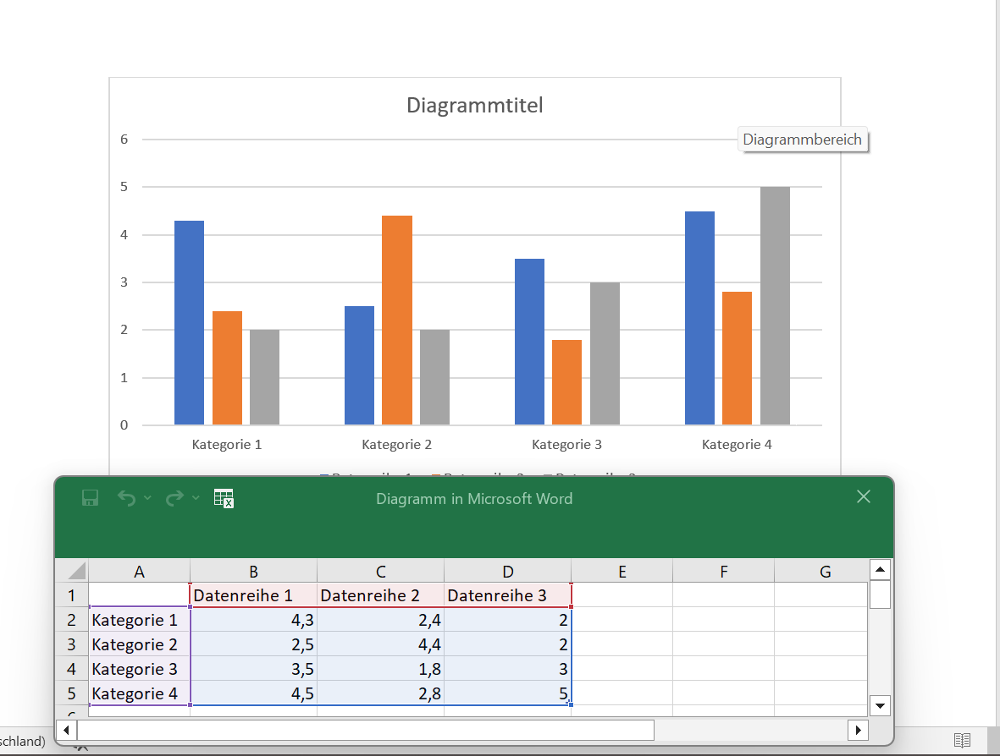
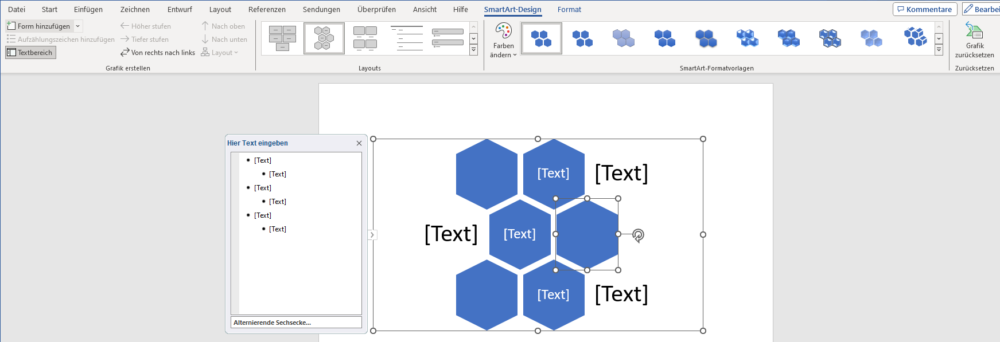
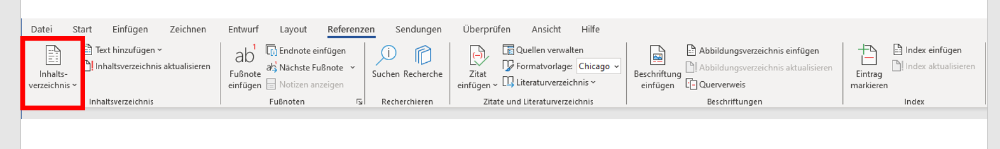

<!--

author:   
email:
language: de
narrator: Deutsch Female

import:   https://github.com/liascript/CodeRunner

link: css/callouts.css
-->
# Zusammenführung der Lernelemente
## Gliederung

- Word
- Powerpoint
- Excel
- Rechtliches
- Medienbearbeitung
- Software
- Hardware
- Recherche
- Soziale Kommunikative Kompetenzen
- Problemlösung

<!---
Unter diesem Kommentar bitte Word einfuegen
-->

## Word

**Was musst Du fürs Studium in Word können?**

Als Student wird das wissenschaftliche Arbeiten ein großer Bestandteil Deines Studiums sein. Eines der wichtigsten Programme kann hierbei Microsoft Word sein. Ob Texte, Inhaltsverzeichnisse oder Formatierungen, mit Word kann man so einiges professionell und individuell erstellen und bearbeiten. Um nicht alles umständlich herunterzuschreiben, bietet das MS-Office-Programm nützliche Funktionen für Deine zukünftigen Arbeiten.

Auf den nächsten Seiten wollen wir Dir daher einen kurzen Einblick über einige dieser Funktionen bieten, die Dir beim Verfassen einer wissenschaftlichen Arbeit helfen können. Vielleicht kanntest Du sie noch nicht und wir können Dir helfen, ein kleines Stück besser mit Word umzugehen. 

*Zu jedem unserer Themen wird nur ein Beispiel gezeigt. Es gibt auch andere Möglichkeiten, die verschiedenen Funktionen zu benutzen. Werde kreativ und probiere sie einfach alle einmal aus!*

### Gliederung

- [**Formatierung**](#formatierung)
- [**Einfügen**](#einfügen)

    -   *Bilder*

    -   *Tabelle*

    -   *Diagramme*

    -   *SmartArt*

- [**Inhaltsverzeichnis**](#inhaltsverzeichnis)
- [**Zitierung**](#zitierung)
- [**Literaturverzeichnis & Abbildungsverzeichnis**](#literaturverzeichnis)
- [**Layout**](#layout)
- [**Überprüfung**](#überprüfung)
- [**Ansicht**](#ansicht)

#### Formatierung

Einer der ersten Schritte zum Erstellen Deines Dokumentes, wird die Formatierung sein. Bei **Start** findest Du alle nötigen Funktionen, um die Grundlagen für Deine Arbeit festlegen zu können. Dazu gehören unter anderem Absätze, Formatvorlagen und die Schrift selbst.

#### Einfügen

Auf den nachfolgenden Seiten findest Du Informationen wie Du einzelne Elemente in Dein Word-Dokument einfügen kannst. 

### Bilder

Bilder werden eingefügt, im Reiter *Einfügen* auf *Bilder* klickst. Daraufhin öffnet sich ein Tab, bei dem Du auswählst: *dieses Gerät* oder *Onlinebilder*. 

**Dieses Gerät**

Zuerst öffnet sich der Dateiordner. Dort wird die Datei mit dem gewünschten Bild ausgewählt und geöffnet. 

**Online Bilder**

Hierbei öffnet sich ein weiteres Fenster. In diesem kannst Du in der Suchleiste oder aus vorgefertigten Suchbegriffen ein passendes Bild für Dein Dokument raussuchen. Dabei kannst Du bei der Suche angeben, ob das Bild über *Creative Common* verfügen soll oder nicht.

### Tabelle

Tabellen werden eingefügt, indem auf die obere Leiste bei **Einfügen** auf die **Tabelle** geklickt wird. Daraufhin öffnet sich ein Tab, bei welchem Du die Anzahl Deiner Spalten und Zeilen auswählen musst.

Danach besteht die Möglichkeit durch Rechts-Klick auf die Tabelle weitere Spalten und Zeilen unter *Einfügen* hinzuzufügen. Außerdem öffnet sich eine neue Leiste *Tabellenentwurf*, dort können Farbe, Rahmen oder Schattierung einer oder aller Spalten der Tabelle angepasst werden.

### Diagramme

Die grafische Darstellung von Daten oder Informationen kann unter Umständen in Deiner wissenschaftlichen Arbeit den Sachverhalt besser veranschaulichen. 
**Achte jedoch auf eine simple Gestaltung**
Den dazugehörigen Punkt findest Du in der oberen Leiste bei **Einfügen** > **Diagramme**. Damit sollte sich ein neues Fenster mit den unterschiedlichsten Diagrammen öffnen. 

Hat man sich für ein Diagramm entschieden, öffnet sich eine zusätzliche Excel Tabelle, in der Du Deine Forschungsdaten eintragen kannst. Diese werden dann im Diagramm veranschaulicht.

### SmartArt

SmartArt ermöglicht eine visuelle Darstellung von Informationen und Bildern. Um sich eine SmartArt-Grafik zu erstellen und anschließend zu verwenden, muss man in der oberen Leiste bei **Einfügen** > **SmartArt** klicken. Tut man dies, so öffnet sich ein Fenster mit vielen verschiedenen Auswahlmöglichkeiten, um seine Informationen perfekt für sich darstellen zu lassen.

Als weiteren Schritt kann man gegebenenfalls seine Grafik nach seinen Vorstellungen anpassen, sei es durch Farbe, eine andere Formatvorlage oder zusätzlichen Formen. 

#### Inhaltsverzeichnis

Um sich das erstellen oder das anpassen eines Inhaltsverzeichnis zu erleichtern, hat Word eine nützliche Funktion für Dich.
Wechsel in der oberen Leiste zu **Referenzen**, dort findest Du ganz links die Funktion ein Inhaltsverzeichnis zu erstellen oder bei Bedarf zu aktualisieren. Damit spart man sich Zeit und vermeidet eventuelle Fehler beim Schreiben eines Inhaltsverzeichnisses. Um seinen Text dem Inhaltssverzeichnis hinzuzufügen, muss man auf *Text einfügen* klicken. 

#### Zitierung

Das Zitieren von Zitaten oder Textabschnitten ist für viele Studenten eine der Königsdisziplinen beim Erstellen ihrer wissenschaftlichen Arbeiten. Wenn man bei Word jedoch in der oberen Zeile auf **Referenzen** geht, findet man die Funktion *Zitat einfügen*. Unter *neue Quelle* kannst Du alle wichtigen Informationen bezüglich Deines Zitates hinzufügen. 
Mit der zusätzlichen Funktion *Formatvorlage*, kann man sich einfach und übersichtlich ein Zitat mit einer direkten Verlinkung zum Inhaltsverzeichnis erstellen.

> [!TIP]
> Eine Empfehlung für eine Formatvorlage beim zitieren, wäre Chicago.

#### Literaturverzeichnis & Abbildungsverzeichnis

Im Literaturverzeichnis kannst Du natürlich nicht nur Deine Zitate hinterlegen, sondern alle Literaturquellen die Du verwendest. Dafür kannst Du Dir auch erst einmal ein leeres Literaturverzeichnis erstellen. Dafür klickt man auf den Punkt **Literaturverzeichnis** und sucht sich erst einmal eine Vorlage aus.
Deine Quellen kannst Du nämlich bei Bedarf jederzeit aktualisieren. Um eine neue Quelle hinzuzufügen oder eine bereits vorhandene Quelle zu bearbeiten, klickt man auf **Zitate und Literaturverzeichnis** > **Quellen verwalten**. Im neuen Tab kannst Du dann beliebig Deine Quellen verwalten.

Auch das Erstellen eines Abbildungsverzeichnis wird über die obere Zeile **Referenzen** > **Beschriftung** durchgeführt. Dabei kann man entscheiden, wie das Abbildungsverzeichnis aussehen und ob es Verlinkungen zum jeweiligen Bild geben soll.

#### Layout

Solltest Du mal für eine Deiner wissenschaftlichen Arbeiten einen benutzerdefinierten Seitenrand, ein horizontales Blatt oder vielleicht eine zwei Spaltenansicht brauchen, dann bist Du hier beim Layout genau richtig. 
Ganz links findest Du alles was mit Seitenrändern oder Absätzen zu tun hat. Dir wird eine vielfältige Auswahl an vorgefertigten Einstellungen geboten. Solltest Du aber andere Vorstellungen oder Angaben haben, dann kannst sie ganz einfach unter *Weitere* oder *Mehr* selbst konfigurieren. 
Gleich daneben findest Du den Absatzblock. Dabei kannst Du bestimmen, wie weit Dein Absatz nach links, rechts, oben oder unten rücken soll. 

#### Überprüfung

Unter dem Punkt *Überprüfungen* befinden sich eine Vielzahl von Funktionen, die Dir eine optimale Unterstützung beim Schreiben Deines Dokumentes bieten können.
Neben den Standardfunktionen wie Rechtschreibung und Grammatik oder dem Wörterzählen, kann Word Dir Deine geschriebenen Sätze laut vorlesen. Es hilft ungemein dies laut zu hören, da Dir so Fehler leichter auffallen können, die Du vielleicht noch nicht entdeckt hast. Diese Funktion findest Du, wenn man bei **Überprüfungen** > **Sprache** > **laut vorlesen** anklickt.

Des Weiteren wollen wir Dir die mögliche Angst vor Fremdsprachen nehmen. In der Leiste unter dem Punkt **Sprache** hast Du die Funktionen **Übersetzen** und **Sprache** zur Verfügung. Gerade der zweite Punkt **Sprache** ist interessant, denn mit diesem kannst Du ganz einfach Deine Rechtschreib- und Grammatikprüfung in eine andere Sprache umstellen.

Anschließend gibt es noch die Kommentar- und Änderungssektion, die wir Dir zeigen wollen. Unter diesen kannst Du allein oder mit anderen Personen an einem Dokument arbeiten, ohne Euch gegenseitig im Weg zu stehen. 

1. Die Kommentare bieten sich besonders dann an, wenn man sich kleine Anmerkungen für später oder Notizen für andere Personen hinterlegen möchte. Zum Hinzufügen, gehe in der Leiste zum Punkt *Kommentare* und füge ein Kommentar am Zeilenrand hinzu. Achte darauf mit der Maus in der richtigen Zeile zu sein. Anschließend wird der von Dir markierte Teil eingefärbt. So verliert niemand den Überblick. Natürlich kannst Du Deine Anmerkungen verändern, löschen oder bei Bedarf auf andere Kommentare reagieren.

  

2. Die Änderungssektion ist vor allem dann wichtig, wenn Du Veränderungen nicht sofort im Text umgesetzt haben willst. Sei es in Einzel- oder Gruppenarbeiten. Die vorläufigen Änderungen können alle auf einmal angenommen oder abgelehnt werden.
   

> [!TIP]
> Um ein Dokument einer anderen Person freizugeben, klicke hierbei über dem Menüband auf **Freigeben** > **Freigabe**. Stelle dabei sicher, das Dein Dokument auf OneDrive gespeichert ist. Die betreffende Person, der Du Dein Dokument freigibst, sollte nachdem teilen eine Email erhalten.

#### Ansicht

Unter Ansicht kannst Du das Dokument Dir so anzeigen lassen, wie Deine Präferenzen sind. Unter dem Punkt **Seitenbewegung** kannst Du festlegen, ob Deine Seiten im Dokument Vertikal oder Horizontal, wie bei einem Buch angezeigt werden soll. 
Im **Lesemodus** kannst Du Dich wie es der Name schon verrät, ganz auf's lesen Deiner Arbeit konzentrieren. 

Der **Plastische Reader** bietet Dir neben der internen Veränderung der Seitenfarbe, dem Text- oder Spaltenabstand ebenso auch eine Silbentrennung an. Auch kannst Du den *Zeilenfokus* aktivieren. Dieser erlaubt Dir, Dich Zeile für Zeile in Deiner Arbeit vorzuarbeiten.

<!---
Unter diesem Kommentar bitte Powerpoint einfuegen
-->

## 
Powerpoint

[1. Abbildung](https://play.google.com/store/apps/details?id=com.microsoft.office.powerpoint&hl=de)

## 
Inhaltsverzeichnis

{{1}} **1. Einstieg**

- **1.1 Festlegung der Kompetenz**

- **1.2 Fragestellung**

- **1.3 Allgemein**

- **1.4 Ziel des Themas**

{{2}} **2. Anwendung eines Lernelements**

- **2.1 Referenzansicht**

- **2.2 Aktivierung der Referenzansicht**

- **2.3 Lösung als Videoansicht**

{{3}} **3. Anwendung eines zweiten Lernelements**

- **3.1 Animation von Bildern und Textfeldern**
   
- **3.2 Animation von Übergängen zwischen Folien**

{{3}} **3. Quellen**

## 1. Einstieg
**1.1 Festlegung der Kompetenz**

Für viele Studiumsbereiche sind gängige Programme, wie Microsoft-Programme notwendig, insbesondere um die Ergebnisse einer Arbeitsprobe zu erstellen und zu präsentieren. 

Die Festlegung der Kompetenzen im Bereich Softwareanwendungen, die im Kurs; _"Welche IT-Kompetenzen sind vorhanden oder müssen geschult werden"_, sind unter anderem; **Word**, **Excel** und **Powerpoint**.  

Im folgendem Beitrag haben wir uns mit der Kompetenz **"Powerpoint"** auseinander gesetzt und uns jeweils auf ein bestimmtes Thema reduziert.  

---

**1.2 Fragestellung**

Wie sehr beschäftigst Du dich in Deinem Berufs- oder Alltagsleben mit dem Programm Powerpoint?

[(genügend)(ausreichend)(gar nicht)]
[                                  ] 

**Begründung**

[[______   ___   ___   ______]]

---

**1.3 Allgemein**

Präsentationsprogramm von Microsoft 

- Gehört zum Microsofot-365-Abonnement
- Desktop-Version: Windows und macOS
- Mobile-Version: App für Android und iOS 
**Aktuellste Version**: PowerPoint 2019

---

**1.4 Ziel des Themas**

- Durch die Anwendung der Sprechernotizen und der Referenzansicht, während der Präsentation, können Karteikarten vermieden werden.

- Zu beachten; 

  - Stichpunkte müssen lesbar, prägnant und kurz den Inhalt wiedergeben 

## 
 2. Anwendung eines Lernelements 

 **Einfügen von Sprechernotizen in einer Powerpoint** 

---

[2. Abbildung](https://support.microsoft.com/de-de/office/hinzuf%C3%BCgen-von-sprechernotizen-zu-folien-26985155-35f5-45ba-812b-e1bd3c48928e#:~:text=Klicken%20Sie%20im%20Men%C3%BC%20Ansicht,Sie%20den%20gew%C3%BCnschten%20Notizentext%20ein)

- Notiz-Symbol neben Anzeigeeinstellungen, oder wie in dem Beispiel vorgezeigt; neben Kommentare

## 2.1 Referenzansicht

**Während der Bildschirmpräsentation Notizen einsehbar**

---

**Unter:**
<lia-keep>
<!DOCTYPE html>
<html>
<body>

<table border>

<colgroup>
<col width=300>
<col width=300 align=char char=",">
</colgroup>
<tr>

	<th>
Arbeitsschritte
</th>
     
	<th>

</th>
</tr>
<tr>
	<td>
<b>1.</b>
</td>
	<td>
Von Beginn an
</td>
</tr>

</tr>
<tr>
	<td>
<b>2.</b>
</td>
	<td>
Drei-Punkte-Symbol
</td>
</tr>

</tr>
<tr>
	<td>
<b>3.</b>
</td>
	<td>
Referenzansicht zeigen
</td>
</tr>
</table>
</body>
</html>
</lia-keep> 

---

**Beispiel:**

[3. Abbildung](https://support.microsoft.com/de-de/office/hinzuf%C3%BCgen-von-sprechernotizen-zu-folien-26985155-35f5-45ba-812b-e1bd3c48928e#:~:text=Klicken%20Sie%20im%20Men%C3%BC%20Ansicht,Sie%20den%20gew%C3%BCnschten%20Notizentext%20ein)

## 2.2 Aktivierung der Referenzansicht

Unter Bildschirmpräsentation kann die **Referenzansicht aktiviert** werden

[4. Abbildung](https://support.microsoft.com/de-de/office/hinzuf%C3%BCgen-von-sprechernotizen-zu-folien-26985155-35f5-45ba-812b-e1bd3c48928e#:~:text=Klicken%20Sie%20im%20Men%C3%BC%20Ansicht,Sie%20den%20gew%C3%BCnschten%20Notizentext%20ein)

---

**2.3 Lösung als Videoansicht**

??[Tutorial](https://www.microsoft.com/de-de/videoplayer/embed/RWfkz0?pid=ocpVideo1-innerdiv-oneplayer&postJsllMsg=true&maskLevel=20&reporting=true&market=de-de " ")

1.Video: [Link zum Tutorial](https://www.microsoft.com/de-de/videoplayer/embed/RWfkz0?pid=ocpVideo1-innerdiv-oneplayer&postJsllMsg=true&maskLevel=20&reporting=true&market=de-de)

## 
 3. Anwendung eines zweiten Lernelements 

**Erstellen von Animationen**

---

[5. Abbildung](https://embed-ssl.wistia.com/deliveries/495e6ff8a0d973e9c08066e811bbeb25.jpg)

## 3.1 Animation von Bildern und Textfeldern

- Headline Punkt "Animationen" anklicken
   
- Zu animierendes Objekt auswählen
  
  - Unter "Animation hinzufügen" gewünschte Animation auswählen
  
  - Optional, Reihenfolge der Animation hinzufügen

  - Tipp: benutzt die Reihenfolge von Animationen um bestimmte Texte oder Bilder beim Präsentieren Stück für Stück einfliegen zu      lassen

[6. Abbildung](https://cdn1.participoll.com/wp-content/uploads/2021/01/03123303/Leanne-screenshot-5.jpg)

## 3.2 Animation/Übergänge zwischen Folien

   - Headline Punkt Übergänge auswählen

   - Empfohlene/beliebte Übergänge werden oben vorgeschlagen

   - Übergang auswählen

   - Übergäng wird im Präsentationsmodus beim start der Folie benutzt

   - Tipp: Versuch nicht zu viele verschiedene Übergänge zu benutzen sondern sich auf 2/3 festzulegen

 

 [7. Abbildung](https://www.wirliebenoffice.de/images/content/tutorials/powerpoint/008-folienubergang-einfugen.png)

## 
Quellen

---
**1.Quelle** 

- https://support.microsoft.com/de-de/office/hinzufügen-von-sprechernotizen-zu-folien-26985155-35f5-45ba-812b-e1bd3c48928e#:~:text=Klicken%20Sie%20im%20Menü%20Ansicht,Sie%20den%20gewünschten%20Notizentext%20ein

**2. Quelle**

- https://de.wikipedia.org/wiki/Microsoft_PowerPoint

<!---
Unter diesem Kommentar bitte Excel einfuegen
-->

## Excel-Formeln
---
> **Für eine Hausaufgabe musst du mehrere komplizierte Werte ausrechnen. Deine Dozentin gibt dir mathematische Formeln vor, welche du im Grunde nicht verstehen, sondern nur anwenden musst. So weit, so gut. Du versuchst die Aufgabe mit Stift, Papier und Handy-Taschenrechner zu lösen, doch bald verlierst du den Überblick. Schlimmer noch: die Ergebnisse deiner Rechnungen scheinen aufeinander aufzubauen und sobald du an einer Stelle einen Fehler vermutest musst du einen ganzen Rattenschwanz an Rechnungen noch einmal lösen. Geht das nicht einfacher?**

## Excel-Formeln
Trage die folgenden Begriffe in den Lückentext ein!

<kbd>Operatoren</kbd><kbd>Konstanten</kbd><kbd>Bezüge</kbd><kbd>Funktionen</kbd><kbd>Elementen</kbd><kbd>relative</kbd><kbd>absolute</kbd>

Excelformeln bestehen aus verschiedenen [[  Elementen  ]]. [[  Funktionen  ]] beginnen immer mit einem Gleichheitszeichen (=). Einträge wie Zahlen, Texte oder Daten verändern sich beim Ziehen einer Formel nicht und werden [[  Konstanten  ]] genannt. Im Gegensatz dazu verändern sich [[  relative  ]] [[  Bezüge  ]], sobald eine Funktion gezogen wird. Mit einem "$" gekennzeichnete [[  absolute  ]] [[  Bezüge  ]] widerum bleiben auch beim Ziehen einer Formel gleich. Mit [[  Operatoren  ]] können die verschiedenen Elemente einer Formel mathematisch oder logisch miteinander in Bezug gesetzt werden.

<!---
Unter diesem Kommentar bitte Rechtliches einfuegen
-->

## Rechtliches

### Creative Commons
 {{|>}}
Creative Commons besteht aus sechs __Lizenzmodellen__, die Lizenzverträge darstellen, aus denen der Urheber eines Werks wählen kann. Der Unterschied zwischen diesen Lizenzmodellen besteht in der __Art und Anzahl der Rechte__, die eine Lizenz einem Nutzer einräumt.

{{|>}}
So unterscheidet sich beispielsweise die _Bedingungslose Lizenz_ von der _Attribution NonCommercial ShareAlike_, insofern, dass sie einem Nutzer mehr Rechte einräumt.

__Die Fragen, die eine Lizenz einem Nutzer beantwortet, sind also folgende:__

1. Was darf mit dem Werk passieren?
2. Was darf nicht mit dem Werk passieren?
3. Was muss angegeben werden, wenn das veränderte Werk veröffentlicht wird?

### Bedingungslose Lizenz

 {{|>}}
Mit der CC0 oder "Bedingungslose Lizenz" verzichtet ein Urherber weltweit auf alle möglichen Schutzrechte. 

Das Werk darf:

- kopiert
- verändert
- verbreitet
- aufgeführt
- für kommerzielle Zwecke verwendet werden,
ohne dass der Nutzer nach Erlaubnis fragen muss.

### Atribution

 {{|>}}
Die Lizenz "Attribution" (Namensnennung) ähnelt der "Bedingungslosen Lizenz", mit einigen Zusätzen.

Das Werk darf:

- kopiert
- verändert
- verbreitet
- aufgeführt
- für kommerzielle Zwecke verwendet werden,
ohne dass der Nutzer nach Erlaubnis fragen muss.

Zusätzlich müssen jedoch der __Urheber des ursprünglichen Werks__, sowie die __Anmerkungen von Veränderungen__ an dem Werk hinzugefügt werden.

### Attribution ShareAlike

 {{|>}}
Die Lizenz "Attribution ShareAlike" (Namensnennung und Weitergabe unter gleichen Bedigungen) ähnelt der "Attribution". Jedoch muss das Werk, welches durch Veränderung des Ursprungswerks entstanden ist, unter __derselben Lizenz__ weitergeführt werden, wie das Ursprungswerk.

Das Werk darf:

- kopiert
- verändert
- verbreitet
- aufgeführt
- für kommerzielle Zwecke verwendet werden,
ohne dass der Nutzer nach Erlaubnis fragen muss.

Zusätzlich müssen jedoch der __Urheber des ursprünglichen Werks__, sowie die __Anmerkungen von Veränderungen__ an dem Werk angegeben werden. Zudem muss das neu entstandene Werk unter derselben Lizenz wie das urpsprüngliche Werk veröffentlicht werden.

### Atribution NoDerivatives

 {{|>}}
Die Lizenz "Atrribution NoDerivatives" (Namensnennung, keine Bearbeitung) gibt Zugang zu vielen Rechten, schließt jedoch das Recht auf Veränderung aus.

Das Werk darf:

- kopiert
- verbreitet
- aufgeführt
- für kommerzielle Zwecke verwendet werden,
ohne dass der Nutzer nach Erlaubnis fragen muss.

Das Werk darf __nicht__:

- verändert werden

Zusätzlich muss jedoch der __Urheber des ursprünglichen Werks__ angeben werden.

### Attribution NonCommercial

 {{|>}}
Die Lizenz "Attribution NonCommercial" (Namensnennung, nicht kommerziell) gibt Zugang zu den meisten Rechten, schließt jedoch das Recht, das Werk für kommerzielle Zwecke zu verwenden, aus.

 Das Werk darf:

- kopiert
- verändert
- verbreitet
- aufgeführt werden

Das Werk darf __nicht__:

- für kommerzielle Zwecke verwendet werden

Zusätzlich müssen jedoch der __Urheber des ursprünglichen Werks__, sowie die __Anmerkungen von Veränderungen__ an dem Werk angegeben werden.

### Attribution NonCommercial ShareAlike

 {{|>}}
Die Lizenz "Attribution NonCommercial ShareAlike" (Namensnennung, nicht kommerziell, Weitergabe unter gleichen Bedingungen) ähnelt der Lizenz "Attribution NonCommercial". Jedoch muss das Werk, welches durch Veränderung des Ursprungswerks entstanden ist, unter __derselben Lizenz__ weitergeführt werden, wie das Ursprungswerk.

Das Werk darf:

- kopiert
- verändert
- verbreitet
- aufgeführt werden

Werk darf __nicht__:

- für kommerzielle Zwecke verwendet werden

Zusätzlich müssen jedoch der __Urheber des ursprünglichen Werks__, sowie die __Anmerkungen von Veränderungen__ an dem Werk angegeben werden. Zudem muss das neu entstandene Werk unter derselben Lizenz wie das urpsprüngliche Werk veröffentlicht werden.

### Attribution NonCommercial NoDerivatives

 {{|>}}
Die Lizenz "Attribution NonCommercial NoDerivatives" (Namensnennung, nicht kommerziell, keine Bearbeitung) gibt Zugang zu einigen Rechten, schließt jedoch das Recht, das Werk zu verändern, sowie es für kommerzielle Zwecke zu verwenden, aus.

Das Werk darf:

- kopiert
- verbreitet
- aufgeführt werden

Das Werk darf __nicht__:

- für kommerzielle Zwecke verwendet
- verändert werden

Zusätzlich muss jedoch der __Urheber des ursprünglichen Werks__ angeben werden.

### Übung

Welche Rechte ermöglicht die CC0 Lizenz?

> **Mehrere Optionen möglich!**

[[X]] Vervielfältigung
[[X]] Verbreitung
[[X]] Vorführung
[[X]] Verarbeitung
[[X]] Kommerzielle Nutzung

### Übung 2
Was unterscheidet die Attribution-Lizenz von der Bedingungslosen Lizenz?

[( )] Dass das Werk nicht für kommerzielle Zwecke verwenden darf.
[(X)] Dass man den Urheber des ursprünglichen Werks angeben muss.
[( )] Dass man das Werk nicht verändern darf.

### Übung 3
Was bedeutet der Ausdruck "ShareAlike" in einer Lizenz?

[( )] Dass man das ursprüngliche Werk unverändert teilen darf.
[(X)] Dass man das erstellte Werk unter derselben Lizenz weitergeben muss, wie das Werk, welches man verwendet hat.
[( )] Dass das erstellte Werk dem ursprünglichen Werk sehr ähnlich sein muss.
[( )] Dass das erstellte Werk dem ursprünglichen Werk nicht sehr ähnlich sein muss.

### Übung 4
Eine Studentin würde gerne ein Bild verwenden, indem sie es verändert und in eine Powerpoint-Präsentation einfügt und vor einigen Zuschauern zeigt. Welche Lizenz müssten für das Bild gelten, damit sie es verwenden könnte?

> **Mehrere Optionen möglich!**

[[X]] CC0 Bedingungslose Lizenz
[[X]] Atrribution
[[X]] Attribution ShareAlike
[[ ]] Atrribution NoDerivatives
[[X]] Attribution NonCommercial
[[X]] Attribution NonCommercial ShareAlike
[[ ]] Attribution NonCommercial NoDerivatives

<!---
Unter diesem Kommentar bitte Medienbearbeitung einfuegen
-->

# Medienbearbeitung

[...]

### Wie erstellt man eine kompromierte Datei?

{{|>}}

Im Studium begegnet einem immer wieder die Herausforderung, Dateien mit dem Lehrpersonal oder anderen Studierenden zu teilen. Um die Weiterleitung von mehreren Dateien zu erleichtern, besteht die Möglichkeit, ein kompromiertes Archiv zu erstellen. Dieses Archiv kann mehrere Dateien ohne Qualitätsverlust in einem kompromierten Ordner umfassen, der ganz einfach mit anderen geteilt werden kann.

Dateien können in verschiedenen Formaten komprimiert werden. Ein gängiges Format ist ZIP (aus dem Englischen "zipper" für Reißverschluss). Um ein ZIP-Archiv zu erstellen, gibt es verschiedene Möglichkeiten, die im Folgenden anhand von Windows und Mac OS behandelt werden sollen.

#### Windows

{{|>}}

_Anleitung_

1. Markiere mindestens zwei Dateien, die Du zippen möchtest.
2. Drücke Rechtsklick und wähle die Option "Senden als" aus.
3. Unter den Sendeoptionen wählst Du "ZIP-komprimierter Ordner" aus.
4. Bennene Deine ZIP-Datei. Danach ist sie bereit zum Teilen.

{{|>}}

_Programme_

Unter Windows gibt es einige Programme, die das Zippen und Entzippen von Dateien erleichtern, wie z.B. WinRAR oder 7ZIP.

#### Mac OS

{{|>}}

_Anleitung_

1. Markiere mindestens zwei Dateien, die Du zippen möchtest.
2. Drücke Rechtsklick und wähle die Option "X Objekte komprimieren" aus.
3. Im selben Ordnen befindet sich jetzt ein Ordner namens "Archiv.zip", der Deine kompromierten Dateien enthält. Du kannst dieses ZIP-Archiv beliebig umbenennen.
4. Um ein ZIP-Archiv zu entpacken, ist lediglich ein Doppelklick auf den Ordner nötig.

{{|>}}

_Programme_

<!---
Unter diesem Kommentar bitte Software einfuegen
-->

<!---
Unter diesem Kommentar bitte Hardware einfuegen
-->

## Hardware

Hardware beschreibt die Physischen Komponenten von Datenverarbeitenden Systemen z.B.: Computer oder Smartphones.

### 1. USB-Sticks

Es gibt viele verschiedene Arten von USB-Sticks die sehr unterschiedliche Verwendungszwecke haben. Zum Beispiel sind USB-Sticks in der Lage eine Bluetooth maus mit dem COmputer zu verbinden oder
dem Computer zugang zum Internet zu gewähren. Doch der wohl am häufigste verwendete USB-Stick ist der USB-Speicherstick. Dieser fungiert als eine kleine externe Festplatte, die dazu in der Lage ist mehrere
GB Daten zu speichern. USB-Speichersticks sind dazu in der Lage große Mengen an Daten zwischen zwei geräten zu tauschen. Allerdings kann es zu Problemen führen, wenn der USB-Speicherstick nur von einem der beiden Geräte gelesen werden kann.

#### USB-Sticks Formatieren

Einen USB-Stick zu Formatieren ist keine schwere Aufgabe aber vorher sollte sichergestellt werden, dass keine wichtigen Daten auf dem Stick vorhanden sind, da beim Formatieren alle Daten verloren gehen.

1. Gehe im Datei-Explorer mit Rechtsklick auf den USB-Stick
2. Wähle Formatieren aus
3. im letzten Schritt muss ein Dateisystem ausgewählt werden. Hierbei empfiehlt sich FAT32, da es von vielen verschiedenen Systemen gelesen werden kann.

### Anschlüsse

Hinter welchem der folgenden Kürzel versteckt sich kein Computeranschluss?

[[x]] VGA 
[[x]] HDMI
[[x]] AUX
[[x]] LAN
[[x]] MDMA
[[x]] DVI-D
[[x]] RAM
[[x]] BLuetooth

Ein Computer ohne Anschlüsse wäre ziemlich nutzlos und in den Augen von vielen Menschen vllt garkein Computer. Anschlüsse erlauben den Horizont des PC´s zu erweitern und ihm viele verschiedene Möglichkeiten zu verpassen. Anschlüsse verbinden Monitore, Maus und Tastatur mit dem Computer und ermöglichen so erst die Bedienung. Dabei gibt es verschiedene Arten von Anschlüssen von denen ich hier einen kleinen Überblick erschaffen will. Wichtig ist hierbei zu beachten. Für jeden zweck gibt es verschiedene Anschlüsse. Es ist daher wichtig jeden PC individuell zu betrachten und zu analysieren welche Anschlüsse Vorhanden sind.

#### Grafik- und Monitoranschlüsse

Wie bereits gesagt ist der Computer erst durch Anschlüsse in der Lage essenzielle Aufgaben zu meistern, wie z.B.: die Eigenschaft Visuelle Inhalte darzustellen. VGA und DVI-D sind zwei Anchlüsse die früher Standard waren. In modernen Geräten werden sie heute kaum noch verwendet sind allerdings noch nicht komplett ausgestorben. Ein etwas modernerer Anschluss ist der HDMI Anschluss, der gleichzeitig auch in der Lage ist Tonsignale zu übertragen. Der wohl modernste Weg Bildschirme an den Computer anzuschließen ist der USB-C Anschluss. 

####  Kommunikation mit externen Geräten

Der mit Abstand am häufigsten verwendete Anschluss ist der USB TYP A Anschluss. Drucker, Maus, Tastatur oder Festplatten können alle mit einem USB TYP A angeschlossen werden. Von diesem Anschluss finden sich an einem Gerät meist mehrere Eingänge wieder.

#### Audiosignale

AudioSignale werden mit Mini-Klinken Buchsen übertragen. Diese können sowohl AUdiosignale vom Computer nach außen führen aber auch von außen nach innen. Diese werden dann farblich markiert. Die Grüne Farbe steht hierbei für das Line Out Signal, mit dem zum Beispiel Kopfhörer oder Stereo-Anlagen angeschlossen werden können. Mikrofone gehören in den Lila Stecker und eine gräulich bläuliche Farbe markiert das Line-In Signal.

#### Netzwerkanschlüsse

Zu guter letzt gibt es noch den Ethernet Anschluss, der es ermöglicht den Computer via Kabel mit einem Rechnernetzwerk oder dem Internet zu verbinden. 

----------------

Das Gute an den vielen Verschieden Anschlüssen ist, dass sie alle sehr unterschiedliche Formen haben und es deswegen fast unmöglich ist Geräte falsch anzuschließen.

<!---
Unter diesem Kommentar bitte Recherche einfuegen
-->

## __Recherche__

Quelle:"Schreiben digital", Julian Kücklich, Lizenz: CC0 1.0, https://api.openverse.engineering/v1/images/e6e14a45-1a41-4b7e-98c8-22aa82293474/thumb/

---
{{|>}} 
Zu den Kompetenzen, die für das Studium besonders wichtig sind, zählt die **Recherchekompetenz**. Heutzutage können wir eine breite Masse an Informationen sehr schnell und einfach abrufen, aber beispielsweise beim Schreiben einer Hausarbeit oder bei der Literatursuche für das Erstellen einer Bachelorarbeit, benötigen wir aussagekräftige und belegbare Informationen. Daher werde ich in diesem Vortrag das Thema Recherche etwas näher beleuchten.

---
### __Richtig recherchieren__
 Der Ablauf einer Recherche
---
{{1}} Was ist das Ziel meiner Recherche?   

{{2}} Wie recheriere ich?

{{3}} Wie dokumentiere ich meine Ergebnisse?

{{4}} Wie kann ich die gefundenen Quellen bewerten?

{{5}} Quellenangaben

> **Um überhaupt recherchieren zu können, sollte man natürlich auch die Sprache verstehen. Falls deutsch nicht deine Muttersprache ist, hier ein Tipp: [Übersetzer Deeple](https://www.deepl.com/de/translator)**

### Was ist das Ziel meiner Recherche?

Im ersten Schritt muss das Ziel der Recherche festgelegt werden. Was möchte ich mit meiner Recherche erreichen, welches Problem soll gelöst oder welche Frage soll beantwortet werden.
---
Was sollte man deiner Meinung nach tun, wenn man das Rechercheziel festlegen möchte? 

Kreuze zutreffendes an:

[[x]] Lesen der Aufgabenstellung
[[x]] Klärung der Anforderungen
[[x]] Aktivierung des Vorwissens
[[x]] Bestimmung der erforderlichen Informationen

> **Tipp: Fragen formulieren mithilfe von** 
[Online Synonym-Wörterbuch](https://synonyme.woxikon.de/)

[ChatGPT](https://chat.openai.com/auth/login) oder [Phind](phind.com)

### Wie recheriere ich?
---
Im zweiten Schritt geht um das Recherchieren an sich. Das Sammeln von Informationen wird erleichtert, wenn man die Suche mit [Stich- und Schlagworten](https://www.hochschule-trier.de/hauptcampus/bibliothek/tutorial-informationskompetenz/suche-vorbereiten/suchstrategien/stich-und-schlagwoerter) eingrenzt.

| Stichwort | Schlagwort|
|--------|--------|
|charakteristisches, sinntragendes Wort aus dem Sachtitel oder aus dem Zusatz zum Sachtitel | möglichst kurzer, genauer und vollständiger Ausdruck für den Inhalt eines Werkes |
| kann, aber muss nicht mit Schlagwort übereinstimmen | - aus Buchtitel - häufig unabhängig vom Titel gebildet - genormter Fachbegriff |
|  Suche im Feld „Titel“ oder auch “Freie Suche“ „Alle Wörter“ o.ä. | Suche im Feld „Schlagwort“ |

 Um sich einen ersten Zugang zum Thema zu verschaffen, ist die __Online-Recherche__ hilfreich und kann einfach und schnell über diverse Suchmaschinen stattfinden...

[Google](https://www.google.de/?hl=de)

Hat man sich einen ersten Überblick verschafft oder noch nicht die passende Literatur gefunden, kann die weitere Suche in der __Bibliothek__ erfolgen. Ein Besuch der örtlichen Bibliothek ist ebenso möglich wie die Nutzung der umfangreichen Online-Angebote. 

[Bibliothek](https://www.fh-potsdam.de/campus-services/bibliothek)

 Datenbanken, Repositorien, Zeitschriftendatenbanken

[Kataloge, Datenbanken](https://www.bib-info.de/berufspraxis/fundgrube-internet/recherche/kataloge-datenbanken)

[Das deutsche digitale Zetschriftenarchiv](https://www.digizeitschriften.de/)

---
> **Weiterer Tipp: Boolesche Operatoren**

Quelle: "Boolean logic", Jakub T. Jankiewicz, Lizenz: CC BY-SA 4.0,
https://upload.wikimedia.org/wikipedia/commons/1/17/Boolean_logic.svg

Empfehlung für 

---

### Wie dokumentiere ich meine Ergebnisse?
---
Die gefundene Literatur muss auch dokumentiert werden, damit sie später ausgewertet und genutzt werden kann. Neben der *schriftlichen Dokumentation* ist die Verwendung eines *Dateimanagementssystems* auf dem Computer sinnvoll.

!?[alt](https://www.youtube.com/watch?v=FnLswdk_Kq4)

Quelle: "Eine Recherche dokumentieren", Heike Baller, Lizenz:  CC BY-SA 3.0, https://www.youtube.com/watch?v=FnLswdk_Kq4

> **Hier ist die Tabelle für die Dokumentation:**

|Datum|Suchbegriff|Suchort|Ergebnis|Weitere gefundene Suchbegriffe|
|-----|-----------|-------|--------|------------------------------|
|     |           |       |        |                              |
|     |           |       |        |                              |

---

> **Mit Hilfe von Literaturverwaltungsprogrammen lässt sich die Literatur noch einfacher verwalten:**

[Citavi](https://www.citavi.com/de)   

[Zotero](https://www.zotero.org/download/)

### Wie kann ich die gefundenen Quellen bewerten?
---
Zum Schluss prüft man, ob die gesammelte Literatur zum anfangs definierten Rechercheziel passt. Sind die Informationen ~~relevant~~ für meine Recherche? Außerdem sollten die enthaltenen Informationen ~~glaubwürdig~~ und auf einem ~~aktuellem~~ Stand sein.

!?[alt](https://www.youtube.com/watch?v=iLzhv50msH0&list=PLuizG2TMVpRNmJbYfp0-VHQJBrejfwvN-&index=5)

Quelle: "Quellenbewertung in der Literaturrecherche", Universitätsbibliothek Mannheim, CC-Lizenz mit Quellenangabe (Wiederverwendung erlaubt) https://www.youtube.com/watch?v=iLzhv50msH0

> **Merke: Kritische Quellenbewertung**

Es gibt bestimmte Kriterien, an denen man "gute" Quellen erkennt:
---
- Ort der Auffindbarkeit, z.B. Fachliteratur aus der Bibliothek
- Aktualität der Quelle (aktueller Forschungsstand)
- Herkunft der Quelle (Wer ist der Autor und warum hat er das Werk verfasst?)
- Relevanz der Quelle (Passt der Inhalt zu meinem Thema.)

> **Tipp für kritische Quellenauswahl im Internet:** [Quellenkritik im Internet](https://niemalsvergessen.systime.dk/?id=206)

### Quellen 

* Niedermair, Klaus (2010): Recherieren und Dokumentieren. Der richtige Umgang mit Literatur im Studium. UVK Verlagsgesellschaft mbH, Konstanz
* Kopsieker, Stephan; Kronfeldner, Maria: Handreichungen für Studierende der Philosophie. Wie recherieren? Hinweise zur Recherche in der Bibliothek und online
* Becker, Sebastian, Meßinger-Koppelt, Jenny, Thyssen, Christoph (Hrsg.) (2020): Digitale Basiskompetenzen. Orientierungshilfe und Praxisbeispiele für die universitäre Lehramtsausbildung in den Naturwissenschaften. Joachim Herz Stiftung, Hamburg

<!---
Unter diesem Kommentar bitte Soziale Kommunikative Kompetenzen einfuegen
-->

# Soziale und Kommunikative Kompetenzen

{{|>}} 
 Im Studium werden immer wieder Skills, wie zum Beispiel vor anderen Komilitonen das eigene Projekt zu präsentieren, Gruppenarbeiten zu managen oder auch einfach das konstruktive sowie effektive kommunizieren, erwartet. Um dir deinen Start zu vereinfachen, haben wir hier schonmal ein paar Tipps, Tricks und einfache Einführungen vorbereitet. 

---
#### 1. Was sind eigentlich soziale und kommunikative  Kompetenzen?
"Sozial-kommunikative Kompetenz ist die Fähigkeit, sich aus eigenem Antrieb mit anderen zusammen- und auseinanderzusetzen sowie kreativ zu kooperieren und zu kommunizieren. Menschen mit hoher sozial-kommunikativer Kompetenz verstehen andere Menschen und können sich selbst verständlich machen."
      https://www.kodekonzept.com/wissensressourcen/kompetenzfelder/

---
 #### Was gibt es für sozial-kommunikative Kompetenzen ?
 * Anpassungsfähigkeit 
 * Beratungsfähigkeit
 * Beziehungsmanagement
 * Dialogfähigkeit
 * Experimentierfähigkeit
 * Gewissenhaftigkeit
 * Integrationsfähigkeit
 * Kommunikationsfähigkeit
 * Konfliktlösungsfähigkeit
 * Kooperationsfähigkeit
 * Pflichtbewusstsein
 * Problemlösungsfähigkeit
 * Teamfähigkeit
 * Verständnisfähigkeit

---

Zusammengefasst bedeutet es, ein hohes Engagement in sozialen Situationen zu besitzen und auch kommunikative Fähigkeiten anwenden zu können. Zu kommunikativen Fähigkeiten zählen, dass man Kompromisse schließen kann, Durchsetzungsvermögen besitzt und konstruktiv, effektiv sowie bewusst kommuniziert.
---
### 1.1. Quiz
Was sind soziale und kommunikative Fähigkeiten?

-[(x)] Konfliktlösung, Teamfähigkeit, Pflichtbewusstsein
-[( )] Programmierung, Analyse, Pessimismus
-[( )] Problemlösungsfähigkeit, Irrationalität, Sturheit 

---
Warum sind soziale und kommunikative Fähigkeiten wichtig?

-[( )] Für private Gespräche 
-[(x)] Um effektiv zu kommunizieren und zu delegieren 
-[(x)] Für Gruppenarbeiten und um Konflikte zu lösen 

---
Was vermutest du, ist für eine effektive Gruppenarbeit wichtig?

-[( )] Ignoranz gegenüber Teammitglieder
-[( )] Kritik ohne Lösungsvorschläge
-[(x)] offene Kommunikation und Zusammenarbeit 

#### Wähle nun die Fähigkeiten aus, die dir bereits liegen, um einen Überblick zu bekommen!

[[ ]] Durchsetzungsvermögen
[[ ]] Teamfähigkeit
[[ ]] Konfliktlösung
[[ ]] Verständnis
[[ ]] Anpassungsfähigkeit
[[ ]] Kommunikationsfähigkeit

### Wichtige soziale und kommunikative Kompetenzen für das Studium anhand einer Gruppenarbeit 

#### Was versteht man unter einem Team?
Ein Team besteht aus Menschen, die gemeinsam arbeiten, kooperieren und die Verantwortung teilen, um ein gemeinsames Ziel zu erreichen. 

---
#### Aufbau und Pflege des Teamgeists
Für eine erfolgreiche Gruppenarbeit ist es wichtig, dass sich alle Teammitglieder als eine Einheit wahrnehmen und auch so agieren.

Wichtige Elemente dafür sind:

- Zielorientierung und Aufgabenverteilung
- Teamrollen und Verantwortlichkeiten 
- Zusammenhalt

---
Vorteile von Gruppenarbeiten im Studium

- Erlernen von Teamfähigkeit und Kommunikation
- vielfältige Blickwinkel auf Themen durch die Gruppenmitglieder
- Stärkung der Gemeinschaft 

---
Welche Rollen gibt es in einer Gruppe?

1. Funktionsrollen 
      übernehmen Verantwortung für Aufgaben, wie z.B.Leitung, Protokollführung, Forschung 
2. Fachliche Rollen 
      Personen mit vielfältigen fachlichen Hintergünden 
3. Sozialpsychologische Rollen
      die Art wie sich ein Teammitglied einbringt (z.B. aktiv oder passiv)
4. Soziale Rollen 
      dient dazu Verhalten und Erwartungen in bestimmten sozialen Situationen zu definieren und zu beeinflussen 

#### Was benötigt ein Team?

[[x]] gemeinsames Ziel
[[ ]] mindestens eine Person die nicht arbeitet
[[x]] Klare Rollen und Aufgabenverteilung
[[x]] Kommunikation

---
Übung zu Verhalten und Rollen innerhalb einer Gruppe

Szenario 1

Du bist Teil einer Gruppenarbeit in der Uni. Einer deiner Teamkollegen übernimmt die Leitung und teilt die Aufgaben gerecht auf. Wie reagierst du?

[(x)] Du akzeptierst die Aufgabenverteilung und arbeitest engagiert an deiner zugewiesenen Aufgabe. 
[( )] Du protestierst gegen die Aufgabenverteilung. 
[( )] Du ignorierst die Aufgabenanweisung und erledigst sie nach deinem eigenen Wille. 

Szenario 2 

Deine Gruppe arbeitet an einem Projekt und es gibt unterschiedliche Meinungen darüber, welchen Ansatz ihr wählen sollt.
Was tust du?

[( )] Du ziehst dich zurück und überlässt die Entscheidung den anderen Gruppenmitgliedern.
[( )] Du drängst darauf, deinen eigenen Ansatz durchzusetzen, da du ihn für den besten hältst.
[(x)] Du versuchst, die verschiedenen Perspektiven zu verstehen, bevor eine gemeinsame Entscheidung getroffen wird.

#### Checkliste für eine erfolgreiche Gruppenarbeit:

[[x]] Arbeitsziel definieren
[[x]] Rollen innerhalb der Gruppen definieren
[[x]] Regelmäßigkeit der Treffen festlegen
[[x]] Länge der Treffen bestimmen
[[x]] Treffpunkte ausmachen
[[x]] effektive Arbeitsweise entwickeln
[[x]] Vorbereitung auf die Treffen?
[[x]] Soll ein Protokoll geschrieben werden? 

<!---
Unter diesem Kommentar bitte Problemloesung einfuegen
-->

# Problemlösung

Während des Studiums wird es gelegentlich zu Problemen kommen, die es lösen gelten wird. Ein paar Hilfestellungen dazu findet man hier. 

## Inhaltangabe

1. Kompetenzen 

2. Vorgehensweise 

3. Problemlösungsstrategien 

4. Stolperfallen 

Vorgang, Kompetenzen, Problemlösungsstrategien, Stolperfallen, Hilfesuche?/nur Fh?/ oft vorkommende Problemme am Anfang des Studiums 

### 1.benötigte Kompetenzen 

- analytisches Denken

- Kreativität

- Teamwork

- Erfahrung

- Lernwilligkeit

### 2.Vorgehensweise 

1. Identifizierung des Problems

2. Fetslegung des Ziels 

3. Festlegung eines Plans 

4. Umsetzung des Plans 

### 3.Problemlösungsstrategien           

**try-and-error**: Probieren und scheitern, aus den Fehlern lernen, neue Lösungswege probieren

**Brainstorming**: schnelles Sammeln von möglichst vielen Vorschlägen, in der Hoffnung, dass einer der Vorschläge sinnvoll ist

**Ursachenanalyse**: Problem analysieren und Ursache finden, dann gezielt Wurzel behandeln

**Entscheidungsanalyse**: unterschiedliche Lösungswege gegeneinander abwägen 

**Unterschiedsreduktion/Bergsteigermethode**: langsames, stufenweises hinarbeiten zum Ergebnis

### 4.Stolperfallen 

Während der Lösung eines Problems kann es natürlich auch zu Schwierigkeiten kommen (dass man ein Problem zu lösen hat ist ja auch schon eine Schwierigkeit). Teilweise sind diese extern, so wenn ein bestimmter Schritt im Lösungsprozzes von einer anderen Person gemacht werden muss, unund teilweise intern. 

Notfallreaktion, in Sackgasse gearbeitet, Angst um Hilfestellung zu fragen 

(Hilfe zur Internetrecherche)

(oft vorkommende Fragen in der ersten Zeit)

Prüfungen
Campuskarte

(wichtige Kontakte der fhp)
IT
Bib?
Prüfung
Modullhandbuch

(Aufgabe)
